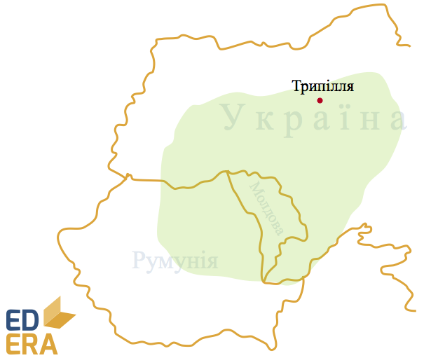

# Енеоліт (мідно-кам'яний вік) (IV-III тис. до н. е.)

Зв’язуючий етап між кам’яним періодом та епохою металу. Знахідки
самородної міді в черговий раз покращили знаряддя праці та дали поштовх розвитку металообробки. Зростає продуктивність праці, починається
торгівля та обмін. Через це з’являється певне майнове розшарування
суспільства. Використовується поділ праці, первісні люди приручають коня.

В українській історіографії цей період пов’язаний з трипільскою
культурою (IV-III тис. до н.е.). Свою назву вона отримала від с.
Трипілля на Київщині, де у 1893 році була знайдена перша пам’ятка цієї
культури. Першовідкривач – Вікентій Хвойка. Трипільська культура також
була поширена на території Молдови та Румунії. Історики палко
сперечаються про походження та зникнення трипільців, але з точністю ми
можемо стверджувати, що їх цивілізація була надрозвинена на свій час.
Розкопки вказують на те, що трипільці мешкали у великих протомістах по
15-20 тис. жителів (припускають існування кількаповерхових будинків).
Трипільці були землеробами. Вони використовували новітні мідні знаряддя
праці на рівні зі звичними кам’яними. Висока врожайність зумовлювалася
екстенсивним господарюванням: місця проживання змінювалися щосторіччя
через виснаженість господарських угідь.

<iframe align="center" width="560" height="315" src="https://www.youtube.com/embed/s41p9IS3UYU" frameborder="0" allowfullscreen></iframe>

У суспільному житті трипільці звернулися до патріархального устрою з
великою декількапарною сім’єю, створюється певна ієрархія родів,
зароджується приватна власність. Мистецтво та релігія також досить
розвинені. Зовнішні та внутрішні чинники не дали трипільцям утворити
повноцінну цивілізацію, проте їхній вплив на розвиток Східної Європи, і
України у тому числі, неможливо переоцінити. Нестача даних не дає нам
можливості впевнено називати трипільців нашими прямими пращурами.

<quiz correctLabel="correct" incorrectLabel="incorrect" checkLabel="check">
        <question multiple>
        
Трипільська культура була поширена на території сучасних:

        <answer correct>Молдови</answer>
        <answer>Росії</answer>
        <answer>Монголії</answer>
        <answer correct>України</answer>
        <answer>Болгарії</answer>
        <answer>Грузії</answer>
        <answer correct>Румунії</answer>
    </question>
</quiz>
