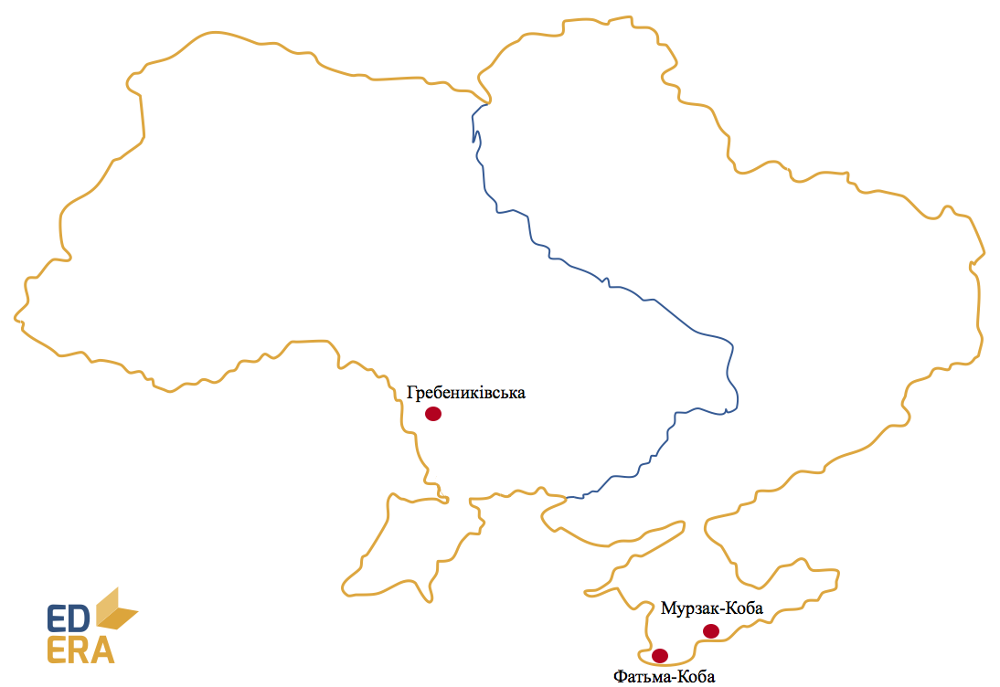

# Мезоліт (9-7 тис. р. до н. е.)

Кінець льодовикового періоду спричинив чергову зміну клімату, що
вплинуло на господарське життя людей.

-   Господарство – присвоююче (полювання, рибальство, збиральництво).
    Жертви мисливців стають меншими та рухливішими, що й дало поштовх до
    розвитку інших методів здобуття їжі. Починається приручення диких
    тварин.

-   Форма суспільної організації – родова община зі зростаючою роллю
    парної сім’ї.

-   Основне знаряддя праці – вдосконалене рубило, скребло,
    гостроконечники.

**Стоянки (1000):**
*Мурзак-Коба, Фатьма-Коба (Крим), Гребениківська (Одещина)*

