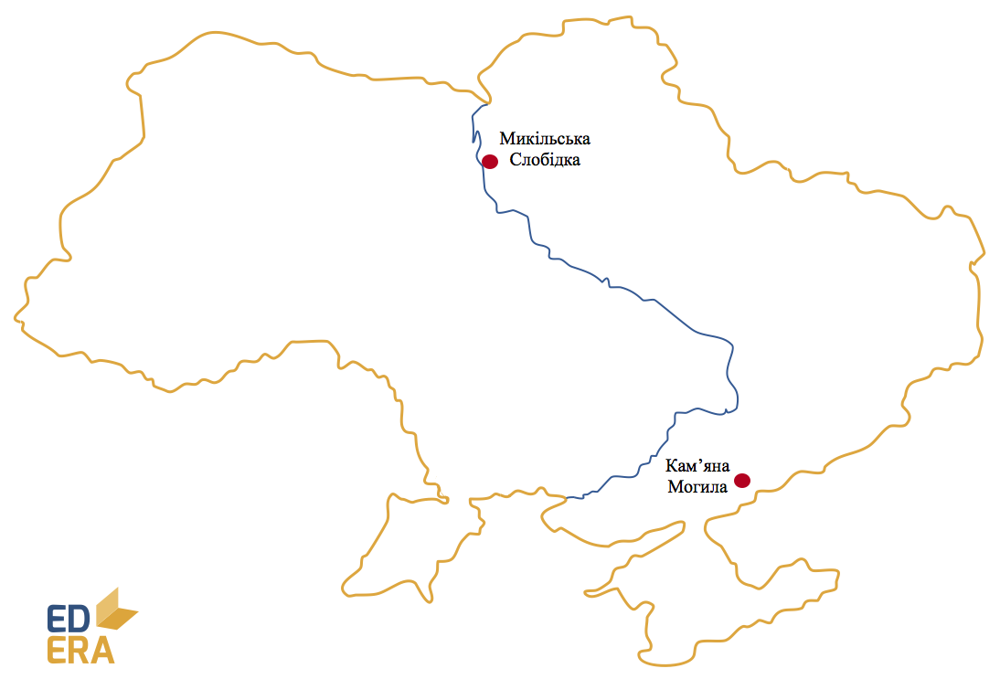

# Неоліт (6-4 тис. р. до н. е.)

Деякі історики кажуть про так звану «неолітичну революцію». Суть її у
винайденні відтворюючого господарства. Це призвело до значних змін у
побуті людей: багато з них стали вести осілий спосіб життя; разом з тим
люди почали запасати їстівні продукти, оскільки самі могли впливати на
їх кількість. Це в рази збільшило їх можливості до пристосування і, як
наслідок, виживання. Говорячи про відтворююче господарство, ми маємо на
увазі землеробство і тваринництво. Останнє розвивалось шляхом приручення
диких тварин. Усі свійські тварини сучасності (окрім коня, який здобув
свій «статус» у мідному віці) стали такими під час неоліту.

-   Знаряддя праці значно покращилися завдяки новим методам обробки –
    свердлінню, пилянню та ін. Люди навчилися обробляти глину, у виробах
    із якої і зберігали надлишки продуктів та воду. Також глиняний посуд
    дав розвиток протокулінарії. Ще одним цивілізаційно утворюючим
    винаходом того часу стало прясло для прядіння, що породило ткацтво
    та тканину.

-   У суспільній організації життя і надалі зростає вага парної сім’ї,
    племінної організації суспільства. З’являються первинні засади
    родової влади, продовжує розвиватись релігія: примітивна магія
    поступається професійним культам. Зростає тривалість життя.
    Зароджується землеробська цивілізація.

*Пам’ятки неолітичної культури: с. Микільська Слобідка на Київщині та
Кам’яна Могила у Приазов’ї.*

