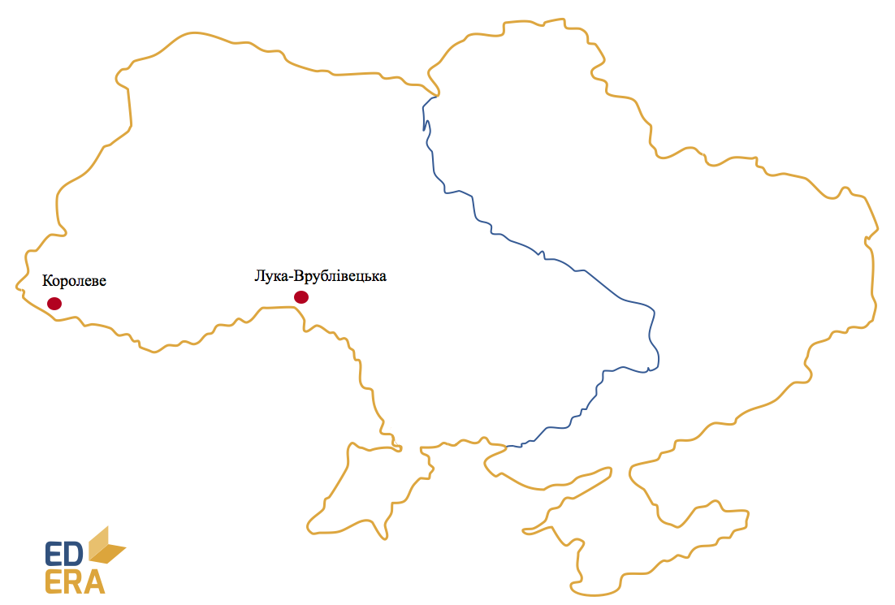
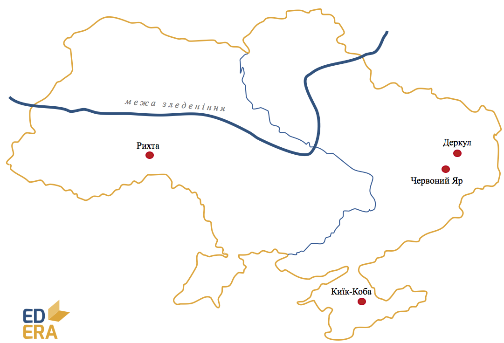
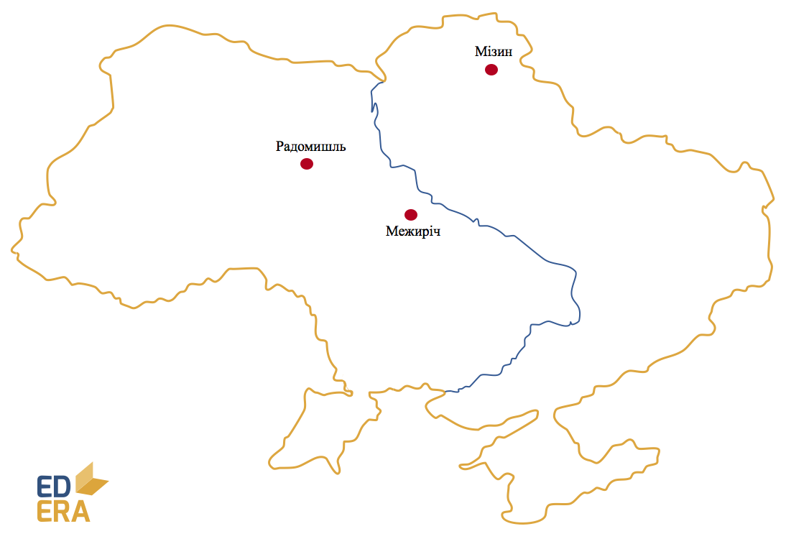
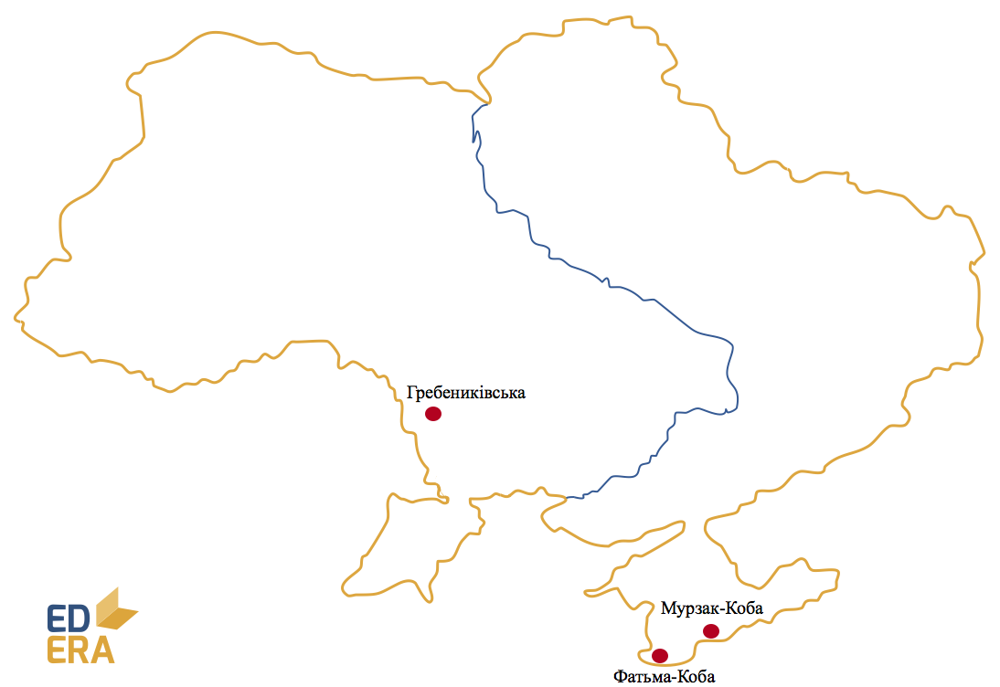
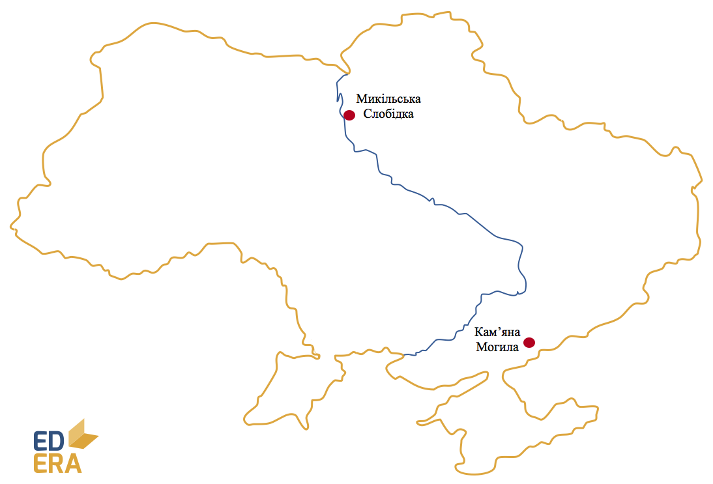
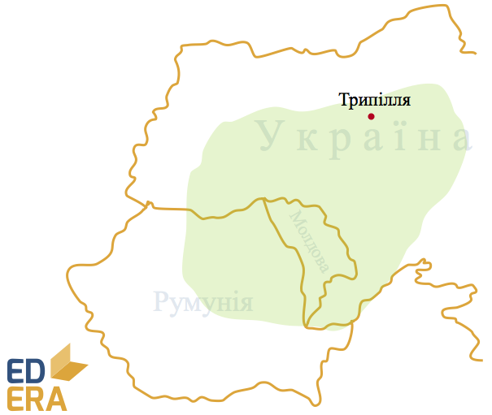

Паростки цивілізації
--------------------
### Кам’яний вік

### Ранній палеоліт {#ранній-палеоліт .unnumbered}

-   Господарство – присвоююче (полювання та збирання).

-   Форма суспільної організації – первісне людське стадо.

-   Основне знаряддя праці – рубило.

**Стоянки (близько 30):**
*с. Лука-Врублівецька (Хмельницька обл.), с. Королеве (Закарпатська
обл.)*

### Середній палеоліт {#середній-палеоліт .unnumbered}

Пройшов під знаком сухого та холодного клімату і, як наслідок,
зледеніння Півночі та Центру Європи і території України.

-   Господарство – присвоююче (полювання).

-   Форма суспільної організації – первісне людське стадо.

-   Основне знаряддя праці – вдосконалене рубило, скребло,
    гостроконечники.

**Стоянки (200):**
*Киїк-Коба (Крим), Рихта (Волинь), Червоний Яр та Деркул (Донбас)*

Зважаючи на суворі природні умови, люди починають виготовляти одяг,
видобувати вогонь, освоювати печери, будувати наземні житла.
Зароджуються релігія та образотворче мистецтво.

### Пізній палеоліт {#пізній-палеоліт .unnumbered}

У цей період завершується формування фізичних та розумових ознак
сучасної людини. Саме тому відбулися значні еволюційні зміни у всіх
сферах життя.

-   Господарство – присвоююче (полювання) з осілим способом життя. Через
    значне вдосконалення знарядь праці ефективність полювань помітно
    зросла.

-   Форма суспільної організації – родова община. Оскільки шлюби між
    членами однієї родової групи були заборонені, розвиваються зв’язки
    між різними родами. Роди згодом стали об’єднуватись у племена, що
    дало початок родовому первіснообщинному ладові.

-   Основне знаряддя праці – кам’яні різці, дротики, голки, шила,
    наконечники списів тощо. Людина мала в арсеналі близько 100 видів
    знарядь праці. Цьому сприяло освоєння техніки обробки кісток.

**Стоянки (800):**
*Мізинська (Чернігівська обл.), Радомишльська (Житомирська обл.),*
*Межиріцька (Черкаська обл.)*

<iframe align="center" width="560" height="315" src="https://www.youtube.com/embed/L5QvK0VWJPI" frameborder="0" allowfullscreen></iframe>

Вірування та мистецтво стрімко розвиваються, хоча й лишаються
примітивними. Окрім образотворчого мистецтва, з’являється і прикладне, а
також прамузика і танці.

### Мезоліт {#мезоліт .unnumbered}

Кінець льодовикового періоду спричинив чергову зміну клімату, що
вплинуло на господарське життя людей.

-   Господарство – присвоююче (полювання, рибальство, збиральництво).
    Жертви мисливців стають меншими та рухливішими, що й дало поштовх до
    розвитку інших методів здобуття їжі. Починається приручення диких
    тварин.

-   Форма суспільної організації – родова община зі зростаючою роллю
    парної сім’ї.

-   Основне знаряддя праці – вдосконалене рубило, скребло,
    гостроконечники.

**Стоянки (1000):**
*Мурзак-Коба, Фатьма-Коба (Крим), Гребениківська (Одещина)*

### Неоліт {#неоліт .unnumbered}

Деякі історики кажуть про так звану «неолітичну революцію». Суть її у
винайденні відтворюючого господарства. Це призвело до значних змін у
побуті людей: багато з них стали вести осілий спосіб життя; разом з тим
люди почали запасати їстівні продукти, оскільки самі могли впливати на
їх кількість. Це в рази збільшило їх можливості до пристосування і, як
наслідок, виживання. Говорячи про відтворююче господарство, ми маємо на
увазі землеробство і тваринництво. Останнє розвивалось шляхом приручення
диких тварин. Усі свійські тварини сучасності (окрім коня, який здобув
свій «статус» у мідному віці) стали такими під час неоліту.

-   Знаряддя праці значно покращилися завдяки новим методам обробки –
    свердлінню, пилянню та ін. Люди навчилися обробляти глину, у виробах
    із якої і зберігали надлишки продуктів та воду. Також глиняний посуд
    дав розвиток протокулінарії. Ще одним цивілізаційно утворюючим
    винаходом того часу стало прясло для прядіння, що породило ткацтво
    та тканину.

-   У суспільній організації життя і надалі зростає вага парної сім’ї,
    племінної організації суспільства. З’являються первинні засади
    родової влади, продовжує розвиватись релігія: примітивна магія
    поступається професійним культам. Зростає тривалість життя.
    Зароджується землеробська цивілізація.

*Пам’ятки неолітичної культури: с. Микільська Слобідка на Київщині та
Кам’яна Могила у Приазов’ї.*

### Енеоліт (мідний вік)

Зв’язуючий етап між кам’яним періодом та епохою металу. Знахідки
самородної міді в черговий раз покращили знаряддя праці та дали поштовх розвитку металообробки. Зростає продуктивність праці, починається
торгівля та обмін. Через це з’являється певне майнове розшарування
суспільства. Використовується поділ праці, первісні люди приручають коня.

В українській історіографії цей період пов’язаний з трипільскою
культурою (IV-III тис. до н.е.). Свою назву вона отримала від с.
Трипілля на Київщині, де у 1893 році була знайдена перша пам’ятка цієї
культури. Першовідкривач – Вікентій Хвойка. Трипільська культура також
була поширена на території Молдови та Румунії. Історики палко
сперечаються про походження та зникнення трипільців, але з точністю ми
можемо стверджувати, що їх цивілізація була надрозвинена на свій час.
Розкопки вказують на те, що трипільці мешкали у великих протомістах по
15-20 тис. жителів (припускають існування кількаповерхових будинків).
Трипільці були землеробами. Вони використовували новітні мідні знаряддя
праці на рівні зі звичними кам’яними. Висока врожайність зумовлювалася
екстенсивним господарюванням: місця проживання змінювалися щосторіччя
через виснаженість господарських угідь.

<iframe align="center" width="560" height="315" src="https://www.youtube.com/embed/s41p9IS3UYU" frameborder="0" allowfullscreen></iframe>

У суспільному житті трипільці звернулися до патріархального устрою з
великою декількапарною сім’єю, створюється певна ієрархія родів,
зароджується приватна власність. Мистецтво та релігія також досить
розвинені. Зовнішні та внутрішні чинники не дали трипільцям утворити
повноцінну цивілізацію, проте їхній вплив на розвиток Східної Європи, і
України у тому числі, неможливо переоцінити. Нестача даних не дає нам
можливості впевнено називати трипільців нашими прямими пращурами.

### Бронзовий вік

Бронза – штучний сплав міді та олова чи свинця. Поширилася на територію
України на поч. ІІ тис. до н.е. Перевага бронзи – менша температура
плавлення, ніж у міді, що спрощувало її обробку.

-   Скотарство остаточно відділяється від землеробства. Цьому сприяв
    посилений розподіл праці.

-   Розвиваються торгівля та військове ремесло.

У різних регіонах через сукупність причин панували різні типи
господарювання: степова Україна – скотарство, лісостепова зона –
землеробство, Полісся – примітивне землеробство. Зростає роль чоловіка у
суспільному житті, патріархат приходить на зміну матріархату.
Виокремлюється воїнство, починається диференціація суспільства за
майновим принципом. Виникають племінні союзи та необхідність їх
узгодженого керування.

### Залізний вік

Перші залізні знаряддя виготовляли із залишків метеоритів. Перші
знахідки виробів із заліза на території України – ХІ-ІХ ст. до н.е.
Оскільки залізна зброя та обладунки значно кращі за мідні чи бронзові,
війна стає ремеслом, а воїн – оспівуваною народом професією. Активно йде
класоутворення. Починаються масштабні міграції людей.

<quiz correctLabel="correct" incorrectLabel="incorrect" checkLabel="check">
    <question text="">
        
У період середнього палеоліту люди навчилися

        <answer>зберігати харчі</answer>
        <answer correct>видобувати вогонь</answer>
        <answer>приручати тварин</answer>
        <answer>обробляти метал</answer>
    </question>
    <question text="">
        
Льодовиковий період на території України розпочався у період

        <answer>раннього палеоліту</answer>
        <answer>неоліту</answer>
        <answer correct>середнього палеоліту</answer>
        <answer>енеоліту</answer>
    <explanation>
    Льодовиковий період на території України розпочався у період середнього палеоліту.
    </explanation>
    </question>
        <question multiple>
        
Трипільська культура була поширена на території сучасних:

        <answer correct>Молдови</answer>
        <answer>Росії</answer>
        <answer>Монголії</answer>
        <answer correct>України</answer>
        <answer>Болгарії</answer>
        <answer>Грузії</answer>
        <answer correct>Румунії</answer>
    </question>
</quiz>
