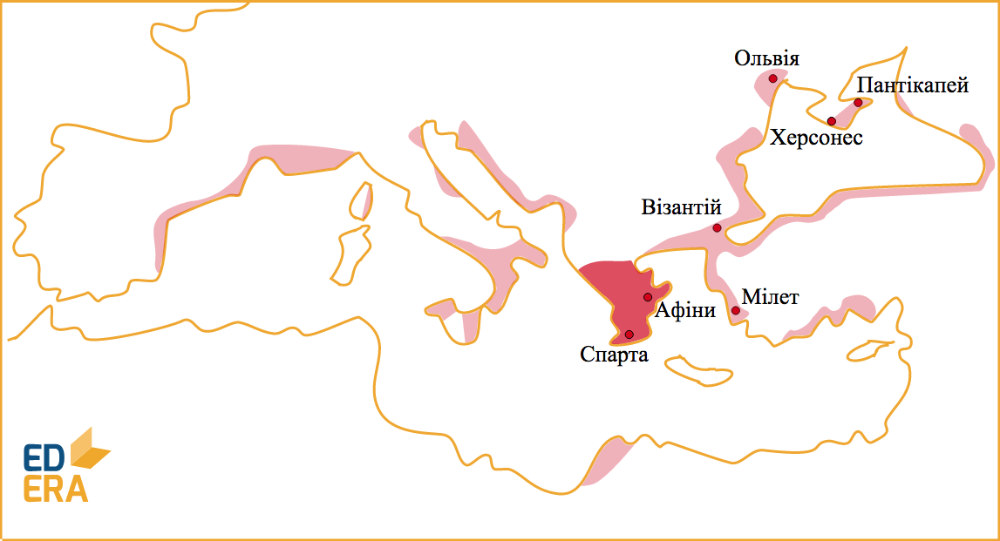
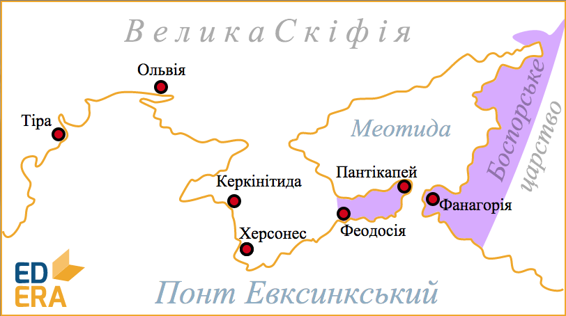

# Пiвнiчне Причорномор’я та Крим (колонiї-полiси)

Через низку проблем соціально-побутового характеру, в VII-VI ст. до н.е.
греки почали переселятися на узбережжя Середземного, Егейського, Чорного
та Азовського морів. Цей процес має назву «Велика грецька колонізація».

Визначення

<b>Полiс</b> — мiсто-держава, мiська громада; особлива форма  соцiально-економiчної та полiтичної органiзацiї  суспiльства, типова для Стародавньої Грецiї та Риму.

Першим давньогрецьким полісом на території України стало місто
**Борисфеніда** (о. Березань, Миколаївська обл.). Найбільш відомими і
крупними містами стали **Ольвія**, **Тіра**, **Херсонес**,
**Пантикапей** та **Феодосія**.

Міста-поліси були самостійними рабовласницькими республіками, наслідуючи
тенденцію Великої Греції. Перський вплив зумовив виникнення монархії –
**Боспорського царства**, що об’єднувало *Фанагорію*, *Пантікапей* та
деякі інші поліси.

У період з другої половини VII до середини І ст. до н.е. дана територія
розвивалася у тісних зв’язках із Грецією, майже в усьому копіюючи її
суспільно-політичний лад. Урбанізація, розвиток торгівлі, карбування
монет та низька військова активність характерні для цього часу.

З середини І ст. до н.е. поліси та Боспорське царство втрачають
незалежність через зростання військової активності в регіоні,
потрапляючи під вплив Понтійського царства, а згодом – Римської імперії.
Була створена римська провінція – Нижня Мезія. Посилені набіги варварів
(особливо – готів у ІІІ ст. н.е. та гунів у VI ст. н.е.) руйнують
господарство полісів, які поступово замітаються пісками історії. Лише
Пантикапей та Херсонес уціліли та потрапили під владу Візантії.

 

<iframe align="center" width="560" height="315" src="https://www.youtube.com/embed/fYxuN5DDEFc" frameborder="0" allowfullscreen></iframe>

<quiz>
  <question text="">
    
Перший грецький поліс у Причорномор’ї 

    <answer correct>Борисфеніда</answer>
    <answer>Ольвія</answer>
    <answer>Херсонес</answer>
    <answer>Пантікапей</answer>
  </question>
<question multiple>
    
Для поліса характерні (виберіть усі правильні варіанти):

    <answer correct>рабовласницький устрій</answer>
    <answer>велика підвладна територія</answer>
    <answer correct>республіканська форма правління</answer>
    <answer>повна торгівельна та економічна ізольованість</answer>
    <answer>загарбницька зовнішня політика</answer>
    <answer correct>карбування монети</answer>
</question>
</quiz>

