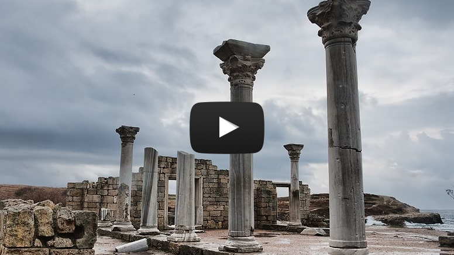

Пiвнiчне Причорномор’я та Крим (колонiї-полiси)
===============================================

Через низку проблем соціально-побутового характеру, в VII-VI ст. до н.е.
греки почали переселятися на узбережжя Середземного, Егейського, Чорного
та Азовського морів. Цей процес має назву «Велика грецька колонізація».

Означення

<b>Полiс</b> — мiсто-держава, мiська громада; особлива форма  соцiально-економiчної та полiтичної органiзацiї  суспiльства, типова для Стародавньої Грецiї та Риму.

Першим давньогрецьким полісом на території України стало місто
**Борисфеніда** (о. Березань, Миколаївська обл.). Найбільш відомими і
крупними містами стали **Ольвія**, **Тіра**, **Херсонес**,
**Пантикапей** та **Феодосія**.

Міста-поліси були самостійними рабовласницькими республіками, наслідуючи
тенденцію Великої Греції. Перський вплив зумовив виникнення монархії –
**Боспорського царства**, що об’єднувало *Фанагорію*, *Пантікапей* та
деякі інші поліси.

У період з другої половини VII до середини І ст. до н.е. дана території
розвивалася у тісних зв’язках із Грецією, майже в усьому копіюючи її
суспільно-політичний лад. Урбанізація, розвиток торгівлі, карбування
монет та низька військова активність характерні для цього часу.

З середини І ст. до н.е. поліси та Боспорське царство втрачають
незалежність через зростання військової активності в регіоні,
потрапляючи під вплив Понтійського царства, а згодом – Римської імперії.
Була створена римська провінція – Нижня Мезія. Посилені набіги варварів
(особливо – готів у ІІІ ст. н.е. та гунів у VI ст. н.е.) руйнують
господарство полісів, які поступово замітаються пісками історії. Лише
Пантикапей та Херсонес уціліли та потрапили під владу Візантії.

 

https://www.youtube.com/embed/fYxuN5DDEFc|

  

  

|<a href="https://study.ed-era.com/courses/EdEra/H101/h101/about?_ga=1.7854647.469818367.1423866830"><button class="but">Переглянути курс!</button></a>

  

  
  

  <h1>Remodal</h1>
  

    Flat, responsive, lightweight, fast, easy customizable modal window plugin
    with declarative state notation and hash tracking.
  

  

    Minified version size: ~4kb
  

   
  <a class="remodal-cancel" href="#">Cancel</a>
  <a class="remodal-confirm" href="https://google.com">OK</a>

<quiz name="History">
<question multiple>
    
Для поліса характерні (виберіть усі правильні варіанти):

    <answer correct>рабовласницький устрій</answer>
    <answer>велика підвладна територія</answer>
    <answer correct>республіканська форма правління</answer>
    <answer>повна торгівельна та економічна ізольованість</answer>
    <answer>загарбницька зовнішня політика</answer>
    <answer correct>карбування монети</answer>
</question>
</quiz>

