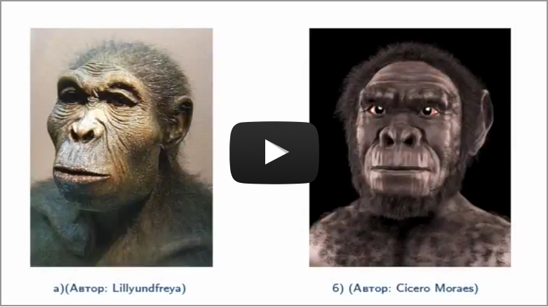

Поява та поселення людей на території України
=============================================
Історія людства починається з появою першої людини. Археологічні
знахідки вказують на те, що перша людина – *Homo habilis (Людина
уміла)* – з’явилася близько 2 млн років тому в південно-східній Африці,
звідки розселилася по всій земній кулі. На територію сучасної України
вона потрапила через Балкани та Центральну Європу близько 1 млн років
тому.

  

  
  

Прадавню історію поділяють на періоди, пов’язані з найпоширенішим на той
час матеріалом. І історію України зачепили усі без винятку періоди.

<table align="center">
<tr>
    <td><b>Залізний вік</b></td>
    <td><b>Бронзовий вік</b></td>
    <td><b>Енеоліт</b></td>
    <td><b>Кам'яний вік</b></td>
</tr>
<tr>
    <td>I тис. до н. е.</td>
    <td>II-I тис. до н. е.</td>
    <td>IV-III тис. до н. е.</td>
    <td>6 тис. – 2 млн років тому</td>
</tr>
</table>

<table align="center">
 <tr>
    <th colspan="5">Кам'яний вік</th>
  </tr>
  <tr>
    <th rowspan="2">неоліт</th>
    <th rowspan="2">мезоліт</th>
    <th colspan="3">палеліт</th>
  </tr>
    <th>пізній</th>
    <th>середній</th>
    <th>ранній</th>
   <tr>
        <td>6-8 тис.</td>
        <td>10-6 тис.</td>
        <td>35-11 тис.</td>
        <td>150-35 тис.</td>
        <td>2 млн.–150 тис.</td>
   </tr>
</table>

<quiz correctLabel="correct!" incorrectLabel="incorrect!" checkLabel="check ansert">
    <question>
    
Людство зародилося

        <answer>у центрі Африки</answer>
        <answer>у Північній Америці</answer>
        <answer correct>на півдні Африки</answer>
        <answer>у південно-східній Азії</answer>
    </question>
    <question>
        
Наукова назва перших людиноподібних мавп

        <answer correct>Homo habilis </answer>
        <answer>Homo erectus</answer>
        <answer>Homo sapiens</answer>
        <answer>Homo heidelbergensis</answer>
    </question>
</quiz>
