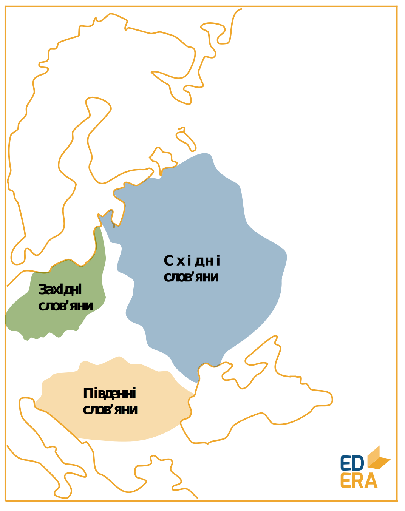
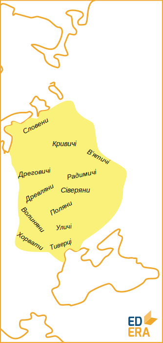

Прадавні слов’яни
=================
https://www.youtube.com/embed/8qkuaLLekbc||<a href="https://study.ed-era.com/courses/EdEra/H101/h101/about?_ga=1.7854647.469818367.1423866830"><button class="but">Переглянути курс!</button></a>

Походження перших слов’ян і досі викликають суперечки, проте найбільш
вірогідним здається їх виокремлення із автохтонного індоєвропейського
населення Східної Європи.

У VI ст. стають відомими перші слов’янські племена: анти, венеди та
склавини з Подніпров’я, берегів Вісли та Подунав’я відповідно.

Розвиток перших слов’янських племен проходить під знаком Великого
переселення народів:

-   готи оселилися в Причорномор’ї, ідучи з Прибалтики. Вони
    розділяються на *ост-* та *вестготів* у залежності від місця
    осілості. У 375 році були підкорені та витіснені гунами;

-   гуни створили могутню військову державу від Карпат до Дону з відомим
    Аттілою на чолі. Після його смерті у 451 р. це утворення стрімко
    втрачає вплив, що дає вільно дихати слов’янам.

Перші слов’яни намагалися поширити свій вплив на велику територію, до
VII ст. заволодівши Балканами та тримаючи у страху Візантію. Військові
успіхи та поступова міграція дали розвиток трьом загальновідомим гілкам
слов’ян: західній, східній і південній. Саме східні племена – древляни, тиверці, уличі, волиняни, ховати, сіверяни, поляни – були пращурами українців.

Східні слов’яни були переважно землеробами з прототипом приватної
власності на орну землю сімей, що її обробляють. Сім’ї об’єднуються в
сусідські територіальні общини. Зароджується феодальний стан через
помітне майнове розшарування населення.

Ремесло відокремлюється від сільського господарства і розпадається на
залізообробне, гончарне, ювелірне тощо. Ковальство виокремлюється в
самостійну професію. Торгівля набуває міжнародного масштабу.

 
Утворюються великі племінні союзи (полян, дулібів) та племінні
князівства: Куявія (поляни під Києвом), Славія (Новгород). Куявію
називають Руською землею, на її основі і постане Київська Русь.

Східні слов’яни мали спільну культуру та елементи побуту, що й об’єднує
різні племена у цілісний етнос.

<quiz name="History" correctLabel="correct" incorrectLabel="incorrect" checkLabel="check">
<question text="Основою державності прадавніх слов’ян були:">
<answer>рабовласницькі імперії</answer>    
<answer correct>племінні союзи</answer>
<answer>міста-держави</answer>
<answer>удільні князівства</answer>
</question>
<question text="На території якого племені було закладено Київ:">
<answer>древлян</answer>    
<answer>кривичів</answer>
<answer correct>полян</answer>
<answer>уличів</answer>
</question>
</quiz>

