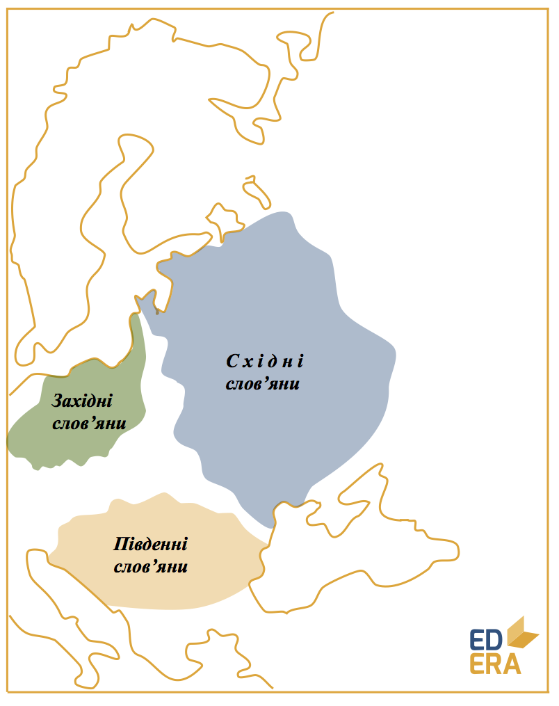
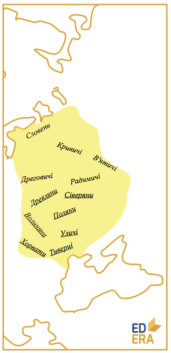

# Прадавні слов’яни

<iframe align="center" width="560" height="315" src="https://www.youtube.com/embed/8qkuaLLekbc" frameborder="0" allowfullscreen></iframe>

Походження перших слов’ян і досі викликають суперечки, проте найбільш вірогідним здається їх виокремлення із автохтонного індоєвропейського населення Східної Європи.

У VI ст. стають відомими перші слов’янські племена: анти, венеди та
склавини з Подніпров’я, берегів Вісли та Подунав’я відповідно.

Розвиток перших слов’янських племен проходить під знаком Великого
переселення народів:

-   готи оселилися в Причорномор’ї, ідучи з Прибалтики. Вони
    розділяються на *ост-* та *вестготів* у залежності від місця
    осілості. У 375 році були підкорені та витіснені гунами;

-   гуни створили могутню військову державу від Карпат до Дону з відомим
    Аттілою на чолі. Після його смерті у 451 р. це утворення стрімко
    втрачає вплив, що дає вільно дихати слов’янам.

Перші слов’яни намагалися поширити свій вплив на велику територію, до VII ст. заволодівши Балканами та тримаючи у страху Візантію. Військові успіхи та поступова міграція дали розвиток трьом загальновідомим гілкам слов’ян: західній, східній і південній. Саме східні племена – древляни, тиверці, уличі, волиняни, хорвати, сіверяни, поляни – були пращурами українців.

Східні слов’яни були переважно землеробами з прототипом приватної власності на орну землю сімей, що її обробляють. Сім’ї об’єднуються в сусідські територіальні общини. Зароджується феодальний стан через помітне майнове розшарування населення.

Ремесло відокремлюється від сільського господарства і розпадається на залізообробне, гончарне, ювелірне тощо. Ковальство виокремлюється в самостійну професію. Торгівля набуває міжнародного масштабу.

Утворюються великі племінні союзи (полян, дулібів) та племінні князівства: Куявія (поляни під Києвом), Славія (Новгород). Куявію називають Руською землею, на її основі і постане Київська Русь.

Східні слов’яни мали спільну культуру та елементи побуту, що й об’єднує різні племена у цілісний етнос.

<quiz correctLabel="correct" incorrectLabel="incorrect" checkLabel="check">
    <question text="">
        
Скільки гілок слов’янства вам відомо?

        <answer>2</answer>
        <answer correct>3</answer>
        <answer>4</answer>
        <answer>13</answer>
    <explanation>
    Слов’ян традиційно поділяють на 3 гілки за географічним принципом: східну, західну та південну.
    </explanation>
    </question>
    <question multiple>
        
Які слов’янські племена були безпосередніми пращурами українців

        <answer>Словени</answer>
        <answer correct>Древляни</answer>
        <answer correct>Волиняни</answer>
        <answer>Кривичі </answer>
        <answer correct>Поляни</answer>
        <answer correct>Уличі</answer>
        <answer>В’ятичі</answer>
        <answer correct>Сіверяни</answer>
        <answer>Дреговичі</answer>
        <answer correct>Тиверці</answer>
        <answer correct>Хорвати</answer>
    </question>
    <question text="">
        
Основою державності прадавніх слов’ян були:

        <answer>рабовласницькі імперії</answer>
        <answer correct>племінні союзи</answer>
        <answer>міста-держави</answer>
        <answer>удільні князівства</answer>
    </question>
    <question text="">
        
На території якого племені було закладено Київ:

        <answer>древлян</answer>
        <answer>кривичів</answer>
        <answer correct>полян</answer>
        <answer>уличів</answer>
    </question>
</quiz>

