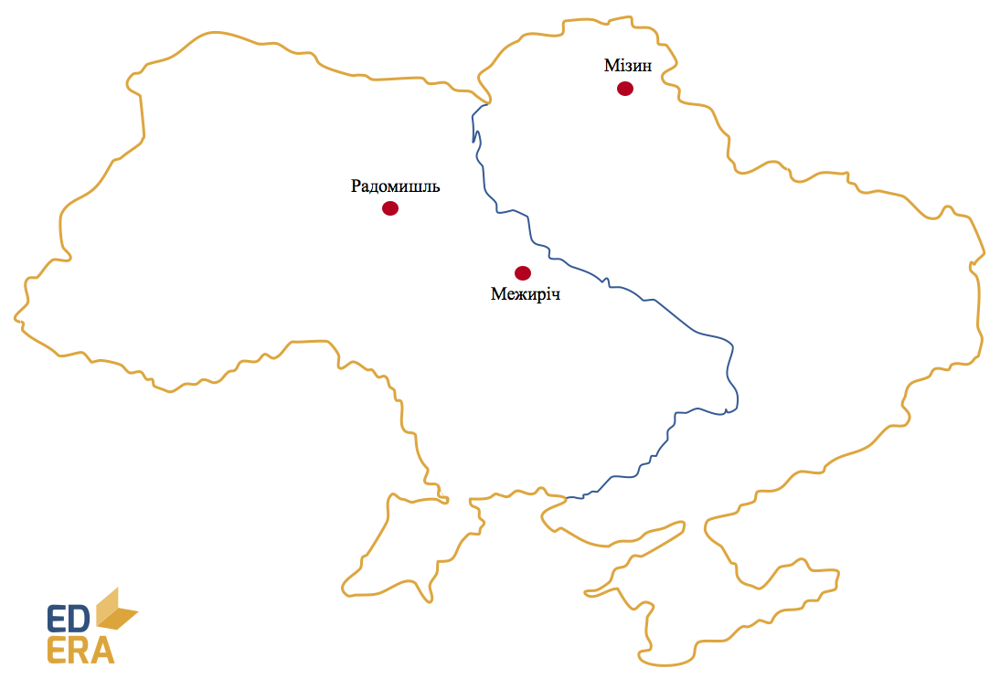

# Пізній палеоліт (40-10 тис. р. до н. е.)

У цей період завершується формування фізичних та розумових ознак
сучасної людини. Саме тому відбулися значні еволюційні зміни у всіх
сферах життя.

-   Господарство – присвоююче (полювання) з осілим способом життя. Через
    значне вдосконалення знарядь праці ефективність полювань помітно
    зросла.

-   Форма суспільної організації – родова община. Оскільки шлюби між
    членами однієї родової групи були заборонені, розвиваються зв’язки
    між різними родами. Роди згодом стали об’єднуватись у племена, що
    дало початок родовому первіснообщинному ладові.

-   Основне знаряддя праці – кам’яні різці, дротики, голки, шила,
    наконечники списів тощо. Людина мала в арсеналі близько 100 видів
    знарядь праці. Цьому сприяло освоєння техніки обробки кісток.

**Стоянки (800):**
*Мізинська (Чернігівська обл.), Радомишльська (Житомирська обл.),*
*Межиріцька (Черкаська обл.)*

<iframe align="center" width="560" height="315" src="https://www.youtube.com/embed/L5QvK0VWJPI" frameborder="0" allowfullscreen></iframe>

Вірування та мистецтво стрімко розвиваються, хоча й лишаються
примітивними. Окрім образотворчого мистецтва, з’являється і прикладне, а
також прамузика і танці.