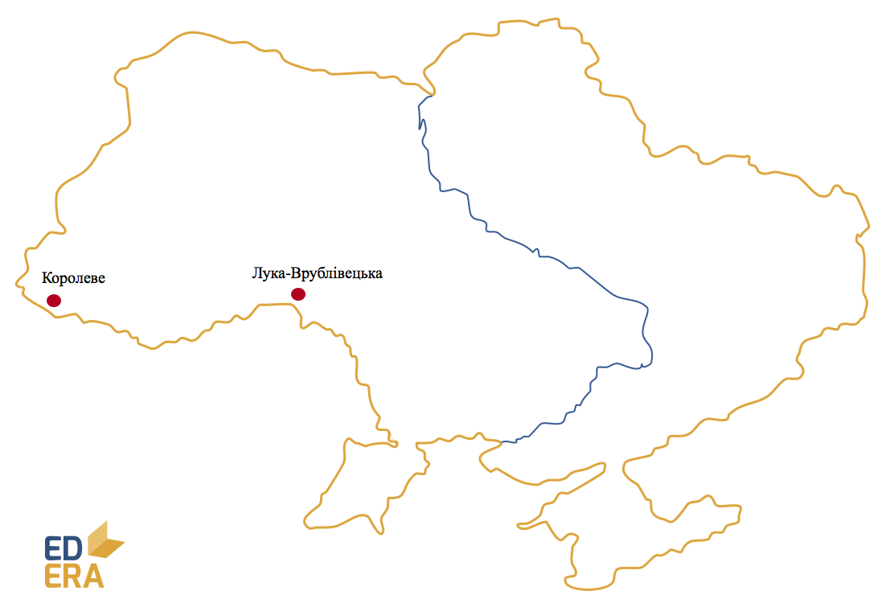

# Ранній палеоліт (1 млн років тому–150 тис. р. до н. е.)

-   Господарство – присвоююче (полювання та збирання).

-   Форма суспільної організації – первісне людське стадо.

-   Основне знаряддя праці – рубило.

**Стоянки (близько 30):**
*с. Лука-Врублівецька (Хмельницька обл.), с. Королеве (Закарпатська
обл.)*

