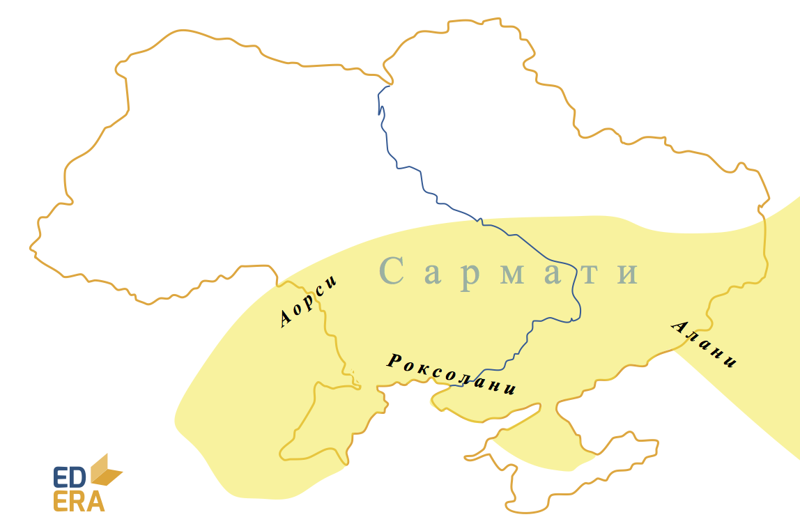

Сармати (ІІІ ст. до н.е. – ІІІ ст. н.е.)
----------------------------------------

Сарматам не вдалося створити державу на кшталт скіфської, проте їх
військова слава була на одному рівні. Увесь цей період вони потроху
просувалися на захід. За свідченнями давніх істориків, сармати являли
собою об’єднання декількох народів, які змінювали одне одного у лідерстві поміж племенем.

Роксолани, а потім алани здійснювали походи у Малу та Середню Азію.
Завдяки Великому переселенню народів сармати опинилися на Британських
островах, в Іспанії тощо.

Культура була здебільшого наслідною до скіфської, проте військові
рішення були новими і прогресивними.

<iframe align="center" width="560" height="315" src="https://www.youtube.com/embed/oU6hYD2VQ_s" frameborder="0" allowfullscreen></iframe>

<quiz correctLabel="correct!" incorrectLabel="incorrect!" checkLabel="check ansert">
  <question text="">
    
Виберіть варіант у якому кочові народи розташовано у порядку їх появи на території України:

    <answer correct>кіммерійці, скіфи, сармати;</answer>
    <answer>скіфи, кіммерійці, сармати;</answer>
    <answer>сармати, кіммерійці, скіфи.</answer>
  </question>
  <question text="">
    
Кочівники, що змогли побудувати свою протодержаву:

    <answer>кіммерійці</answer>
    <answer>готи</answer>
    <answer>сармати</answer>
    <answer correct>скіфи</answer>
  </question>
</quiz>
