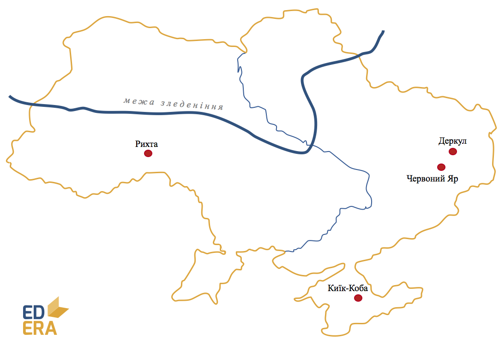

# Середній палеоліт (150-40 тис. р. до н. е.)

Пройшов під знаком сухого та холодного клімату і, як наслідок,
зледеніння Півночі та Центру Європи і території України.

-   Господарство – присвоююче (полювання).

-   Форма суспільної організації – первісне людське стадо.

-   Основне знаряддя праці – вдосконалене рубило, скребло,
    гостроконечники.

**Стоянки (200):**
*Киїк-Коба (Крим), Рихта (Волинь), Червоний Яр та Деркул (Донбас)*

<quiz correctLabel="correct" incorrectLabel="incorrect" checkLabel="check">
    <question text="">
        
У період середнього палеоліту люди навчилися

        <answer>зберігати харчі</answer>
        <answer correct>видобувати вогонь</answer>
        <answer>приручати тварин</answer>
        <answer>обробляти метал</answer>
    </question>
</quiz>