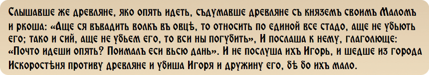

Ігор (бл. 879—945)
==================

Як нам вже відомо, Ігор – син Рюрика, що став князювати не після
досягнення повноліття, а лише після смерті князя-регента, приблизно у 33
роки (912 рік). Проте успіхи Ігоря не були такими значущими, як
досягнення Олега. Своє правління «молодий» князь розпочав із придушення
повстань древлян та уличів. У Ігоря з’явилася нова проблема – кочові
племена зі сходу – печеніги. У 915 році з ними укладено мирну угоду,
проте печеніги, досить активно підтримувані Візантією, уже у 930 році
поновили набіги на Русь. У свою чергу, Ігор поновив морські походи у
Візантію. 941 року флотилія із 1000 лодій (зустрічаються неправдоподібні
дані про 10000 лодій) безперешкодно увійшла до Босфору у надії на те, що
візантійський флот буде у поході проти сарацинів. Проте плани русів
стали відомими імператору Візантії, і грецький флот було повернено
заздалегідь. Оборонці Константинополя прийняли бій, маючи на озброєнні
так званий «грецький вогонь» – легкозаймисті речовини (нафта, сірка
тощо), що не можна було погасити водою - який виприскувався з бронзових
труб прямо на київські судна. Оцінивши невигідну диспозицію та несучи
значні втрати, Ігор вирішив відступити та отримати бажану здобич з
узбережжя Малої Азії. Візантійські полководці ж мали свою думку щодо
руського флоту і гнали його, поливаючи вогнем, до самої Керченської
протоки. Реваншував Ігор у 943 році. Цього разу частину війська було
десантовано на узбережжя поблизу Константинополя. До речі, сама армія
Ігоря складалася з варягів, полян, кривичів, тиверців та
найманців-печенігів. Візантійці, побачивши піші та морські війська,
вирішили не спокушати долю і одразу запропонували мир. У результаті був
підписаний новий договір між Візантією і Руссю, який трохи погіршував
становище руських купців у Константинополі (вони позбавлялися права на
безмитну торгівлю), проте мав засади повномасштабного військового
союзництва.

Після успіху у Візантії Ігор направив свою міць на каспійського союзника
греків – Кавказьку Албанію. Спустошивши столицю й інші крупні
мусульманські міста, у тому ж 943 році, русичі зі славою та великою
здобиччю повернулися додому, а їх вплив у Прикаспії зріс.

Здобуваючи вплив далеко за межами Русі, Ігор втрачав свій вплив на
народи всередині країни, зокрема на волелюбних древлян. Збільшення
данини суттєво бентежило їх, проте суперечки із київськими збирачами
вирішувалися хоч і не мирним шляхом, але у межах здорового глузду. І
саме вихід за рамки, втрата почуття міри і спричинили вбивство князя
Ігоря. Досить жорстоке вбивство, якщо знову ж таки вірити «Повісті
минулих літ». Повернувшись із Каспійського походу, Ігор вирішив сам
зібрати підвищену дань з древлян. Раніше це була прерогатива його
воєводи Свенельда. Переконавши древлян за допомогою своєї дружини
віддати необхідні кошти, Ігор попрямував до Києва, але, відпустивши
більшість свого війська, повернувся до Іскоростеня – головного міста
древлян, аби зібрати данину для себе особисто. Це визвало обурення у
древлян на чолі з їх ватажком Малом, і вирішили вони покінчити з цим
свавіллям. Ось як описує це «Повість…».

А візантійський історик Лев Диякон змалював картину цього вбивства більш
детально. Ніби Ігоря прив’язали до двох дерев, що були силоміць
притиснуті до землі, і відпустили їх, розірвавши князеве тіло на шматки.
Проте похований був Ігор із князівськими почестями. Слово «честь» було
відомо і у ті буремні часи…