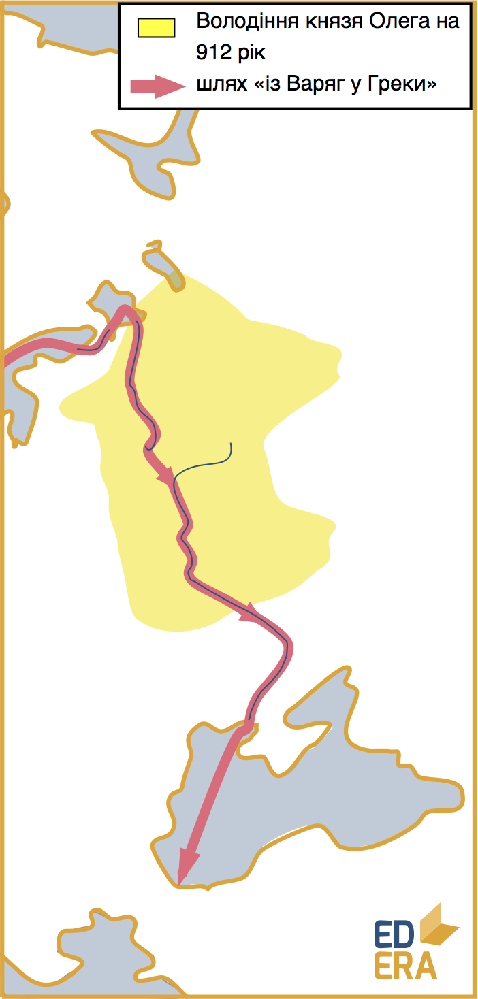
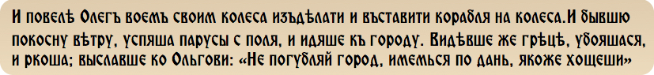
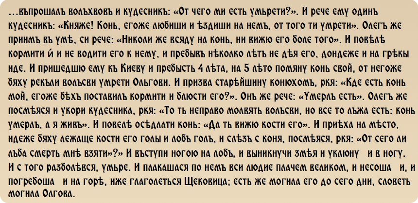

Надалі буде розглянуто становлення та розквіт Київської Русі, так звану
«золоту добу», у хронологічній послідовності правління князів київських.

Олег (845-912)
==============

Був довіреною особою новгородського князя Рюрика і регентом[^1] свого
малолітнього сина – Ігоря. У 882 році Олег на чолі варязького війська
увійшов до Києва, убивши Аскольда і Діра та де-факто започаткувавши
династію Рюриковичів. Правив князь-регент з 882 до 912, хоча і мав би
передати трон Ігорю після досягнення останнім повноліття. Авторитет,
військовий та політичний талант були вірними супутниками Олега, який
отримав від нащадків прізвисько «Віщий». Саме він, за легендою, вперше
застосував до Києва визначення «мати міст руських».

Почав своє правління Олег, звісно, з питань внутрішніх. Захопивши до
Києва Смоленськ та Любеч, маючи під собою Новгород, він обклав даниною
древлян, полян, сіверян та радимичів. Тобто під владою князя опинилося
ядро Руської держави, а також один з основних торгових шляхів
Середньовіччя – «Шлях із варяг у греки». Саме ці стратегічні здобутки за
перші декілька років правління (до 885 року) дозволили Олегу
зосередитись на зовнішньополітичних зносинах. Причому як торгівельних,
так і завойовницьких, котрі часто йшли нога в ногу. Конфлікти у Прикаспії зменшували значущість підконтрольного Хозарському каганату та
Волзькій Булгарії Волзького торгового шляху, а військові успіхи русів у
Візантії супроводжувалися вигідними торгівельними угодами.

Найбільших успіхів Олег досяг у Візантії. Відомо два великих походи на
Константинополь – у 907 та 911 роках. Перший похід не викликає довіри у
істориків, деякі навіть вважають його повністю вигадкою
Нестора-літописця – автора «Повісті минулих років», яка містить детальну
інформацію про розвиток цих подій. Згідно з «Повістю...» 2000 лодій підпливли до Константинопольскої гавані, яка, за наказом імператора Льва IV Філософа, була перекрита ланцюгами.

Проте замість того, щоб грабувати передмістя, увесь флот був витягнутий
на суходіл та поставлений на колеса. Коли здійнявся вітер, з мурів
Константинополя можна було спостерігати величезну флотилію, що атакує
суходолом. Це надломило захисників Візантії, і місто здалося, сплативши
величезну контрибуцію[^2] (24 гривні за кожну лодію). А сам Олег на знак
перемоги прибив свій щит на браму Константинополя.

Сюжет, достойний Голлівуду. Проте перемога 911 року сумнівів не
викликає. У результаті греки знову заплатили контрибуцію (48 тис.
гривень золотом), підписали вигідні для русичів угоди:

-   про торгівлю;

-   про забезпечення їх кораблів при поверненні на Русь;

-   про взаємну допомогу кораблям, що зазнали лиха поблизу берегів
    однієї із країн. 

Тобто були закладені основи давньоруського морського і
    торгівельного права.

<iframe align="center" width="560" height="315" src="https://www.youtube.com/embed/DOjwtg9DNf0" frameborder="0" allowfullscreen></iframe>

Надалі Олег намагався розширити свій вплив і на Прикаспій. У 912 році
здійснюється похід на Арабський халіфат. Пройшовши із Азовського моря у
гирло Дону з дозволу Хозарського каганату, руський флот із 500 човнів досяг Волги, протягнувши свої лодії волоком по суходолу, звідки вони
спустилися у Каспійське море. Спустошивши його південно-західне
узбережжя, Олег направився у Русь, проте хозари вирішили помститися 
за одновірців і напали на руське військо, знищивши його основну частину. Вважається, що у цьому поході загинув і сам князь, хоча легенда знову ж
таки говорить інше.

<i>Легенда 1</i> 
Одного разу князь Олег запитав у волхвів про свою смерть. Волхви
відповіли: «Ти помреш від коня свого». Засмутившись, князь наказав
відвести свого улюбленця у стійло і гарно його годувати, проте ніколи
більше не підводити до князя. Через деякий час ця історія забулася
князеві, проте після успішних походів у Візантію Олег запитав у конюхів,
де його улюблений кінь, залишений багато років тому. «Помер» – відповів
конюх. І посміявся Олег над чудесниками, і попрохав відвести його на
могилу коня свого. «І від цих кісток смерть мені прийняти?» – питав
Олег, роздивляючись череп та кістки давно померлого коня. У той самий
момент, як сказав він це, із черепа виповзла отруйна змія і вкусила
князя київського за ногу. Через три дні Олег помер і був похований на
Щекавиці.

Також з іменем Олега пов’язана інша легенда.

<i>Легенда 2</i> 
Підкоривши Київ і вбивши Аскольда з Діром, Олег запропонував усій їхній
дружині присягнути йому на вірність. Проте згодилися не всі. Один із
дружинників утік у древлянські ліси, де оселився на одинокій скалі біля
злиття двох річок. Звали цього дружинника Житомир. І це легенда про
заснування міста Житомира, що став центром племені житичів древлянського
племінного союзу.

Звісно, смерть войовничого князя вірогідніше зустріла його під час битви, ніж у побуті. Проте смерть Олега – й досі ласий шматок у історичних дискусах.

А після тієї чи іншої смерті князя Олега настав час того, від чийого
імені мав би правити Олег і хто був народжений князем – Ігоря.

[^1]: Регент – у монархічних державах тимчасовий правитель, допоки монарша особа не може посідати престол, здебільшого через неповноліття, іноді – хворобу.

[^2]: Контрибуція – післявоєнний платіж, котрий сплачує держава, що зазнала поразки, державі-переможниці.

<quiz correctLabel="correct" incorrectLabel="incorrect" checkLabel="check">
<question text="">

Важливий торгівельний шлях, що опинився під контролем Русі завдяки Олегові

<answer>Шлях із німців у хазари</answer>
<answer>Шлях із німців у хазари</answer>
<answer>Волзький шлях</answer>
<answer correct>Шлях із варяг у греки</answer>
<answer>Великий шовковий шлях</answer>
</question>
<question text="">

Встановіть хронологічний порядок подій: 
 
1.

<answer>Похід у Візантію</answer>
<answer correct>Початок князіння Олега у Києві</answer>
<answer>Похід у арабський халіфат</answer>
<answer>Встановлення контролю над шляхом «із варяг у </answer>
</question>
<question text="">

2.

<answer>Похід у Візантію</answer>
<answer>Початок князіння Олега у Києві</answer>
<answer>Похід у арабський халіфат</answer>
<answer correct>Встановлення контролю над шляхом «із варяг у </answer>
</question>
<question text="">

3.

<answer correct>Похід у Візантію</answer>
<answer>Початок князіння Олега у Києві</answer>
<answer>Похід у арабський халіфат</answer>
<answer>Встановлення контролю над шляхом «із варяг у </answer>
</question>
<question text="">

4.

<answer>Похід у Візантію</answer>
<answer>Початок князіння Олега у Києві</answer>
<answer correct>Похід у арабський халіфат</answer>
<answer>Встановлення контролю над шляхом «із варяг у </answer>
</question>
</quiz>