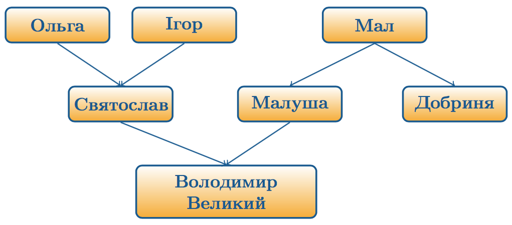

Ольга (бл. 890-969)
===================

Дружина князя Ігоря та мати князя Святослава. Була княгинею-регентом
після вбивства чоловіка (з 945 по 962 роки). Відома через свою криваву
помсту древлянам за князя Ігоря та як княгиня, що прийняла християнство
та намагалася зробити його державною релігією Русі.

Після вбивства Ігоря древляни надіслали до Києва посольство з
пропозицією до князівської вдови вийти заміж за їхнього князя Мала.
Ольга спокійно прийняла послів, прохаючи трохи часу, по закінченні якого
вони були закопані живцем поблизу князівського двору. Надалі, за
наказами Ольги, було спалено у лазні найкращих мужів древлянських, яких
княгиня запросила до Києва, щоб засвідчили повагу до неї, та перебито
древлянське військо на підпитку, яке було запорошене на тризну за
Ігорем. Ці факти здаються не досить правдивими, адже древляни не раз і
не два потрапляли у підступні і, головне, смертельні пастки княгині,
керовані жагою шлюбу їхнього князя зі вдовою князя київського. Тобто
доволі-таки незавуальовано давні джерела підкреслюють як древлянську
наївність на межі з дурістю, так і Ольжину криваву підступність задля
помсти[^3]. Найбільш відомий останній акорд винищення княгинею древлян.
Взявши в облогу їх головне місто Іскоростень (сучасний Коростень
Житомирської області), Ольга запросила у якості данини по три голуба та
горобця з кожного двору. Містяни з радістю погодились на такі легкі
умови. Княгиня ж, отримавши птахів, звеліла до кожного з них прив’язати
палаюче лахміття. Птахи, налякані вогнем, полетіли у свої двори, враз
підпалюючи усе місто. Іскоростень був суттєво зруйнований, а древляни
ніколи більше не були вагомою силою у Русі.

Щодо князя Мала, його доля після кривавого і безуспішного сватання
невідома. Проте з його нащадками пов’язують досить багато видатних
особистостей. Наприклад, воєвода київського князя Володимира
Святославовича Добриня вважається сином Мала. У той же час Добриня є
дядьком Володимиру, адже сестра Добрині Малуша була ключницею Ольги та
дружиною Святослава, від якого народила сина Володимира. Отже, Мал є
батьком легендарного Добрині Микитовича та дідом усесвітньо відомого
Володимира Хрестителя. Досить непогано для місцевого князька, що вбив
князя київського і залицявся до його вдови.

Ольга вважається першою правителькою Русі, що офіційно прийняла
християнство. Звісно, Аскольд також був християнином, проте не корректно
вважати Аскольдiв Київ центром усiєї Русi, на вiдмiну вiд Києва за
правлiння Ольги. Вона досить цілеспрямовано готувалася до введення
християнства на Русі як державної релігії, проте це доробить її онук.
Детальнiше про «пригоди» Ольги на шляху до нової релiгiї - поговоримо
трохи згодом.

Княгиня Ольга була не лише жорстокою (що було нормою Середньовіччя), але
й мудрою. Помстившись за чоловіка, вона почала вирішувати проблему, яка
стала причиною його смерті,— систему збору данини. Основою реформи стала
чітка регламентація зборів за планом «хто, коли і скільки має сплатити».
У 945 році було встановлено, що *полюддя* (щорічний об’їзд князем з
дружиною своїх земель для збору данини) відбувається з листопада по
квітень. Люди з чітко зазначених територій збиралися на спеціально
визначених місцях – *погостах* і *становищах*.

Керував усім князівський намісник – *тіун*. Данина іноді називалася
*оброком*; частіше за все віддавалася натурою (медом, хутром та ін.).
Розміри були встановлені чітко і різнилися від багатства землі, з якої
данина збиралася. Наприклад, з північних регіонів, багатих на хутрових звірів, данина була більшою, ніж із
хліборобських земель. По суті, був введений у дію податковий кодекс, з
урахуванням майнового розшарування суспільства.

На початку 960-х років нарешті і де-факто влада перейшла до Святослава
Ігоровича, а Ольга лишалася таким собі мудрим порадником і помічником.
Так, наприклад, у 968 році Ольга керувала обороною Києва від печенігів,
бо Святослав перебував у своїй болгарській резиденції. І хоча син не
поділяв релігійних поглядів своєї матері, княгиня Ольга була похована за
християнським звичаєм 24 липня 969 року.

[^3]: Проте необхідно зазначити, що помста по крові була нормою того часу і використання для того обману – природно. Викликає недовіру не факт помсти, а її жорстокість, методичність і надмірність.