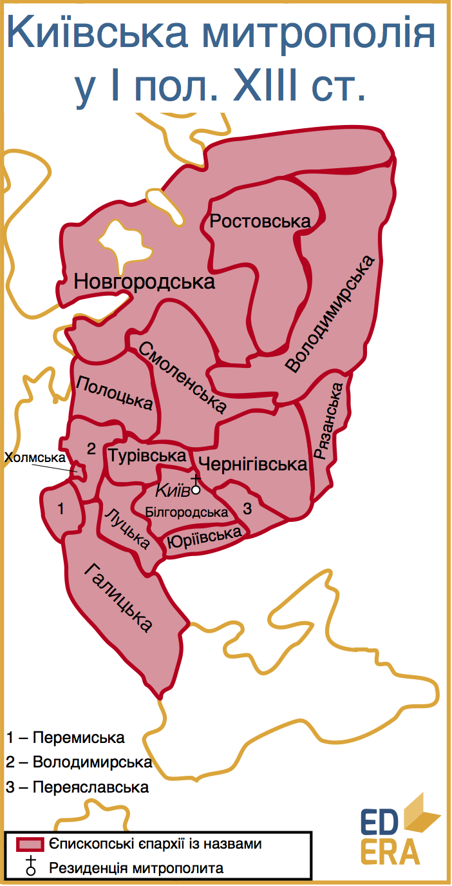

Прийняття християнства
======================

Отже, християнство на державному рівні на Русі запровадив Володимир
Святославович. Офіційно, на церковному рівні, вважається, що відбулося
це у 988 році, хоча, очевидно, цей процес відбувався не один рік через
величезний розмір держави та картатість населення. Мабуть, із
впевненістю сказати, що Русь стала цілком християнською стало можливо
років через сто після 988 року. Передумов для цього декілька.

По-перше, у надважливому центрі Русі, Новгороді, хрещення почалося лише
990 року, і тривало не один рік, так як північне населення Русі
скептичніше ставилося до нової релігії.

По-друге, хрещення відбувалося «вогнем і мечем», руйнувалися язичницькі
капища[^1]. Відповідно, такі дії потребували підготовки, певного часу на
виконання та ще більше часу на те, щоб примусово охрещена спільність
припинила спротив і прийняла нову релігію.

По-третє, значно швидше нова релігія поширювалася по містах, оминаючи
невеликі поселення.

По-четверте, каста волхвів, служителів культів язичництва, користувалася
неймовірною повагою у населення і деякий час після впровадження нової
релігії мала значний вплив. І лише їх повне знищення, а
скоріше-зникнення можна було вважати за перемогу нової релігії. Саме
через ці пункти необ’єктивно буде стверджувати, що християнство було
впроваджено за декілька років.

Як вже було зазначено, християнство не було новинкою на Русі: існують
свідчення про «Аскольдове хрещення», Ольга офіційно прийняла
християнство, община християн у Києві була доволі значною. Тобто, хоча
русичі і не досить дружньо зустрічали нову державну релігію, для неї був
певний ґрунт у руському суспільстві. А чому ж саме православ’я?

«Повість» пропонує легенду про вибір релігії Володимиром. Іслам не
сподобався князю, адже забороняв алкоголь.

Представники католицизму майже не мали шансів, адже Володимир,
посилаючись на часи Ольги, коли католицька місія в Русь провалилася,
також не пристав на доводи на користь «західного християнства».

Іудаїсти із Хозарського каганату також пропонували свою релігію. Проте
Володимирові не сподобалася доля євреїв, котрих вигнали з їх
Батьківщини.

Проте дещо об’єднувало усі ці релігії – вони були монотеїстичними, тобто
мали лише одного верховного Бога. Таким чином, лишалася ще одна –
православ’я. Звісно, згідно з «Повістю…» обрана вона була не за
залишковим принципом, причинам цього вибору присвячена не одна сторінка.
Якщо ж підійти до питання пошуку причин обрання православної віри з
точки зору логіки, то можна побачити такі основні пункти:

-   мова проповідей. Православні літургії велися слов’янською мовою і
    були б одразу зрозумілими населенню, на відміну від служінь на
    латині, арабській мові чи єврейських мовах[^2]

-   культурні зв’язки. Так склалося, що Русь розвивалася у тісному
    контакті з Візантією. І релігія греків викликала більше довіри у
    русів, ніж інші, значно менш відомі.

-   ієрархія у суспільстві. Наприклад, у католицизмі духовенство мало
    верховенство над світською владою. Було б досить дивно, якщо б
    Володимир власноруч поступився своїм статусом новоствореній релігії.
    У «грецькій вірі» світська влада домінувала над релігією, тому це
    було дуже на руку князеві.

<iframe align="center" width="560" height="315" src="https://www.youtube.com/embed/lyDxETVs02M" frameborder="0" allowfullscreen></iframe>

Як вже було зазначено, прийняття християнства (православного) Руссю
вцілому та Володимиром зокрема було наріжним каменем
русько-візантійських домовленостей щодо віськової допомоги та одруження
Володимира із царевною Анною. Через невиконання імператором Василем ІІ
цих домовленостей розпочалася так звана Корсунська війна, у результаті
якої Володимир зайняв кримські володіння Візантії. Як уже відомо, після
виконання усіх домовленостей, окупація була знята. Проте із Корсунем
пов’язують іще дещо важливе:вважається, що Володимир міг охреститися у
Корсуні. А після хрещення – і одружитися там. Проте таку саму силу має і
твердження, що Володимир охрестився у Києві.

Кияни хрестилися усім містом у Дніпрі у 988 році. Якраз по прибутті
князя із новою дружиною, тепер єдиною, згідно із новою вірою. І в житті
князь став стриманішим, позбавився булду і розбрату, бо до прийняття
християнства Володимир був страшенним розпусником. Тобто нова релігія,
згідно «Повісті», дійсно змінила життя князя. А що нового принесло
православ’я у життя і суспільство простих русів і держави загалом?

1.  Нова релігія сприяла класовому розшаруванню суспільства, яке в свою
    чергу грало на характерну для Середньовіччя суспільно-економічну
    систему – феодалізм. Світська влада набувала ознак абсолютизму,
    визнавалася божественною; релігійна влада знаходилася під патронатом
    світської, а прірва між правителями і людом зростала. У той самий
    час християнство сповідувало рівність и смиренність. Саме таким
    чином релігія допомагала стримувати суспільство.

2.  Прийняття однієї із світових релігій відкрило Русі шлях до визнання
    та рівноправного діалогу із державами Європи. І хоча це
    безпосередньо не вплинуло на населення Русі, пожвавилися міжнародні
    відносини: військові та, здебільшого, торгівельні. Що таке
    «визнання»? Усвідомлення території як суб’єкта міжнародної політики.
    Хоча могло статися дещо по-іншому – Русь, прийнявши релігію
    Візантії, могла тісно увійти у орбіту Константинополя і потроху
    ставати залежною від нього у питаннях зовнішньої політики. Проте
    такого не сталося, навпаки, не втрачаючи зв’язків із Візантією, Русь
    покращувала та примножувала контакти із Заходом. Так, за даними
    посібника «Історія України» О.Д. Бойка за період X-XIII століть
    члени сімєй київського князя та руської знать мали 83 шлюби із
    представниками західноєвропейських еліт і лише 12 із членами сім’ї
    візантійського імператора. Різниця суттєва.

3.  Звісно, основним здобутком православного християнства стала
    консолідація населення такої величезної території, централізація
    київської влади. Населення Новгорода і Тмутаракані мало стати
    одновірцями, а не послідовниками місцевих вірувань, що дозволяло
    відчувати їм схожість, спільність та спорідненість між собою.

4.  Нова, більш прогресивна, якщо порівнювати із язичництвом, релігія
    почала формування нового, розвиненішого суспільства зі новими
    нормами моралі, поваги. Змінилося відношення до жінок,
    започаткувалася моногамія, відношення до людського життя
    стало поважнішим. Також розширювався, правда із значними
    обмеженнями, кругозір та світопізнання. Адже нова релігія могла дати
    значно більше відповідей на питання про створення світу, появу
    людей, сутність навколишнього світу.

Неможливо не відзначити, що у нової віри були присутні і **негативні**
тенденції:

1.  Досить різко виділився південний вектор розвитку суспільства, адже
    православ’я було поширене лише у Візантії та на Балканах. А церковну
    мову Русі довелося позичати у болгар, тобто доступність знань різко
    знизилася, бо ж церква Середньовіччя являла собою центр освіти та
    знань про навколишній світ, а здобутки західної цивілізації лишилися
    закритою книгою для Русі через латинську мову, незрозумілу
    і невідому.

2.  Християнство накладало досить багато обмежень на повсякденне життя
    людини, хоча й додавало йому моральності.

3.  Русь пов’язала себе із занепадаючою імперією, а не Заходом, що
    стрімко розвивався після варварської навали. Через 400 років після
    прийняття Руссю християнства Візантійська імперія перестала
    існувати, а у Європі почалася доба Просвітництва. Звісно, умови у
    них були різні, проте Візантія стабільно регресувала протягом усього
    цього часу.

Звісно, усі описані процеси, як-то зростання рівня освіти, розвиток
зв’язків із Заходом, відбувалися не миттєво, а так само протяжно, як і
сам процес хрещення.

Прийняття державної релігії викликало і бурхливу організацію церковного
життя. Так вводилась «десятина» – податок на утримання церкви, рівний
десятій долі прибутку людини. 1037 року засновується митрополича єпархія
у Києві. До Руської митрополії входило 16 єпископств, із них 10
розташовувалися на території сучасної України.

Щодо освіти та науки, то саме під патронатом церков та монастирем
писалися книги, засновувалися школи, тобто йшов культурно-освітній
процес.

Важливо усвідомити, що православне християнство не лише визначило,
умовно, Бога, якому буде молитися Русь, а й сприяло розвиткові засад
прогресивного суспільства та того, що у наш час називається соціальною
політикою. 

Той факт, що прийнявши візантійську модель християнства Русь не стала
залежною від Царгорода, а лише долучилася до духовної скарбниці східного
християнства можна вважати чи найбільшим успіхом Володимира та його
наступників.

[^1]: Капище – частина язичницького храму, що знаходилося за вівтарем і де розташовувалися ідоли чи інші культові речі

[^2]: євреї за свою багатовікову історію користувалися двома основними мовами – ідишем та івритом

<quiz correctLabel="correct" incorrectLabel="incorrect" checkLabel="check">
<question multiple>

Вкажіть обидва можливих місця хрещення Володимира

<answer correct>Київ</answer>
<answer>Новгород</answer>
<answer correct>Херсонес</answer>
<answer>Царгород</answer>
</question>
</quiz>