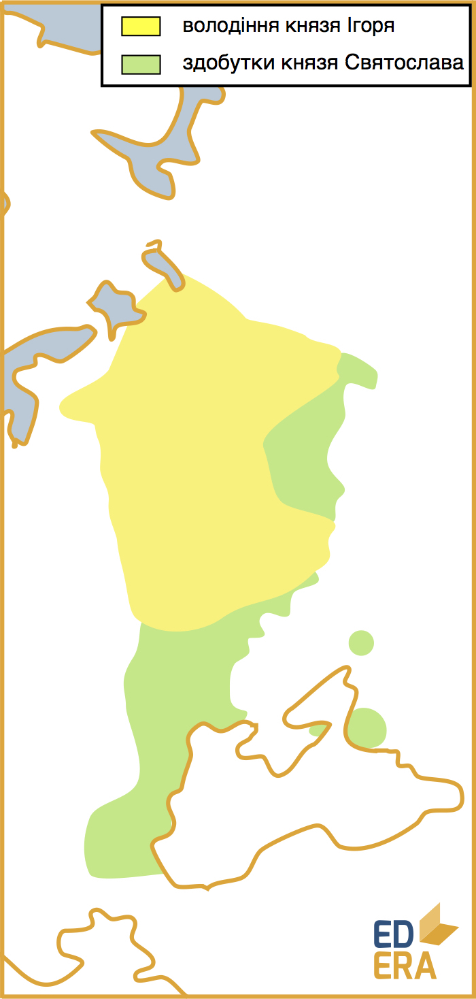
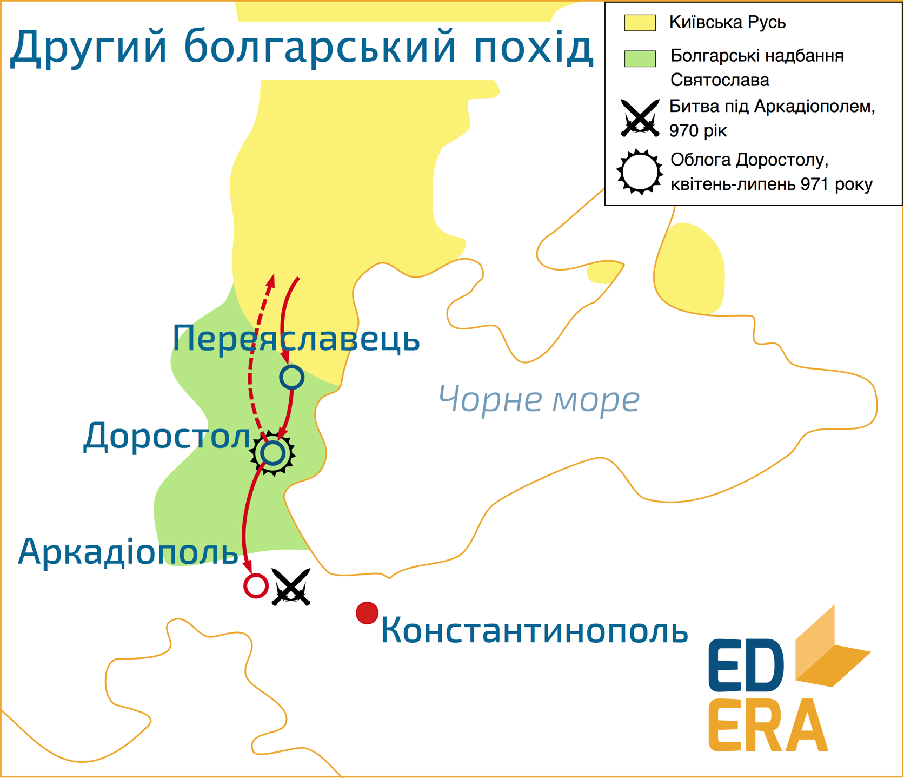
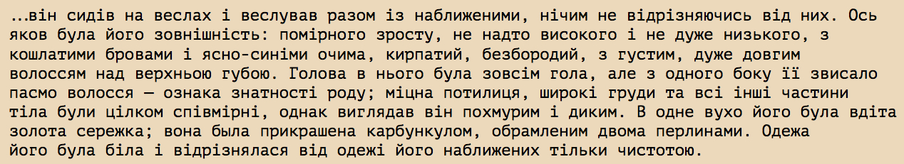

# Князь Святослав Ігорович (934-972)

Князь-лицар, князь-козак, воїн, а не політик, побратим, а не володар,
Олександр Македонський середньовіччя – якими тільки епітетами не
наділяли Святослава Ігоровича сучасники та історики. Пізно зійшовши на
київський престол (тривалість регентства на Русі, як бачимо, залежить
від регента, а не наступника), цей князь перекроїв карту Європи, змінив
розклад сил у ній, пройшов із походами більше 8000(!) кілометрів[^4] і
загинув біля Дніпровських порогів від підступної засідки. І це за 10-12
років!

Святослав провів у походах більшу частину свого князювання, рідко
буваючи в Києві. Щодо згаданої вище облоги Києва печенігами, то військо
під проводом князя відігнало печенігів від міста, проте оборона, як вже
було зазначено, була організована Ольгою. І саме вона контролювала і
правила за відсутності Святослава. Після смерті своєї матері князь
залишив у Києві старшого сина Ярополка, середній Олег став древлянським
князем, а молодший Володимир сів у Новгороді. Влада була розділена, і
Святослав міг продовжувати свої походи.

<iframe align="center" width="560" height="315" src="https://www.youtube.com/embed/VNgSa-lwQaA" frameborder="0" allowfullscreen></iframe>

 
Але повернемося у 964 рік. Це період першого походу Святослава, на той час
вже повноцінного Київського князя. Похід був здійснений на слов’янське
плем’я в’ятичів, що підкорялися та сплачували данину Хозарському
каганату. Підпорядкувавши в’ятичів Києву, Святослав попрямував до
Хазарії, спустошивши союзну їй Волзьку Булгарію. Вважається, що князь
мав лицарські переконання і перед нападом відправляв посланців із
повідомленням «іду на Ви». Отримавши цю звістку, каган хозарів вийшов
назустріч руським військам. Генеральна битва відбулася поблизу міста
Ітиль – столиці Хазарії. У літописах холодно і коротко описується
перемога русів, що відкрила шлях до багатств Ітилю. Після зруйнованої
вщент столиці настала черга інших великих міст каганату: Саркелу на
Дону, Семендеру та ін. Святослав намагався закріпити територію каганату
за собою, а не лише завоювати здобич. Так на місті зруйнованого Саркелу
постало руське поселення Біла Вежа, існують дані про військові залоги
русичів в Ітилі та Семандері, під контроль князя потрапила Тмутаракань –
місто на Кубані - і було утворене Тмутараканське князівство. Надалі шлях
князя попрямував на Північний Кавказ, де були переможені племена ясів та
касогів.

Наслідки

У результатi цього походу занепали такi значнi держави регiону, як Волзька Булгарiя та Хозарський каганат; руське вiйсько отримало видатну здобич; влада Києва роз- повсюдилась на важливий Волзький торговий шлях, Кубань та Дон (Тмутаракань та Бiла Вежа); консолiдувалися схiднослов’янськi племена. Проте, зруйнувавши Ха- зарiю, Святослав вiдкрив шлях на Русь кочовим народам сходу (печенiгам, надалi — половцям), що у майбутньому спричинить немало проблем жителям Русi.

Наступною ціллю Святослава стала потужна та прогресуюча Болгарія.
Подейкують, руку до русько-болгарського конфлікту приклала Візантія.
Існують свідчення, що Святослав приймав послів від Базилевса з цінними
дарунками та проханням розпочати військові дії проти болгар.
Візантійська імперія таким чином намагалася послабити одразу двох своїх
прямих конкурентів, адже Болгарія домінувала на Балканах, які були у
зоні візантійських інтересів, а Русь стрімко розвивалася та загрожувала
Царгороду зі сходу, зазіхаючи на його кримські володіння. Так чи інакше,
але 968 року Святослав на чолі 60-тисячного війська виступає у похід.
Увійшовши у гирло Дунаю та пропливши вглиб Болгарії, руське військо
спішилося та у першій же битві під Доростолом розбило болгар. Надалі
русичі зайняли більше 80 міст на дунайських берегах, а Святослав обрав
собі за резиденцію місто Переяславець, звідки де-факто правив Болгарією.
Проте сумна звістка змусила руське військо покинути мальовничі Балкани:
печеніги взяли в облогу Київ. Можна припустити, що печенізька військова
активність була простимульована Візантією, адже русько-болгарська війна
пройшла у зовсім іншому руслі, аніж собі планували візантійці. Замість
двох ослаблених виснажливою боротьбою країн, у Константинополі отримали
Русь із вишколеною у боях армією та з імперськими амбіціями домінування
у регіоні. Тому не виключено, що візантійські правителі вкотре вдалися
до стратегії «загортання вогню чужими руками». Святослав, відігнавши
печенігів, на деякий час затримався в Києві, адже Ольга, що керувала
обороною Києва та країною під час незліченних походів сина, не хотіла
його відпускати, а київська знать дорікала князю:

На що князь мав свою думку:

Святослав виношував мрію про дніпровсько-дунайську імперію зі столицею у
Переяславці на Дунаї, а для кращого керівництва Руссю він вирішив
розділити її поміж синами. 969 року княгиня Ольга померла, і Святослав,
бувши язичником, дозволив поховати її за християнським звичаєм. Після
поділу Русі та смерті матері його більше нічого не тримало у Києві, тому
був розпочатий другий болгарський похід.

<iframe align="center" width="560" height="315" src="https://www.youtube.com/embed/_2F2jOXz2FU" frameborder="0" allowfullscreen></iframe>

Могутнє руське військо досить швидко не лише повернуло князеві втрачені
болгарські землі, а й просунулося вглиб Болгарії. Проте війна, що мала
бути русько-болгарською, перетворилася на русько-візантійську. Святослав
на хвилі успіху увійшов до візантійської провінції Фракії і рушив у
напрямку Константинополя. За 100 км від столиці Візантійської імперії,
поблизу міста Аркадіополь, відбулася битва між двома арміями, у якій
греки зазнали значних втрат. Святослав отримав величезну данину та
військову славу, а імператор ліквідував загрозу для Константинополя, підписавши мирний договір. Сталося
це 970 року. Ситуація у регіоні стабілізувалася, а князь виношував нові
плани завоювань, сидячі на берегах Дунаю.

Проте у Царгороді не могли більше спокійно спостерігати за шаленими
військово-політичними успіхами русів. Тому у 971 році була знову зібрана
величезна армія, яка рушила на болгарсько-візантійський кордон.
Блискавичним ударом був захоплений Переяслав із невеликою залогою.
Основні сили руського війська знаходилися поблизу Доростола, куди і
відправилися візантійці. 23 квітня відбувся перший бій, у ході якого
сильнішими виявилися русичі. Імператорське військо відступило на велику
рівнину, почався новий бій. На цей раз сили були рівні, адже візантійці
безуспішно атакували, а руське військо оборонялося без шансів на
контратаку. Святослав дав наказ відступити за мури міста, і так почалася
тримісячна облога Доростолу. Звісно, повсякчас відбувалися невеликі
сутички між мобільними загонами двох армій. Проте стан міста в облозі
значно гірший за стан армії, що осаджує це місто, і, не маючи
можливостей вийти з Доростолу, Святослав вимушений був піти на мирну
угоду з візантійцями на їх умовах.

У результаті:

-   руські війська полишали Болгарію і не претендували на ці землі;

-   поновлювалися торгові та політичні зв’язки Києва та Царгороду;

-   Русь та Візантія створювали військовий союз;

-   імператор забезпечував продовольством усе військо князя у кількості,
    достатній для повернення у Русь;

-   Перше Болгарське царство[^5] перестає існувати, адже Візантія
    де-факто окуповує східні області Болгарії. Поки незалежний захід ще
    півстоліття був оплотом болгарської державності.

Візантійський історик Лев Діакон зберіг опис князя Святослава під час
підписання вищезгаданої угоди:

Михайло Грушевський у своїй «Історії України-Руси» підтримує цей образ

Сьогодні точаться дискусії з приводу достовірності даного опису. Певні
історики намагаються описувати київських князів патлатими та бородатими
дядьками у хутрових шапках. Цей опис притаманний володарям північніших
земель і не враховує впливу східної цивілізації на українські землі.
Тобто поставлена проблема має під собою історичний ґрунт, але ті, хто
лобіюють її неправдивість, частіше за все переслідують не історичні
цілі.

Повертаючись навесні 972 року до Києва, князь із невеличким загоном
потрапив у печенізьку засідку поблизу дніпровських порогів. Можна
припустити, що печеніги діяли за певної підтримки візантійців. Є
свідчення, що після підписання мирної угоди між князем та імператором,
із Візантії вирушив посол до печенігів. Якщо це так, то він мав
конкретну пропозицію та винагороду за її реалізацію. Адже мирна угода
легко порушується, а фізичне знищення такого видатного полководця і
політика значно полегшило б життя стагнуючій імперії. Такі методи
політики були нормою того часу, тим більше – для Візантії, а войовничі
кочові племена в усі часи були найкращими найманцями. Так чи інакше,
невеличкий загін князя було повністю знищено. Київ так і не дочекався
свого правителя, який змінив дніпровські кручі на дунайські береги. А
воїном він був настільки відомим і поважним, що печенізький хан Куря
зробив собі із черепа Святослава кубок і виносив його лиш найдорожчим
гостям. Така вона, середньовічна шана, цілком у дусі часу. Після
загибелі князя Русь лишилася під опікою трьох його синів, які розпочали,
по суті, першу міжусобицю.

Через сотню-дві років уся держава захлинеться кров’ю від міжусобних
війн, а поки – це конфлікт трьох братів.

[^4]: за версією О. Д. Бойка

[^5]: Болгарська держава на Балканах, що існувала 681—1018 роках. Історія Болгарії налічує декілька періодів царств, які мають порядкову нумерацію.

<quiz correctLabel="correct" incorrectLabel="incorrect" checkLabel="check">
    <question text="">
        
Основа зовнішньої політики Святослава Ігоровича –

        <answer correct>загарбницькі походи</answer>
        <answer>чисельні політичні союзи, міжнародні договори та торгівельні зв’язки з іншими державами, тобто, лише політичні інструменти</answer>
        <answer>стримання агресивних сусідів. Жодних загарбань, проте активне посилення кордонів та оборонної міці Русі.</answer>
        <answer>політичні шлюби своїх дітей та нащадків видатних європейських володарів</answer>
        <explanation>Якщо ви обрали варіант з політичними шлюбами, вітаю, ви непогано орієнтуєтеся в історії України. Проте, разом з тим, трохи забігаєте наперед, адже цей факт стосується Ярослава Мудрого, про якого мова піде далі.
        </explanation>
    </question>
    <question>
        
Візуально Святослав був подібний до

        <answer>половецького хана</answer>
        <answer correct>запорізького козака</answer>
        <answer>середньовічного лицаря</answer>
        <answer>розбійника</answer>
    </question>
    <question>
        
Князь Святослав загинув

        <answer>970 року</answer>
        <answer>971 року</answer>
        <answer correct>972 року</answer>
        <answer>974 року</answer>
    </question>
</quiz>