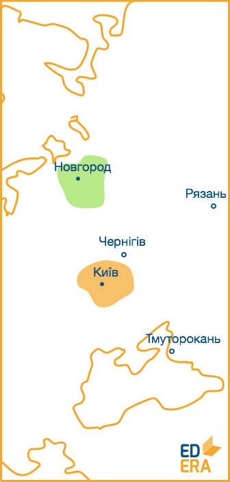

# Утворення Київської Русi 1/3

З часів появи слов’ян до утворення Київської Русi пройшло декiлька столiть. У цей перiод державнiсть схiдних слов’ян розвивалася шляхом утворення так званих племiнних союзiв. Це були об’єднання племен та родiв пiд проводом патрiархiв зi спiльними вiруваннями. Надалi цi утворення еволюцiонували в князiвства на чолі з вождями, а потiм – iз князями. Вiдомо близько 14 великих союзiв племен: древляни, поляни, сiверяни, тиверцi тощо. З часом найбiльш могутнiм став союз полян i дулiбiв. Проте перськi та арабськi iсторики видiляють декiлька ранньофеодальних слов’янських державних утворень.

**Наприклад**, *Славія* із центром у *Новгороді*, *Куявія* із
центром у *Києві*. Також у їх творах описується *Артанія* із центром
в *Арті*, проте версії того, яке ж реальне місто мали на увазі перси і
араби, суттєво різняться: від Тмутаракані до Рязані і Чернігова.

<quiz correctLabel="correct!" incorrectLabel="incorrect!" checkLabel="check ansert">
    <question>
    
Оберіть правильне, на ваш погляд, твердження

        <answer>Час утворення Київської Русі співпав з початком формування слов’ян</answer>
        <answer correct>Спочатку сформувалися слов’яни, а потім, через декілька століть, утворилася Київська Русь</answer>
        <answer>Східні слов’яни сформувалися у перше століття існування поліетнічного державного утворення під назвою Київська Русь</answer>
        <answer>Київська Русь утворилася із прадавньої слов’янської держави Артанії</answer>
    </question>
</quiz>
