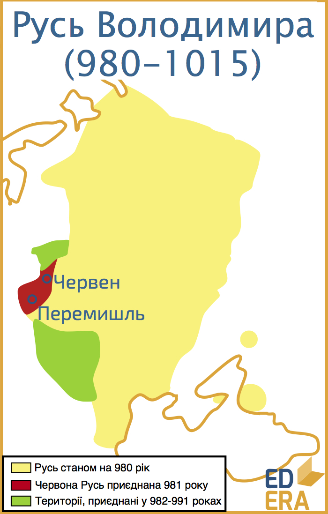
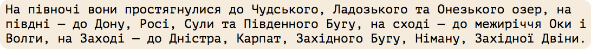
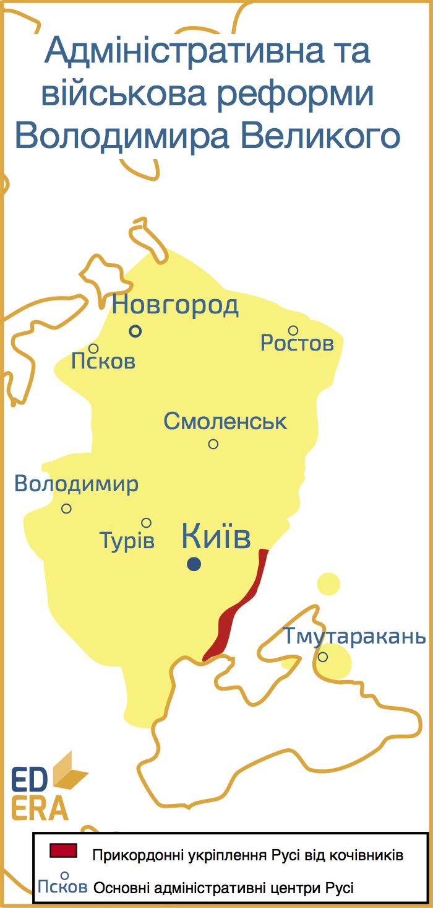

Володимир (958-1015)
====================

Великий, Хреститель, Святий, Красне Сонечко – якими тільки епітетами не
нагороджували молодшого Святославовича сучасники, нащадки та історики.
Дійсно, стільки реформ та зрушень відбулося за період князювання
Володимира, що лишити його без прізвиська історія не змогла. Почав
княжити Володимир у 980 році. Найпершим його здобутком на престолі стало
об’єднання усіх земель східних слов’ян в одній державі. Звісно,
об’єднання відбувалося силою, а хронологія його походів така:

* 981 року була завойована Червона Русь із містами Червеном та Перемишлем;
* 982 – остаточно приєднані до Русі в’ятичі, яких обклав даниною ще
батько Володимира;
* 983 – приєднано землі балтійського племені ятвягів;
* 984 – завойовано землі радимичів;
* 985 – князь розпочинає військові дії проти Волзької Булгарії. Війна
точиться зі змінним успіхом, проте мир підписаний на умовах, вигідніших
болгарам. Того ж року данню обкладається занепадаюча Хазарія; 

* 988 року розпочинається так звана Корсунська війна.
Передумовою для неї стала руська військова поміч Візантії, за яку було
обіцяно руку сестри імператора для київського князя. Проте після
вирішення своїх проблем за допомогою війська русичів, базилевс
відмовився від свого слова і Володимир, щоб покарати греків за обман,
йде походом на головну колонію Константинополя у Криму – місто Херсонес
(Корсунь). Після тривалої облоги і допомоги зрадників-містян Херсонес
здався, а руським військом були загарбані великі території Криму, аж до
Керченського півострова. Для деескалації конфлікту імператор таки дає
згоду на одруження своєї сестри з Володимиром. Останній, у якості викупу
за наречену, повертає Херсонес під владу візантійської корони.
* 991 — після походу у Прикарпаття у складі Русі опиняються білі
хорвати.

У результаті 10 років військових дій усі східнослов’янські племена
об’єдналися у межах однієї держави та остаточно сформувалася територія
Київської Русі. Вона стала найбільшою державою в Європі із площею більше
800 тис. км$^2$. Олександр Дмитрович Бойко у своєму підручнику «Історія
України» описує руські землі:

Заграбавши таку безмежну територію, Володимир провів *адміністративну*
реформу для кращого управління своїми землями. Вона полягала у передачі
усіх удільних князівств під контроль своїм дванадцятьом синам та
наближеним дружинникам.

Таким чином замість свавільних, часом непідконтрольних Києву місцевих
князьків із сепаратистськими настроями, Володимир отримав вірних та
відданих лише йому правителів. Навіть у найвіддаленіших куточках
держави. Владу було централізовано.

Володимир почав масштабно та систематизовано карбувати монету. Для обігу
Русі цілком вистачало арабської та візантійської монети, проте власний
платіжний засіб був політичним доказом самостійності та влади київського
князя.

Великою проблемою Русі лишалися набіги печенігів. Ось хронологія
основних: 990 рік, 992 року постраждав Переяслав, 993 та 996 роки, 997
року печеніги дійшли до Києва, у 1001 та 1013 роках вони виступали на
Русь у союзі з поляками[^8]. Щоб захистити свою державу, Володимир
запровадив *військову* реформу, яка також мала посилити централізацію
влади. Суть її полягала у роздачі земельних наділів на південних
кордонах у приватну власність «мужам лучшим». Останні, в свою чергу,
зобов’язувалися нести прикордонну службу з власними невеличкими
загонами. Таким чином, Володимир отримав на периферії своєї держави
віддане йому військо, не підвладне сепаратистським настроям, а пов’язане
з ним стосунками «сюзерен-васал».

А дружинники-прикордонники, б’ючись із ордами кочівників, захищали не
лише якогось абстрактного та віддаленого на сотні верст київського
князя, а свою власну землю. Така собі середньовічна психологія.

Також для оборони використовувалася величезна система валів, так званих
Змієвих. Деякі історики пов’язують їх будівництво з епохою Київської
Русі, проте є всі підстави вважати, що їх зведення завершилося за
декілька століть до утворення Русі. Питання їх створення та мети – тема
для окремої наукової роботи. Підкреслимо ж лише їх активне використання.

Щодо фактів, то при Володимирі активно розвивається камінне будівництво,
хоча й не уціліло жодної будівлі того часу. Закладаються міста Володимир
на Клязьмі (990), Бєлгород (991) та інші.

Наступною реформою стала *релігійна*. Вона визначила вектор розвитку
усього регіону, без перебільшення, на наступну тисячу років. Мова,
звісно, про прийняття християнства. Цей безумовно нелегкий вибір князя
Володимира буде розглянуто в окремому розділі. Поки необхідно зазначити,
що релігійна реформа розпочиналася зі спроб перетворити язичництво на
монотеїстичну[^9] релігію. Проте у русичів були досить різні улюбленці
серед величезного пантеону язичницьких богів, і визнання одного з них
важливішим за інші не сприяло централізації влади та об’єднанню руського
суспільства. А це, як можна помітити, була чи не основна мета Володимира
по закінченню активних військових дій.

Наприкінці свого князювання Володимир задумав ще одну суттєву зміну:
ігноруючи принцип престолонаслідування, він вирішив передати Київ свому
улюбленному сину Глібу. Звісно, це викликало непокору у старших синів
Святополка та Ярослава. Перший почав готувати заколот проти батька, за
що був кинутий у київську темницю, а другий відмовився платити щорічну
данину у розмірі двох тисяч гривень. Володимир збирає каральний похід на
Новгород, стольний град Ярослава, проте при підготовці до нього помирає
15 липня 1015 року у своїй заміській резиденції. Смерть Володимира
намагалися тримати у таємниці, адже Святополк, котрий знаходився у
Києві, спробував би узурпувати владу. Тіло князя тишком вивезли,
закутане у килими, та поховали у Десятинній церкві, яку сам Володимир і
наказав побудувати на честь хрещення Русі.

Досягнення Володимира Великого варті окремої наукової праці. Проте він
залишив по собі дещо більше, ніж просто свої здобутки. Після кривавої
міжусобиці, у якій загинула більшість Володимировичів, до влади прийшов
Ярослав, який не лише зберіг, а примножив могутність та престиж
Київської Русі. Володимир же був оспіваний при будь-якому режимі: при
імператорі його почитали за хрещення, при більшовиках – за об’єднання
слов’янських земель. В українській історіографії на першу позицію
виносять державотворчий талант Володимира, адже Україна небезпідставно
вважає себе наступницею Київської Русі. Дійсно, талановита людина – усім
зумів догодити.

[^8]: Захопивши Червону Русь, землі ятвягів та білих хорватів, Володимир зазіхнув на зони впливу Польського Королівства. До цього періоду не було відомо про значні русько-польські конфлікти. Надалі ж локальні конфлікти русів-українців та поляків стали невід’ємною частиною життя обох народів аж до середини ХХ століття. На сьогодні Польща – вірний партнер та друг України, перша країна, що визнала українську незалежність. Сталося це 2 грудня 1991 року.

[^9]: Монотеїзм – віра в єдиного Бога. Язичництво натомість мало цілий пантеон божеств. Історія довела ефективність монотеїстичної системи, адже абсолютна більшість людей у всьому світі вірять у того чи  dіншого, проте єдиного, Бога.