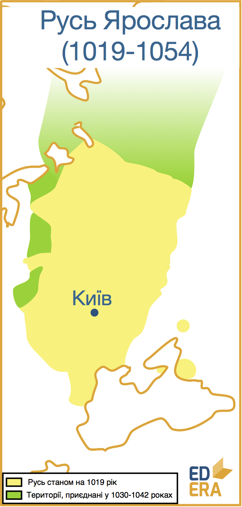

Ярослав (981-1054)
==================

На відміну від батька, Ярослав не вів загарбницьку політику, а
зосередився на внутрішніх проблемах країни – збереженні єдності та
захисту кордонів. Проте від початку правління, а саме – 1019 року, йому
необхідно було вирішити першочергову проблему.

Живим лишався брат Ярослава – Мстислав, князь тмутараканський, який все
ще був претендентом на київський престол. У 1023 році він збирає військо
і йде на Ярослава. Проте, зайнявши Чернігів, Мстислав не поспішає дати
генеральну битву своєму братові. Лише 1024 року біля Листвена відбувся
бій, у якому поразки зазнала дружина Ярослава. А ось реакція Мстислава
була досить незвичною:

Тобто було запропоновано, а надалі – реалізовано, дуумвірат
Володимировичів. Мстислав посів у Чернігові, а Ярослав вирішив лишитися
у Новгороді, вважаючись князем київським. Ставши стольним градом
Мстислава, Чернігів почав бурхливо розвиватися і за декілька років став
одним з найважливіших культурних та політичних центрів Русі. Брати разом
керували державою та військовими походами, допоки Мстислав не помер у
1036 році, захворівши на полюванні. Він був похований у ним же
збудованому Спасо-Преображенському соборі у Чернігові. А Ярослав став
одноосібним правителем Русі і, нарешті, переїхав до Києва.

<iframe align="center" width="560" height="315" src="https://www.youtube.com/embed/55-g4gekb6U" frameborder="0" allowfullscreen></iframe>

Військова політика Ярослава, хоч і не була агресивною і масштабною, все
ж таки мала місце:

* 1029 року відбувся похід на ясів, що загрожували Тмутаракані;
* 1030-1031 роки – польська кампанія, у якій Володимировичі підтримували
князя Безприма у його зазіханнях на польський престол та водночас
відвоювали Червону Русь;
* 1036 року військо Ярослава остаточно розбило сили печенігів, які так
довго шматували кордони держави. На честь цієї перемоги було закладено
собор Святої Софії;
* 1038 рік – похід на ятвягів;
* 1040 – на Литву;
* 1041 – у Мазовію;
* 1042 – проти балто-фінських племен ям та чудь;
* 1043 року відбувся останній похід русів на Константинополь, яким
керував син Ярослава – Володимир. І хоча руське військо зазнало поразки,
відносини між Києвом та Візантією продовжують тіснішати.

Все ж таки основою князювання Ярослава були будівництво, творення,
просвітництво, а не військові походи. Активно закладалися міста,
здебільшого у прикордонні: більше 13 поселень було засновано понад
Россю, Сулою та Трубежем – південними кордонами Русі (Корсунь, Біла
Церква, Торчеськ, Лубни); місто Ярослав у Червенській землі; Юр’їв у
Прибалтиці; Ярославль на берегах Волги. Також активізувалося будівництво
безпосередньо у містах: розростаються Київ, Чернігів, Турів, Переяслав,
Володимир-Волинський. 

<iframe align="center" width="560" height="315" src="https://www.youtube.com/embed/9NYOqX12CWY" frameborder="0" allowfullscreen></iframe>

Засновано Києво-Печерську лавру, Юр’їв монастир у Новгороді, Ірининський
собор, Золоті ворота та Лядську браму у Києві. За словами єпископа
Саксонії Тітмара, у Києві того часу проживало більше 50 000 тисяч
жителів та було більше 400 церков. Звісно, це доволі перебільшений опис,
проте він показує ставлення приїжджих європейців до столиці Русі як до
важливого культурно-політичного центру усієї Європи. Саме Ярослав
керував розвитком міста у такому напрямку.

Продовжуючи справу батька, Ярослав усіляко допомагав і стимулював
розвиток християнства на Русі. А у 1051 році князь зважується на
безпрецедентний крок: власноруч, без дозволу константинопольського
патріарха, затвердив митрополита київського. Ним став Іларіон – перший
русин-митрополит Київський. Такий крок мав на меті автономізувати руську
церкву, якомога зменшити вплив Візантії на її внутрішні справи.

У цей період стрімко, і під патронатом князя, розвивалися законодавство,
написання книг, освіта та дипломатія, але про це мова йтиме надалі і
більш конкретно.

Наприкінці свого князювання, відчуваючи наближення смерті, Ярослав
надумав реформувати принцип престолонаслідування на Русі, адже досвід
міжусобиць був не лише гірким і кривавим, але й повчальним. Принцип, що
існував, був «вертикальним»: батько предавав свій уділ старшому синові,
той – своєму старшому синові. Таким чином, усі інші сини позбавлялися
права на престол свого батька, що і викликало братські міжусобиці.
Ярослав запропонував «горизонтальний» принцип: після батькової смерті
престол переходить старшому сину, після смерті старшого сина –
середньому і так далі; після смерті усіх братів за тим самим принципом
право на престол отримують сини старшого брата.

Проте така реформа дала результат лише на перших порах, а конфлікт «брат
на брата» змінився конфліктом «дядько на племінника», адже сини не
хотіли чекати свого наділу від братів свого батька, бо, маючи велику
кількість дядьків, можна було і самому не встигнути покнязювати.
Обходячи усе нові і нові методи престолонаслідування, міжусобиця стрімко
набирала обертів, ховаючи під собою могутню державу.

20 лютого 1054 року Ярослав Володимирович помирає у Вишгороді. Його було
поховано у соборі Святої Софії, поряд із дружиною Інгігердою. А разом із
князем у минуле відходять і найкращі часи Київської Русі.

«Яблуко від яблуні…» – це саме про Володимира і Ярослава, батька й сина,
достойних один одного. Перший, загарбавши величезні території, ніби
проштовхався у ряд могутніх країн та родів, а другий, зберігши ці
території та поставивши культуру на перше місце у своїй державі, став
дійсно поважним правителем, рівним серед рівних у великій європейській
родині. Можна помітити, що для піднесення держави недостатньо
віртуозного керманича, необхідні і гідні послідовники. А наступного
такого успішного етапу державотворення українському народові (адже він
по праву вважає Русь попередницею сучасної Української Держави)
доведеться чекати ще півтисячоліття.

<quiz correctLabel="correct" incorrectLabel="incorrect" checkLabel="check">
<question text="">

У 1024-1036 роках Ярослав керував

<answer>Новгородським князівством, доки Мстислав князював у Києві</answer>
<answer>усією Руссю одноосібно з Києва</answer>
<answer correct>усією Руссю разом із братом</answer>
<answer>Мстиславом усією Руссю одноосібно з Новгороду</answer>
</question>
<question text="">

Собор святої Софії було закладено Ярославом на честь

<answer>повернення Червоної Русі</answer>
<answer correct>перемоги над печенігами</answer>
<answer>одруження княгині Анни із французьким королем</answer>
<answer>княгині Ольги – прабабці Ярослава</answer>
</question>
</quiz>