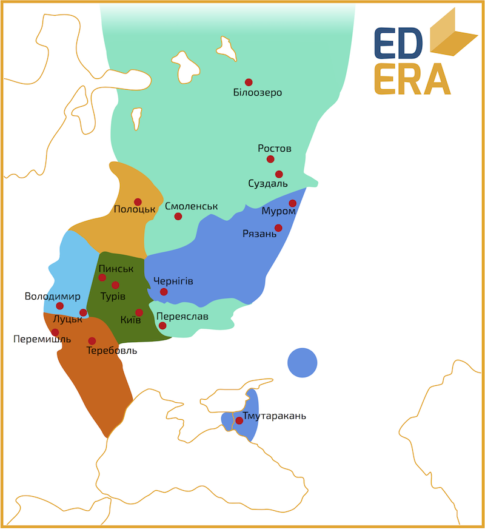

Битва на Альті. Київське повстання.
-----------------------------------

Половці не припиняли набіги на Русь. Черговий розпочався 1068 року.
Спільне військо князів вийшло назустріч кочівникам. Зустрілися дві армії
на березі річки Альти, де княжичі були нищівно розгромлені. Святослав
втік до Чернігова, а Ізяслав із Всеволодом – до Києва. У стольному граді
містяни зібрали віче і почали вимагати від Ізяслава озброїти їх, щоб
захищатися від половців, котрі могли піти на Київ.

Проте Ізяслав відмовив і кияни почали повстання: було зруйновано дім київського воєводи, князя Всеслава звільнили з порубу, а Ізяслав та
Всеволод втекли із Києва.

<iframe align="center" width="560" height="315" src="https://www.youtube.com/embed/WzKenT7vSwM" frameborder="0" allowfullscreen></iframe>

Декілька слів про приводи для повстання. Бажання та реакція киян були
цілком резонними – князь програв битву та не сприяв ініціативі киян з
оборони міста. Тим більше, ставлення до Ізяслава та його наближення було
не тепле. Тому він мав би поступитись княжим столом. Проте, як зазначає
П. Толочко, у князя просто не було резервів зброї та коней для
спорядження бодай десятої частини бажаючих. Тобто вимогу жителів міста
князь, навіть при шаленому бажанні, ніяк не міг виконати. Вимога,
озвучена на віче була неможливою для виконання. М.Грушевський та
О.Субтельний навіть називають це повстання «першою українською
революцією».

Так от, звільнений Всеслав був запрошений киянами на київський стіл, а
Ізяслав направився до Польщі за допомогою двоюрідного брата Болеслава
ІІ, князя польського. У той час Святослав у своєму уділі, у Чернігові,
збирає військо і вирушає назустріч половецьким полчищам. Бій відбувся 1
листопада 1068 року, Святослав переміг у декілька разів переважаючу
армію половців, навіть, за деякими даними, полонив половецького хана
Шарукана. Саме полоном хана пояснюють спад войовничості кочівників на
декілька десятиліть. Тим часом Ізяслав та Болеслав ІІ збирають військо і
вирушають на Київ, наблизившись до нього на відстань атаки навесні 1069
року. Всеслав, дізнавшись про поляків, що наближаються, втік у напрямку
Полоцька, де знову вокняжився через декілька років, пробувши київським
князем близько півроку. Фактично зраджені кияни, на вічі вирішили
покликати Святослава та Всеволода захистити місто від нападників із
заходу.

Всеволод і Святослав приїхали до Києва, щоб бути посередниками між
містянами та своїм братом. Це було перше протиставлення молодших
Ярославовичів Ізяславу, перший конфлікт інтересів між братами. Старшому
брату було запропоновано відвести війська та мирно вокняжитись у
столиці, а кияни приймуть його без опору, а у разі відмови Святослав та
Всеволод пообіцяли боронити місто та битися з братом.

Ізяслав направив до Києва свого сина Мстислава із невеличким загоном та
відпустив польське військо на «покорм» в околицях Києва. Як і за часів
Болеслава І, поляків починають тишком знищувати місцеві жителі і
Болеслав ІІ лишає Русь. А Мстислав із своїм загоном все ж таки покарав
частину киян за бунт, порушивши батькову обіцянку.

Із вступом Ізяслава на престол розпочався, умовно, другий період
тріумвірату. Брати шукали шляхи для стабілізації їх відносин. У 1072
році Ярославовичі зібралися у Вишгороді для зміцнення спільної влади,
проте відновлення колишньої єдності було неможливим. Через рік, у 1073
році, Всеволод і Святослав вступають у заколот проти Ізяслава, якому
закидали змову із Всеславом проти себе. Святослав займає Київ, Всеволод
– Чернігів, а Ізяслав знову тікає до Польщі. Але на цей раз Болеслав ІІ
не допомагає своєму родичу, а, відібравши частину майна, випроваджує з
Польщі, уклавши угоду із молодшими Ярославовичами. Ізяслав продовжив
свій шлях до Священної Римської імперії, де також не отримав допомоги
від імператора Генріха IV. Тоді старший Ярославович посилає свого сина
Ярополка до політичного противника імператора Генріха ІV – Папи
Римського Григорія VII. Останній добре прийняв руське посольство та 17
квітня 1075 року видав буллу[^2], якою коронував Ярополка та його батька
на Руське королівство зі столицею у Києві[^3]. Через декілька днів Папа
направив Болеславу ІІ повідомлення із засудженням його грабунку Ізяслава
та вимогою надання допомоги новому Руському королю.

Тим часом у Києві помирає князь Святослав, як каже літопис – через
невдалу операцію. Сталося це у самому кінці 1076 року. На початку 1077 у
Київ приходить Всеволод, проте править лиш декілька місяців, адже на
Київ знову насувалося польське військо: Болеслав ІІ послухав наказ Папи
та знову допоміг Ізяславові. Всеволод не дає бій брату, а лишає Київ,
відступивши до Чернігова. Так розпочалося вже третє київське княжіння
Ізяслава. Проте тривало воно недовго. Кінець 1077 – початок 1078 року
ознаменувався новою активністю полоцького князя Всеслава Брячиславовича.
У відповідь на його похід на Новгород (1077) відбулося два походи (1077,
1077-1078) на його вотчину. Другим керували обидва Ярославовича і,
нажаль, під час другого походу на Полоцьк була започаткована тенденція,
що надалі сприяла посиленню міжусобиць – у якості дешевих найманців у
бойових діях приймали участь половці. Покаравши Всеслава, Ярославовичі
отримали нових молодих князів, жадібних до влади, - повстали Олег
Святославович та Борис В’ячеславович. Вони, також за допомоги половців,
завдали поразки Всеволоду на річці Сожиці. Ізяслав прийшов на допомогу
молодшому брату і в жовтні 1078 року поблизу Чернігова відбулася
генеральна битва між дядьками та племінниками. У ній загинули князь
Ізяслав та Борис. Ця битва згадується у «Слові о полку Ігоревім». А у
Києві починає княжити Всеволод.

До речі, Ярополк Ізяславович так і не княжив у Києві, не дивлячись на
благословення Папи Римського. Після смерті батька він княжив на Волині,
конфліктуючи із онуками Володимира Ярославовича. У цій боротьбі йому
іноді допомагав Володимир ІІ Мономах, син Всеволода. Був підступно
убитий 1088 року своїм дружинником. Тіло Ярополка було доправлене до
Києва, де його зустрічали князь Всеволод та митрополит Іван ІІ. Поховано
його у церкві Св. Петра, яку було закладено самим Ярополком.

Всеволоду Ярославовичу випало керувати Руссю близько 35 років: 15
одноосібно, та ще близько 20 у складі тріумвірату. На початку князювання
Всеволоду довелось продовжити боротьбу із своїми племінниками (Романом
та Олегом Святославовичами), у якій перед тим загинув Ізяслав.
Святославовичі покликали собі на допомогу половців, що стало тенденцією
для молодих князів, які не мали доброго війська. Проте половців було
підкуплено Всеволодом і вони вбили Романа та вислали на Родос[^4] Олега.
Продовжилися конфлікти із Всеславом Полоцьким, щоправда бойовими діями
проти нього часто керував не Всеволод, а його син – Володимир Мономах,
котрий активно допомагав батькові у внутрішній політиці.

Всеволод Ярославович був освіченою та розвиненою людиною. Володимир
Мономах зазначав, що батько «сидячи вдома» знав 5 іноземних мов. Під час
його князювання у Києві були закладені церква Андрія Первозваного,
Михайлівський Видубицький монастир. У зовнішній політиці Всеволод
орієнтувався на Священну Римську імперію з Генріхом IV на чолі, з яким
одружилась княгиня Євпраксія Всеволодівна.

Помер останній із Ярославовичів у 1093 році. Його наступником став
Святополк ІІ Ізяславович. Саме зі зміною київського князя розпочалася
чергова масштабна міжусобна війна.

З 1094 по 1097 рік на Русі розгорнулася боротьба між Святославовичами
(Олегом, Ярославом та Давидом) та Святополком Ізяславовичем, якому
допомагав Володимир Мономах із синами. Боротьба розгорнулася за «вотчину
Святославову» – східноруські землі. На фоні вторгнення половців на Русь,
які періодично допомагали Святославовичам, та загибелі декількох князів
у битвах назріла необхідність мирного розподілу влади. Тому 1097 року
був скликаний Любецький з’їзд князів, на якому було розподілено Русь між
Рюриковичами та постановлено спільно боротися проти половців.

Тобто, влада розподілялася таким чином:

-   Святополку Ізяславовичу – Київ, Турів, Пінськ;

-   Володимиру Мономаху – Переяслав, Суздаль, Ростов, Смоленськ, Білоозеро;

-   Олегу та Давиду Святославовичам – Чернігів, Рязань, Муром, Тмутаракань;

-   Давиду Ігоровичу – Володимир-Волинський, Луцьк;

-   Васильку Ростиславовичу – Теребовль;

-   Володарю Ростиславовичу – Перемишль.

У результаті Любецького з’їзду:

1.  Володимир Мономах втрачав землі, що завоював, на користь
    Святославовичів;

2.  Встановлювався новий принцип передачі влади: за кожною гілкою
    Рюриковичів закріплювалась певна частина Русі і престолонаслідування
    відбувалося уже всередині новоутвореної династії. Таким чином, Русь
    із централізованої монолітної держави перетворилася на федерацію з
    умовно незалежних князівств. Процес розпаду Русі на удільні
    князівства став незворотнім.

Проте одразу після з’їзду чвари та кровопролиття продовжилися, на цей
раз за південно-західні наділи. І вдруге був оголошений князівський
з’їзд у Витечеві у 1100 році. За його результатами було покарано
(територіально) головного винуватця нової міжусобиці – Давида Ігоровича.
А вже 1103 року на іншому з’їзді князі вирішили виступати спільним
військом проти половців і атакувати їх у степу.

Це стало початком серії вдалих походів: 1103, 1107 та особливо успішного
1111 року(так званий «хрестовий похід» проти половців). Цікаво, що
лідером у цих походах був не київський князь Святополк, а Володимир
Мономах, саме йому приписували славу від звитяжних походів.

Під час князювання Святополка було збудовано Михайлівський золотоверхий
собор, у якому його було і поховано у 1113 році, після смертельної
хвороби.

Смерть князя спровокувала повстання киян. Святополк за життя потурав
лихварям, підвищив податки та ціни на продукти першочергової
необхідності (хліб, сіль), тобто посилилися феодальні утиски. Саме через
це і виступили містяни у квітні 1113 року. Віче постановило запросити на
київський престол Володимира Мономаха, що мав неабиякий авторитет та
повагу у русичів, здебільшого, через переможні походи на половців. Це
запрошення суперечило будь-яким принципам престолонаслідування, оголошеним до того. Проте київські бояри все-таки запросили Володимира. Ним одразу ж було прийнято «Статут Володимира Мономаха», який поліпшував становище незахищених верств населення. Тим самим було припинено народні хвилювання.

[^2]: Булла – документ, грамота, наказ, що видається Папою Римським. Назва походить від металевої печатки, якою і скріплювали документ

[^3]: Першість Ізяслава і Ярополка у когорті Руських королів – факт маловідомий і не достатньо підтверджений

[^4]: грецький острів у Егейському морі

