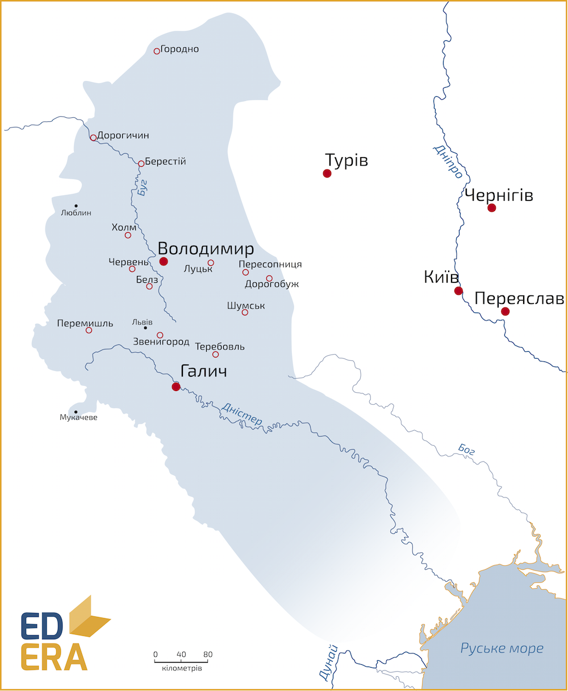
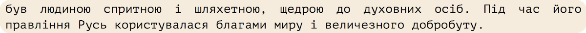

Данилові нащадки (1264-1349)
----------------------------

###  Лев I Данилович (1228-1301)

У Галицькому князівстві після смерті Данила правили троє його синів:
Лев, Мстислав та Шварно. Після смерті Василька Романовича королем стає
Лев І Данилович (хоча корону і не отримував, у джерелах іменується
королем[^4]; Шварно сидить у Холмі, далі – стає на декілька років
Великим князем Литовським і загадково помирає; у Володимирі у той час
княжить Володимир Василькович, з його смертю на Волинь переходить
Мстислав, який по своїй смерті у 1292 році нащадків не лишив.

Лев І правив з 1269 по 1301 рік і намагався продовжувати політику батька
щодо зменшення залежності від Золотої Орди та нарощення могутності
відносно західних Польщі та Угорщини. Проте Лев був активнішим у
зовнішній політиці: претендував на литовський та краківський престоли;
приєднав Люблінську землю та частину Закарпаття, через що територія
Галицько-Волинського князівства досягла свого історичного максимуму.
Столицю князівства переніс до «свого» міста – до Львова. Наступником
Лева став його син Юрій.

<iframe align="center" width="560" height="315" src="https://www.youtube.com/embed/SMGMSEMK5rg" frameborder="0" allowfullscreen></iframe>

### Юрiй I Львович (1252-1308)

Правити почав у 1301 році. Останній могутній і одночасно одноосібний
правитель Галицько-Волинського князівства. Ним було втрачено Люблін та
Закарпаття, проте міжнародний авторитет його князівства-королівства
зростав. Через перенесення кафедри митрополита із Києва до
Володимира-на-Клязьмі звертається до Константинополя із проханням
утворення окремої Галицької митрополії[^5]. На що 1303 року дістає
згоду. Утворює військовий союз із Тевтонським Орденом для стримування
Польщі та Литви та протидії уже занепадаючій Золотій Орді. Економіка та
добробут громадян князівства зростає. Польський середньовічний історик
Ян Длугош так описував Юрія І

За деякими даними помер не 1308, а 1315 року. Лишив по собі двох синів:
Лева та Андрія.

### Лев II Юрiйович та Андрiй Юрiйович

Перша згадка про братів датована 1315 роком, саме з цим пов’язують іншу
можливу дату смерті Юрія Львовича. У цьому році брати підписали угоду із
Тевтонським Орденом про спільну боротьбу із Золотою Ордою. Проте
основною проблемою князівства стала Литва Гедиміна, що стрімко
розвивалася та зазіхала на галицько-волинські території. Для протидії
Литві було створено союз із польським королем Владиславом І. Лев сидів у
Галичі, а Андрій – у Володимирі. Брати загинули у 1323 році чи то у
битві проти ординців, чи то від отруєння литовцями. Після їх смерті
обірвалася династія Романовичів. Хоча існують дані про Володимира
Львовича, який номінально вважався галицько-волинським князем і Руським
Королем, хоча країною керували бояри. Але його особа більш ніж
таємнича.

### Юрiй II Болеслав (1298-1340)

Онук Юрія І Львовича, із династії П’ястів. Його було обрано на княжіння
за загальною згодою Польща, Литви, Угорщини та місцевого боярства. Але
замість маріонеткового князька цей союз отримав правителя, який
намагався проводити власну політику, за що його і було отруєно у 1340
році. При Юрії ІІ посилився вплив золотоординців, розпочалися
територіальні конфлікти із Польщею. Продовжував, як і попередники,
союзні відносини із тевтонцями. Підтримував торговців і міщан взагалі,
для чого 1324 року дарував Магдебурзьке право містові Володимир[^6], а
1339 – Сяноку. Це сприяло зростанню міст і напливу європейців різних
професій. Така вільна політика молодого правителя була не люба абсолютно
усім і його правління насильницьки завершилося у 1340 році. Юрій ІІ –
останній правитель Галицько-Волинського князівства, яке після його
смерті просто перестало існувати.

Любарт-Дмитро Гедемінович намагався закріпитися на цих землях, проте
більшість часу його володіннями були одне-два удільних князівства, а не
вся Галицько-Волинська держава. Розпочався 50-річний конфлікт за ці
землі між Польщею та Литвою, у результаті якого перша отримала Галичину,
а друга – Волинь.

[^4]: тут постає питання наслідування королівського титулу від Данила. Адже він розірвав угоду із Римом і, теоретично, міг би втратити право своїх нащадків на титул. І навіть якщо спадковий титул вважати невтраченим, то спадкоємця корони мають коронувати. Простіше кажучи, у спадок передається не королівський титул, а право на нього. І жодного з Данилових нащадків не було короновано згідно норм тогочасного права. Проте, міжнародна спільнота визнавала їх право на ці титули й іменувала їх відповідно. І на сьогодні прийнято вважати наступників Данила Королями Русі – *Rex Russiae*.

[^5]: у російській науці має назву Малоруської

[^6]: перше українське місто, що отримало Магдебурзьке право

<quiz>
<question>
	
Найбільшу територію Галицько-Волинська держава мала за правління

        <answer>Юрiя II Болеслава</answer>
	<answer>Юрiя I </answer>
        <answer>короля Данила</answer>
	<answer correct>Лева I</answer>
</question>

<question>
	
Галицька митрополія була заснована за

        <answer>Юрiя II Болеслава</answer>
	<answer correct>Юрiя I </answer>
        <answer>короля Данила</answer>
	<answer>Лева I</answer>
</question>
</quiz>