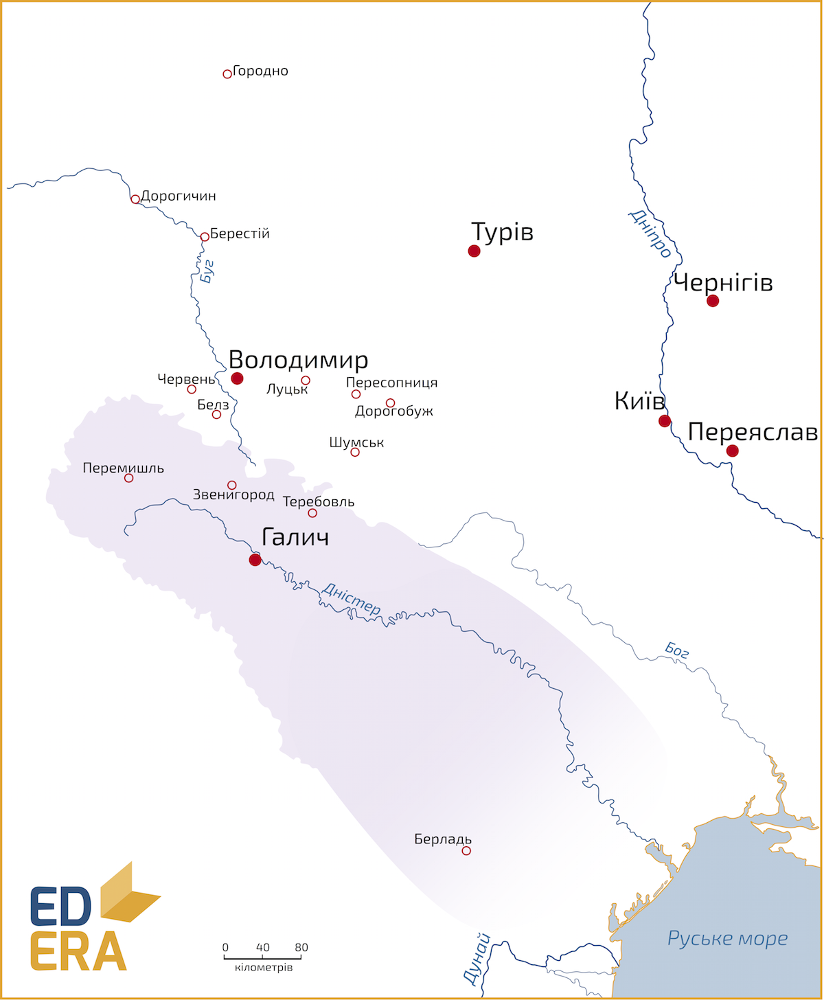

Галицьке князівство
===================

*Важливі міста*: **Галич**, Теребовль, Перемишль.

Цю територію населяли племена волинян, білих хорватів та тиверців.
Наприкінці Х століття Володимир Великий приєднує її до Київської Русі.
Надалі ці землі були спірними між Руссю і Польським королівством. У часи
належності до Русі ці землі були у складі волинського князівства, допоки
у 1084 році не виокремилися у Галицьке князівство під керівництвом
Рюрика, Василька та Володаря Ростиславовичів. Саме через це князівство
розпочалася міжусобиця 1097-1100 року. Остаточно об’єднав усі землі
Галицького князівства Володимирко Володарович у 1144 році, а головним
містом, вочевидь, став Галич.