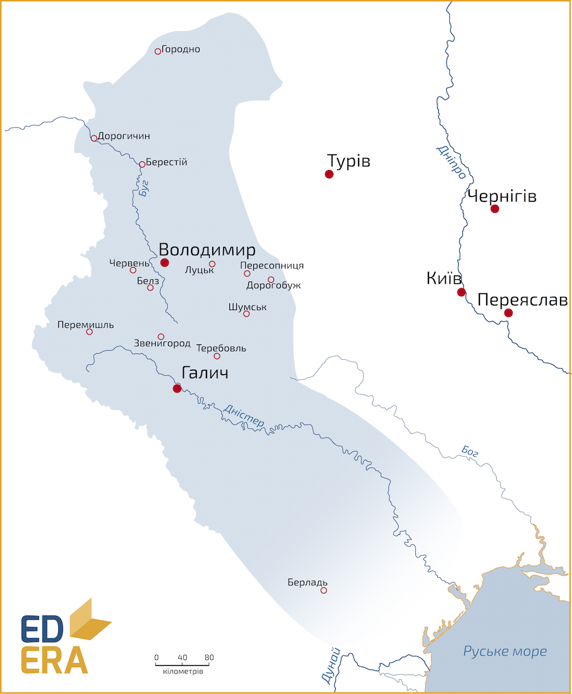

Галицько-Волинське князівство
=============================

<iframe align="center" width="560" height="315" src="https://www.youtube.com/embed/RhKUwQRfBm8" frameborder="0" allowfullscreen></iframe>

Об’єднанню сприяло віддалене розташування двох князівств відносно Києва,
спільні зовнішні вороги – поляки та угорці, сильна економіка для
незалежного розвитку та, звісно, лідери, які змогли об’єднати та
втримати доволі різні території.

