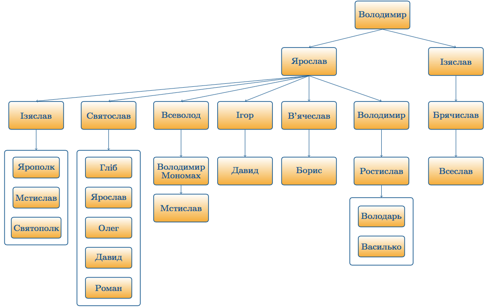

Генеалогічне дерево
===================

У даному дереві зазначені ті Рюриковичи, які були найбільш активними і
про яких йшла мова у цій частині. Реальна їх кількість більша, дерево
усіх нащадків – складніше.

<quiz>
<question>
	
У якій із даних гілок Ярославовичів усі представники були київськими князями? Нумерація від 1 до 6 зліва направо

        <answer>1</answer>
	<answer>2</answer>
        <answer correct>3</answer>
        <answer>4</answer>
 	<answer>5</answer> 
	<answer>6</answer>
</question>
</quiz>