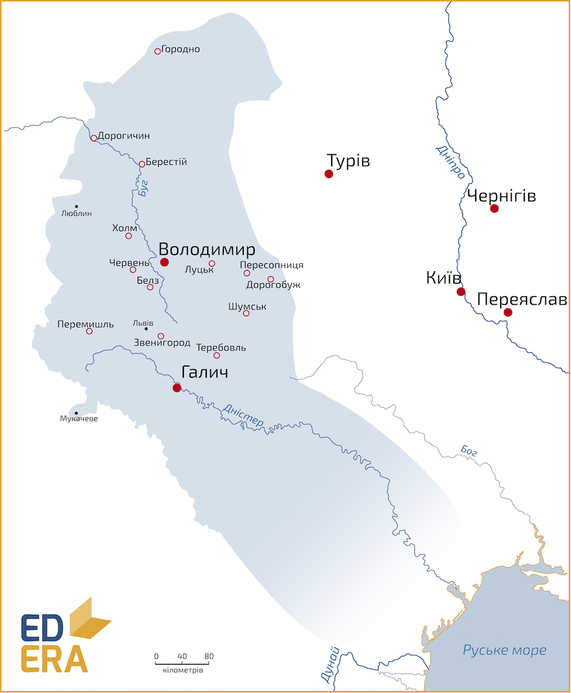

# Князь Лев I Данилович (1228-1301)

У Галицькому князівстві після смерті Данила правили троє його синів:
Лев, Мстислав та Шварно. Після смерті Василька Романовича королем стає
Лев І Данилович (хоча корону і не отримував, у джерелах іменується
королем[^18]; Шварно сидить у Холмі, далі – стає на декілька років
Великим князем Литовським і загадково помирає; у Володимирі у той час
княжить Володимир Василькович, з його смертю на Волинь переходить
Мстислав, який по своїй смерті у 1292 році нащадків не лишив.

Лев І правив з 1269 по 1301 рік і намагався продовжувати політику батька
щодо зменшення залежності від Золотої Орди та нарощення могутності
відносно західних Польщі та Угорщини. Проте Лев був активнішим у
зовнішній політиці: претендував на литовський та краківський престоли;
приєднав Люблінську землю та частину Закарпаття, через що територія
Галицько-Волинського князівства досягла свого історичного максимуму.
Столицю князівства переніс до «свого» міста – до Львова. Наступником
Лева став його син Юрій.

<iframe align="center" width="560" height="315" src="https://www.youtube.com/embed/SMGMSEMK5rg" frameborder="0" allowfullscreen></iframe>

[^18]: тут постає питання наслідування королівського титулу від Данила. Адже він розірвав угоду із Римом і, теоретично, міг би втратити право своїх нащадків на титул. І навіть якщо спадковий титул вважати невтраченим, то спадкоємця корони мають коронувати. Простіше кажучи, у спадок передається не королівський титул, а право на нього. І жодного з Данилових нащадків не було короновано згідно норм тогочасного права. Проте, міжнародна спільнота визнавала їх право на ці титули й іменувала їх відповідно. І на сьогодні прийнято вважати наступників Данила Королями Русі – *Rex Russiae*.
