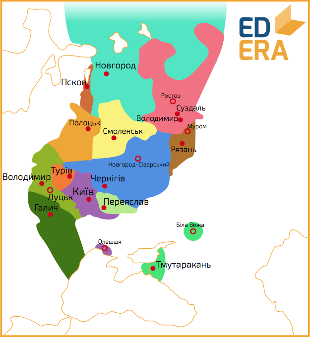

Роздробленість
==============

Якщо київських князів до Ярослава було легко просто запам’ятати, то
структурувати правителів Києва у період 1054-1132 років простіше
таблицею:

<table align="center">
<thead>
<tr>
<th>Роки правління</th>
<th>Правитель</th>
</tr>
</thead>
<tbody>
<tr>
<td>1054-1068</td>
<td>Ізяслав Ярославович</td>
</tr>
<tr>
<td>1068-1069</td>
<td>Всеслав Брячиславович</td>
</tr>
<tr>
<td>1069-1073</td>
<td>Ізяслав Ярославович</td>
</tr>
<tr>
<td>1073-1076</td>
<td>Святослав Ярославович</td>
</tr>
<tr>
<td>1077</td>
<td>Всеволод Ярославович</td>
</tr>
<tr>
<td>1077-1078</td>
<td>Ізяслав Ярославович</td>
</tr>
<tr>
<td>1078-1093</td>
<td>Всеволод Ярославович</td>
</tr>
<tr>
<td>1093-1113</td>
<td>Святополк Ізяславович</td>
</tr>
<tr>
<td>1113-1125</td>
<td>Володимир Всеволодович Мономах</td>
</tr>
<tr>
<td>1125-1132</td>
<td>Мстислав Володимирович Великий</td>
</tr>
</tbody>
</table>

<iframe align="center" width="560" height="315" src="https://www.youtube.com/embed/e2hKJM53iPQ" frameborder="0" allowfullscreen></iframe>

Надалі ситуація лише погіршувалася. У період із 1132 по 1246 рік, тобто
трохи більше ніж за сто років, 24 князі змінювали один одного 46 разів.
Тобто, у середньому, кожен князь із цього періоду двічі приходив на
київський стіл.

Але у історії у цілому, та в цьому випадку зокрема, усереднення
неможливе. Чому? З цих 46 періодів 35 тривали менше року. Зміни князів
проходили калейдоскопічно, декому вдавалося повернути собі престол.
Декому – не один раз це вдавалося, а Рюрику ІІ Ростиславовичу вдалося
здобути та втратити Київ 6(!) разів. Ці шість князювань тривали
приблизно стільки ж часу скільки одне, найдовше за цей період,
Святослава ІІІ Всеволодовича – 13 років. Досить довго, особливо на фоні
10-денного правління Ігоря ІІ Ольговича. Чому ж князів так страшенно
тягнуло до Києва? Київський великокняжий престол давав право відчувати
себе головою династії Рюриковичів, впливати та керувати справами менших
князівств. Звісно, Київ поступово втрачав політичну вагу, проте
символізм «матері міст руських» притягував амбітних князів. До того ж
тут розташовувався митрополит, що лишало його культурним та релігійним
центром Русі. А Київське князівство лишалося одним з найбільших та
найбагатших, ставши «першим серед рівних», а потім і втративши перше
слово цієї фрази. До речі, Київ «чудодійно» діяв на кожного нового
київського князя періоду міжусобиць. Новоспечений князь, що боровся з
іншими, захоплював, втрачав та ділив удільні князівства, селячись на
дніпровських схилах різко ставав поборником миру, спокою та
централізованої влади на Русі. Так боролися доцентрова та відцентрова
тенденції у руському суспільстві. Вочевидь, остання перемогла. Цьому
існує декілька причин:

<ol>
  <li>Система престолонаслідування. На Русі так і не закріпилася жодна із
    схем спадкування, що їх намагалися вводити князі. Як
    «горизонтальна», так і «вертикальна» схеми мали свої недоліки. Проте
    ці принципи змішалися і кожен міг трактувати своє право на престол
    (великий чи удільний) як йому буде завгодно. У результаті –
    нескінченний каталізатор[^6] міжусобних війн.
  </li>    

  <li>Територія та етнічний склад. На початок ХІІ ст. Русь все ще була
однією з найбільших держав Європи і давно перестала бути державним
утворенням слов’ян. Меря та чудь, литва та ятвяги, печеніги та
половці – близько 20 народностей населяло Русь. Швидке «конвеєрне»
приєднання земель значно випереджало за темпами формування органів
влади, розвиток інфраструктури і, як наслідок, утворення єдиної
руської спільності. Титульні слов’яни не встигали поглинати та
асимілювати інші народи.
  </li>
</ol>  

<iframe align="center" width="560" height="315" src="https://www.youtube.com/embed/DOjwtg9DNf0" frameborder="0" allowfullscreen></iframe>

<ol>
    <li value="3">Зміна центрів світової торгівлі. «Шлях із варяг у греки» сприяв швидкому розвиткові Києва, а занепад цієї артерії негативно відбився на місті. Спочатку Візантія відкрила свої порти венеціанським торгівцям, які у конкурентній боротьбі перемагали купців руських. А
    захоплення хрестоносцями Константинополя 13 квітня 1204 року
    відсунуло стольний град на периферію світової торгівлі. У той самий
    час розвивалася торгівля (як наслідок – зростало населення) у інших
    містах Русі: Чернігові, Галичі, Смоленську. Такі
    торгівельно-фінансові центри дають удільним князям економічну і,
    найголовніше, фінансову незалежність від уже умовного
    центру держави.
    </li>
</ol>

<iframe align="center" width="560" height="315" src="https://www.youtube.com/embed/tBxuesWS-V0" frameborder="0" allowfullscreen></iframe>

<ol>    
 <li value="4">Землеволодіння. Феодалізм і роздробленість взаємозалежні. Феодальне
    землеволодіння полягає у великій кількості відносно невеликих
    земельних володінь, а ці володіння, якщо налагоджують замкнений цикл
    виробництва сільськогосподарської лідера та власне невеличке
    військо, то воно ідеально відповідає державі періоду Середньовіччя.
    </li>
</ol>

<iframe align="center" width="560" height="315" src="https://www.youtube.com/embed/q54pZPB5Hr4" frameborder="0" allowfullscreen></iframe>

<ol>
 <li value="5">Кочівники. Печеніги, торки, половці мало того, що грабували та
спустошували руські землі, так іще й допомагали князям у їх
міжусобицях, розхитуючи Русь із середини. А коли збирались масштабні
спільні походи проти кочівників, витрачалося чимало ресурсів та
гинуло багато людей, в тому числі і князівської крові. Статична,
довготривала боротьба із армією без постійного місця дислокації не
укріпила ще жодну державу. Усі вади Русі як федеративної агонізуючої
держави показала монголо-татарська навала, коли замість об’єднання
та спільного протистояння кожен із удільних князів переслідував суто
свої інтереси. А програли, у результаті, всі, окрім монголів. Але
про це трохи пізніше.
 </li>
</ol>
    
Усе це, а особливо – переший та четвертий пункти, викликало збільшення
кількості удільних князівств, де-факто незалежних одне від одного. Після
1132 року протягом півстоліття утворилося близько 15 таких удільних
князівств. Через сто років їх стало більш ніж півсотні.

Проте роздробленість – не біда самої лише Русі, а закономірний виток
еволюції будь-якого нормального суспільства того часу: Франкська імперія
Карла Великого розпалася на менші утворення, Візантія під тиском
хрестоносців з одного та османів з іншого боку на певний час розкололася
на декілька імперій, Священну Римську імперію чекала та ж участь. Проте
саме феодальна роздробленість дала колосальний поштовх розвитку
економіки (господарства та ремесла) та зростанню кількості населення.
Демографічний вибух потягнув за собою і культурний розвиток. На Русі ці
процеси були дещо викривлені монголо-татарською навалою. Проте
демографічний, соціальний чинник є найважливішим, адже Народ є носієм
влади, культури, історії держави. Навіть якщо ця держава і перестає
існувати на невизначений час.

[^6]: *(хім.)* речовина, що прискорює реакцію, але не входить до її продуктів