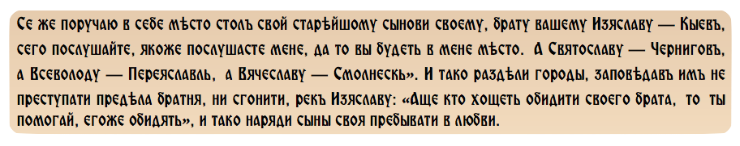
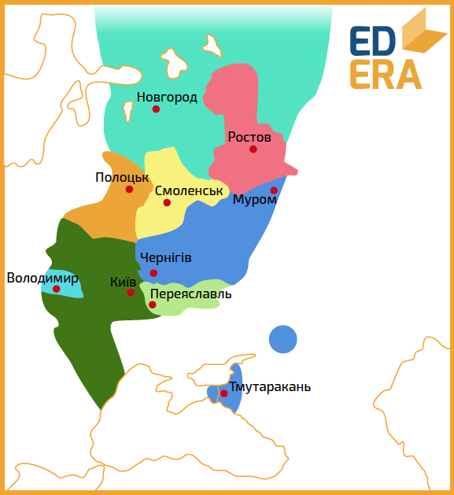

#Тріумвірат

Після своєї смерті (1054 рік) Ярослав залишив велику та могутню країну,
5 синів та новий принцип спадкування престолу. За «вертикальним»
принципом у Києві мав би почати княжити Ростислав Володимирович – єдиний
син старшого сина Ярослава, котрий помер у 1052 році. Але згідно з новим
принципом київським князем став найстарший живий Ярославович – Ізяслав.
«Повість» наводить слова батька своїм синам напередодні смерті:

Саме так і почався період «тріумвірату Ярославовичів», адже Ізяслав
керував Руссю на рівних із Святославом та Всеволодом. Ігор, В’ячеслав та
амбітний Ростислав не були достатньо активними. В’ячеслав помер 1057
року і у Смоленськ перебрався Ігор, що сидів у Володимирі-Волинському.
На Волинь поставили Ростислава. Ігор помер вже у 1060 році. Тріумвіратом
було вирішено не підіймати Ростислава далі по ієрархії князів, а просто
лишити у Володимирі. А вже у 1064 князь Ростислав покинув Волинь і
прогнав із Тмутаракані свого двоюрідного брата Гліба Святославовича. Там
новий князь правив 3 роки, поки його не отруїли греки із сусідніх
візантійських колоній. Таким чином, на початок 60-х років ХІ століття на
Русі не лишилося впливових лідерів, що змогли б впливати на політику
трьох Ярославовичів. Окрім одного.

Бiографiчна довiдка

<b>Всеслав Брячиславович</b> (1029-1101) – князь полоцький. Представник гiлки Iзяславовичiв Полоцьких, заснованої сином Володимира Великого Iзяславом. Iзяславовичi Полоцькi усiляко пiдкреслювали свою окремiсть серед Рюриковичiв, їх князiвство мало певну автономiю у Русi, а престол спадкувався усерединi гiлки. Мав певнi конфлiкти iз Ярославом Мудрим.

Саме Всеслав і кочові племена торків та половців були основною проблемою
тріумвірів на першому етапі їх правління – з 1054 по 1068 роки.

Так як наділом Всеволода був Переяслав – найпівденніше князівство, то
саме йому доводилося першим зустрічати та зупиняти кочівників. У 1054
році він запропонував мир і викуп замість битви половцям, що вперше
прийшли до кордонів Русі; 1055 року здійснив похід на торків. Ізяслав,
на відміну від Всеволода, що оборонявся, намагався розширити кордони
Русі: у 1058 році він захопив землі балтійського племені голядь. У 1060
році спільне військо трьох Ярославовичів та Всеслава вирушило на торків
та нанесло їм настільки нищівного удару, що ці племена не з’являлись
біля Русі 70 років. А вже наступного року знову Всеволод самотужки та
невдало протистояв половцям. Після цього нападу Переяславщина була
суттєво спустошена та розорена. Декілька років на Русі панував спокій,
допоки Всеслав не спустошив Псков (1065) та Новгород (1066). У відповідь
на це тріумвірат знову збирає об’єднане військо і у 1067 році
зустрічається із бунтівним князем на річці Немізі. Армія Ярославовичів
перемагає, а Всеслава хапають, відвозять до Києва та саджають у
поруб.[^1] До речі, саме у описі цієї битви у «Повісті» зустрічається
перша згадка про Мінськ.

[^1]: незвичайна в’язниця на Русі. Складалася із свіжозрубаних дерев, які, ніби частокіл, оточували ув’язненого; не мала вікон та дверей.

<quiz> 
<question multiple>
    
До складу тріумвірату входили:

    <answer correct>Ізяслав</answer>
    <answer>Всеслав</answer>
    <answer correct>Святослав</answer>
    <answer>Святополк ІІ</answer>
    <answer>Брячислав</answer>
    <answer correct>Всеволод</answer>
</question>

<question>
	
Уперше Мінськ згадується у

           <answer>1060 році</answer>
           <answer correct>1067 році</answer>
           <answer>1167 році</answer>
           <answer>1090 році</answer>
</question>
</quiz> 