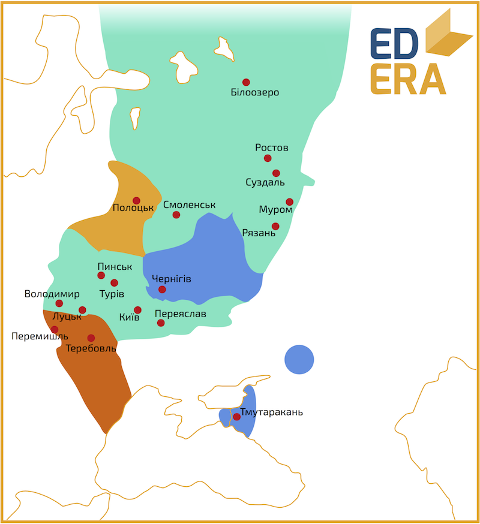

Володимир II Мономах (1053-1125)
================================

<iframe align="center" width="560" height="315" src="https://www.youtube.com/embed/FyA-zxIVVEY" frameborder="0" allowfullscreen></iframe>

Славу та могутність Володимир Мономах отримав ще до входження на
київський престол, будучи князем переяславським. Його князювання стало
«лебединою піснею» Русі, адже держава на короткий час наблизилася, хоча
й не повернулася, до своєї могутності минулих років. Які ж основні
здобутки Володимира Всеволодовича Мономаха?

1.  *Організація та керівництво злагодженою та успішною боротьбою руських князів проти половців;*

2.  *Літературна діяльність. До нашого часу дійшли: лист Мономаха до брата Олега Святославовича; «Повчання Володимира Мономаха» та автобіографічне оповідання «Про шляхи та лови»[^5];*

3.  Правова діяльність, направлена на нівелювання соціальної нерівності
    у руському суспільстві;

4.  Об’єднання 75% Русі – лише Галицька, Полоцька та Чернігово-Сіверська
    землі лишилися поза його владою. Тим самим призупинення розпаду
    Русі, зменшення сепаратистських настроїв та посилення централізації
    великокнязівської влади. Русь на короткий час повернулася до когорти
    наймогутніших держав Європи.

5.  Остання в історії русько-візантійська війна. Мономах підтримував у
    посяганнях на візантійський престол самозванця Лжедіогнеа ІІ, за
    якого навіть видав свою дочку Марію. 1116 року була перша спроба –
    військо Мономаха захопило багато міст по Дунаю. Після полону
    самозванця візантійськими воїнами київський князь продовжував
    військові дії, проте безрезультатно. І 1123 року було підписано
    мирну угоду, скріплену шлюбом онуки Мономаха та
    візантійського імператора.

До речі, саме при Володимирові розпочалися шлюби між представниками
різних гілок Рюриковичів, адже гілки уже цілком переросли у окремі
династії.

Помер Володимир Мономах у віці 71 року. Його було поховано у Софійському
Соборі, поряд із батьком.

[^5]: *курсивом* виділено – здобутки до входження на київський стіл