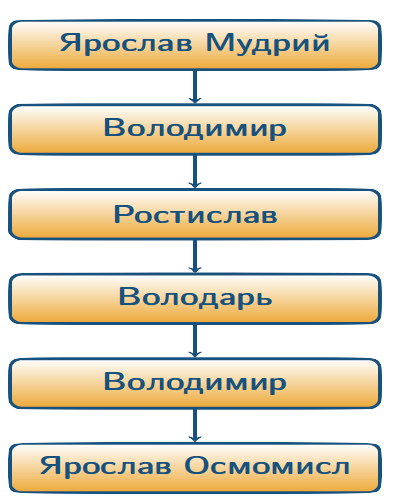
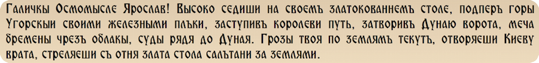

#Ярослав Володимирович Осмомисл (бл.1130-1187)

Досить могутнім це князівство стало за часів Ярослава Осмомисла: у
1153-1187 роках. По-перше, Ярослав успішно протистояв київському князю
Ізславу ІІ у боротьбі за незалежність від Києва. По-друге, територія
Галицького князівства значно розширилася: було приєднано дунайське
пониззя, землі між Карпатами та Дністром. Так описує князя та його землі
«Слово о полку Ігоревім»:

<iframe align="center" width="560" height="315" src="https://www.youtube.com/embed/v24V5kEOIug" frameborder="0" allowfullscreen></iframe>

Саме з цього твору і пішло прізвисько «Осмомисл» – той, що має вісім
смислів, тобто – розумний, мудрий.

Ярослав був одним з наймогутніших руських князів, підтримував дружні
стосунки із Суздальським князівством, сусідніми Угорщиною та Польщею,
Візантією та Священною Римською імперією.

У цей період розвивалося сільське господарство, торгівля, адже Ярославом
контролювалися усі основні ріки регіону: Дністер та гирло Дунаю.
Укріплялися та закладалися міста. Галицька земля процвітала.

Проте у 1170-х роках почалися боярські хвилювання, через які мав
рятуватися втечею син Ярослава – Володимир. Проте виступ бояр було
подавлено, а син повернувся до батька. Так у конфліктах з боярами,
союзами та війнами із київськими, володимирськими та суздальськими
князями і минуло князювання Ярослава Осмомисла.

Правив Ярослав 35 років. Був похований в Успенському соборі Галича.
Наприкінці 1930-х років його залишки були знайдені українським
археологом Ярославом Пастернаком. Проте їх знов було втрачено у роки
Другої світової війни і вдруге віднайдено у 1991 році.

Перед смертю він заповів Галич своєму незаконному сину Олегу, а
Володимиру – Перемишль. Проте бояри не послухалися князя і одразу після
його смерті Олег був прогнаний із князівства. Розпочався невеликий
занепад Галицького князівства, що тривав трохи більше 10 років до
об’єднання його із Волинським князівством.

За цей період Галицьке князівство окуповували угорці, проти них
підіймалося повстання, Володимир Ярославович тікав та повертався на
княжіння, рік правив волинський князь Роман Мстиславович, який і
об’єднає два князівства трохи потому.

<quiz>
<question>
	
За час князювання у Галичі Ярослав Осмомисл приєднав до свого князівства

        <answer>Полісся</answer>
	<answer>Червону Русь</answer>
        <answer correct>пониззя Дунаю</answer>
        <answer>Київське князівство</answer>
</question>

<question>
	
Основна причина динамічного розвитку торгівлі за Ярослава Осмомисла у князівстві – 

        <answer>чисельні торгівельні союзи з іншими князівствами</answer>
	<answer>знайдені поклади золота поблизу Галича</answer>
        <answer correct>контроль над Дністром та Дунаєм – найбільшими водними артеріями регіону</answer>
        <answer>особиста зацікавленність бояр</answer>
</question>
</quiz>
