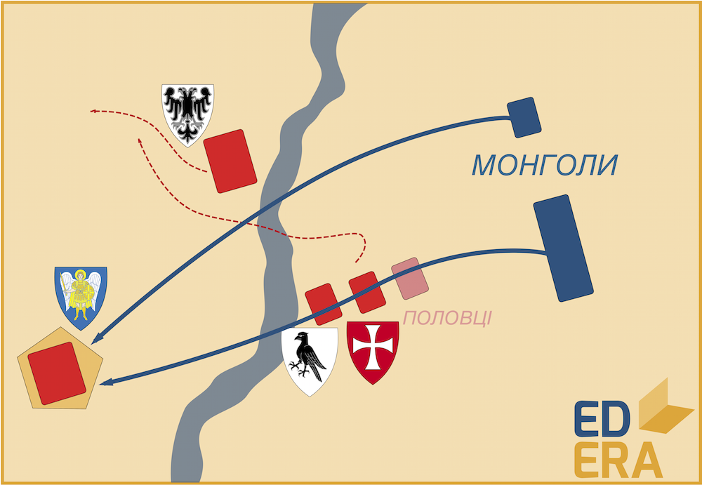

# Битва на Калці (1223 р.)

Перший контакт Русі і Золотої Орди пов’язаний, як не дивно, із
половцями. Руські князі виступили об’єднаним військом із половцями
назустріч ординцям за запрошенням половецького хана Котяна Сутоєвича .
Це було цілком логічною спробою зупинити монголів поза власною
територією, у половецьких степах. Також половці, у разі відмови
допомогти, могли б об’єднатися із ординцями і створити ще небезпечнішу
загрозу для Русі. Тому Мстислав Старий (Київ), Мстислав Удатний (Галич),
Мстислав Святославович (Чернігів), Данило Романович (Володимир) та ще з
десяток князів маленьких удільних князівств вирішили допомогти половцям,
з панівною верхівкою яких Рюриковичі встигла суттєво поріднитися
(звісно, шляхом шлюбів між представниками руської та половецької знаті).
31 травня 1223 року два війська зустрілися на берегах річки Калка[^22] у
Донецькому степу.

Монголи застосували тактику вдаваного відступу: вони зробили вигляд, що
відступають, а руські війська, повіривши в це, порушили стрій та
неузгоджено і невпорядковано почали переслідувати втікачів. Проте
відступав лише авангард, а розрізнені загони русичів неслися прямо на
основні сили ординців, котрі почали контрнаступ. Перемога монгольського
війська стала справою часу, а основним завданням русичів стало
виживання. Дійсно, згідно з літописом, військо захисників понесло значні
втрати (вказується цифра в 90% війська, яка є перебільшеною), в тому
числі і приблизно 10 князів. При чому, більшість князів та воєвод
загинула не на полі бою, а у монгольській пастці. Під час битви частина
руського війська укріпила свій табір та розпочала оборону, яка тривала
декілька днів. До них був відправлений монгольський гонець з обіцянкою
життя у разі припинення опору. Так як ситуація була передбачувана та
безперспективна, русичі згодилися. І монголи святкували свою перемогу,
постеливши колоди та дошки на лежачих руських князів та воєвод.
Подейкують, що ординська обіцянка була сформульована у вигляді

що формально було виконано. 

<iframe align="center" width="560" height="315" src="https://www.youtube.com/embed/U2-6Q_Hfu1I" frameborder="0" allowfullscreen></iframe>

Половці після битві на Калці у більшості
своїй мігрували на Кавказ, за Дунай та в Угорщину, а невелика частина
лишилася у складі орди та асимілювалася. Ординці, втомившись від довгого
походу та втративши багато живої сили, повернулися у степи Середньої
Азії, щоб повернутися через 17 років. А Русь, отримавши урок від Золотої
Орди, не вивчила його і ці 17 років були витрачені на чергові міжусобиці
та поділи сфер впливу. І коли монголи вдруге прийшли на Русь, вона була
так само неготова, як і першого разу.

1239 року монголо-татари, під проводом онука Чингісхана Батия, знов
підійшли до кордонів Русі. Це було частиною величезного західного походу
монголів 1236-1242 років. Розоривши північно-східні землі, 1240 року
монголи підійшли до Києва, який обороняв воєвода Данила Галицького
Дмитро. Довго і добре оборонившись під монгольською облогою, Київ все ж
таки не витримав і впав. Тоді і розпочалося одне з наймасштабніших
руйнувань та кровопролить величного міста. Фактично, саме 1240 року Київ
остаточно втратив будь яку політичну вагу, лишаючись лише рядовим
адміністративним центром, адже знадобилося не одне століття, аби Київ
оправився від руйнувань та збитків від ординської навали. А якщо
згадати, що під час постійних міжусобних конфліктів Київ не раз потерпав
від Руських князів (Юрій Довгорукий, Андрій Боголюбський, Рюрик ІІ), то
тривалий занепад «матері міст Руських» видається закономірним.

<iframe align="center" width="560" height="315" src="https://www.youtube.com/embed/iw_nyy17MKg" frameborder="0" allowfullscreen></iframe>

[^22]: точна ідентифікація цієї річки – предмет масштабної історичної дискусії

<quiz>
<question>
	
Битва на Калці відбулася у

        <answer>1240 році</answer>
	<answer>1230 році</answer>
        <answer>1234 році</answer>
	<answer correct>1223 році</answer>
</question>

<question>
	
Осадою Києва у 1240 році керував

        <answer>Тохтамиш</answer>
	<answer correct>Батий</answer>
        <answer>Темуджин</answer>
	<answer>Єсугей</answer>
</question>
</quiz>
