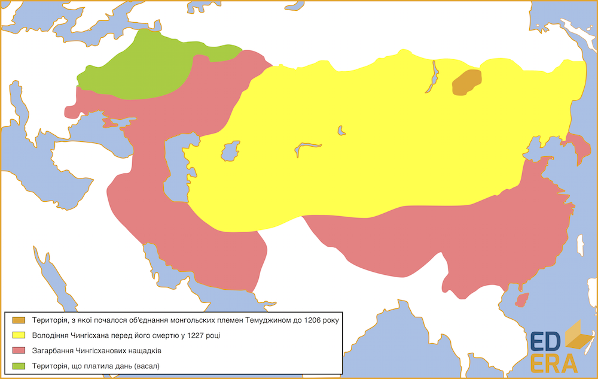
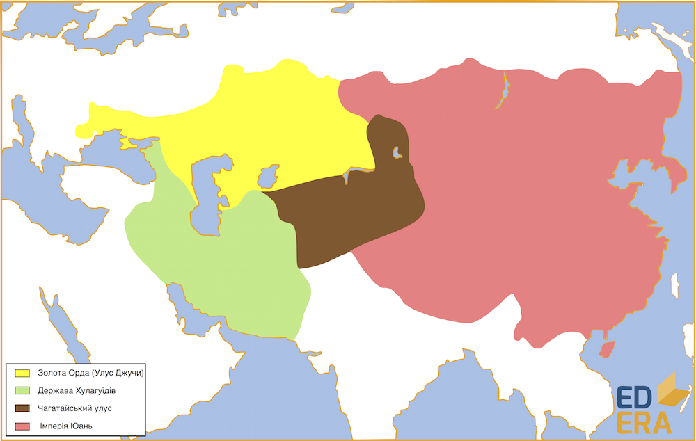

Монгольська імперія
===================

Монгольська держава зародилася на самому початку ХІІІ століття на
просторах сучасних Північно-Східного, Східного Сибіру та Монголії. Хан
Єсугей розпочав об’єднання монгольських племен і формування потужної
армії, проте був отруєний до завершення своїх планів. Цю справу
продовжив його син – Темуджин (Темучжин, Темучин), який на курултаї[^1]
1206 року отримав звання «Чингісхан»(«великий хан», «хан над ханами»),
під яким і увійшов в історію. Саме від 1206 року починається відлік
історія Монгольської імперії, яка за часів найбільшої могутності займала
територію від Тихого океану до Чорного моря. Вважається, що ця імперія –
найбільша за історію людства, із площею більше 20 млн. км$^2$ (у
дослідників ця цифра суттєво різниться від 20 млн. км$^2$ до майже 40
млн. км$^2$, проте у даному випадку точна цифра не важлива) та
населенням більше 100 млн. чол. До своєї смерті у 1227 році Чингісхан
встиг дійти лише до Каспійського моря, проте його нащадки продовжили
справу об’єднання величезних територій під своєю владою.

Правити імперією могли лише нащадки одного із чотирьох синів Чингісхана
від першої дружини, так була започаткована династія Чингизідів. Перед
смертю Темуджин поділив державу між вищезазначеними чотирма синами,
кожна частина називалася «улус».

Спочатку улуси були складовими однієї держави, проте великі території та
окрема політика володаря кожного улуса робили ці частини де-факто
незалежними державами. В принципі, Монгольську імперію згубили ті
недоліки, які мала Русь перед монгольською навалою і які заважали Русі
достойно захищатися:

-   велика територія;

-   поділ держави на частини;

-   боротьба нащадків Чингісхана за титул Великого хана (на Русі -
    Рюриковичі та Великий князь Київський).

[^1]: Курултай – у тюркських народів – всенародний з’їзд, який відіграє роль законодавчого органу.