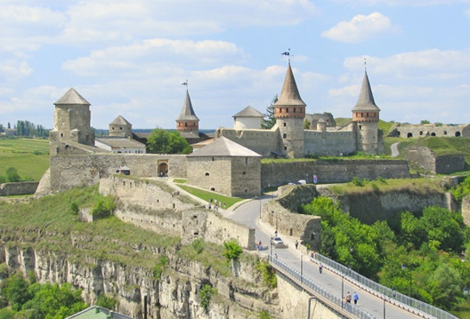
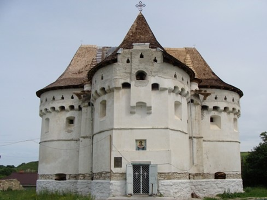
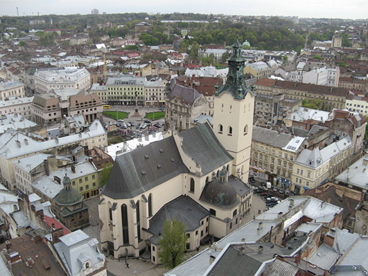

# Архітектура і містобудування

<iframe align="center" width="560" height="315" src="https://www.youtube.com/embed/TlzY9gfAsrY" frameborder="0" allowfullscreen></iframe>

Містобудуванню було характерне поєднання традицій Русі та західноєвропейських принципів побудови міст у зв’язку з поширенням магдебурзького права. Широко застосовувалися прийоми регулярного планування: місто поділялося на своєрідні квартали, в центрі яких розташовувалася **ринкова (торгова) площа**, на якій будувалася ратуша, торгові лавки й будинки ремісників та торговців, а поруч знаходилися основні храмові та церковні будівлі. Ринкова площа поставала центром адміністративного, економічного та духовного життя.

Вагоме місце посідали й оборонні споруди, які захищали від нападів таких загарбників, як татари й турки. Будувалися замки, переважно дерев’яні, та фортеці в основних і найбільших містах: Києві, Житомирі тощо. Однак, у той же час розпочалася побудова й розбудова мурованих з каменю оборонних замків і фортець в таких містах, як Луцьк, Хотин, Львів, Кам’янець-Подільський, Мукачеве та інших. 

Однією з перших і найпотужніших мурованих оборонних фортець був *Верхній замок у Луцьку*, що на Волині, який був побудований за Любарта Гедиміновича в XIV ст. На Поділлі важливою була оборонна *Кам’янець-Подільська фортеця*, а також *Хотинська фортеця*, яку в другій половині XV ст. перебудували та значно укріпили. Наприкінці XIV ст. на Закарпатті звели *Мукачівський замок* за сприяння Федора Коріатовича. Значну оборонну потужність мала й *Білгород-Дністровська (Аккерманська) фортеця*. 

<i>Кам'янець-Подільський замок</i>, 
автор фото: Håkan Henriksson (Narking)

Храми і монастирі теж зводилися за подібними принципами з метою оборони та запобігання їхнього руйнуванню чи спаленню внаслідок загарбницьких нападів ворогів. До важливих пам’яток мурованого будівництва належать *церква Св. Юра*, *Вірменська церква Святого Миколая* в Кам’янці-Подільському та інші. 

На Поділлі зводилися одночасно як культові, так і оборонні храми, що зумовлювалося його розташуванням в прикордонній смузі. До прикладу, *Покровська церква-фортеця* в с. Сутківцях Хмельницької області є мурованою сакральною спорудою оборонного типу та водночас і храмом, і фортецею.

<i>Покровська церква (Сутківці)</i>, 
автор фото: Вадим Войтик
 

На західноукраїнських землях, які перебували під владою Польщі та Угорщини з поширенням католицизму зросла кількість будівель готичного стилю. Зводилися костели, синагоги залежно від домінування тієї чи іншої релігійної громади. Однією з найдавніших споруд, в якій присутні елементи готики є *церква Різдва Богородиці* в Рогатині. У Львові яскравими готичними пам’ятками є *Латинський (римо-католицький) кафедральний собор Успіння Божої Матері*, а також *Вірменський собор Успіння Богородиці*. Основними характерними рисами готичного храму були великі готичні вікна у вигляді арок з вітражами, товсті муровані цегляні стіни та крутосхилий шпилястий дах. 

<i>Латинський кафедральний собор у Львові</i>
 

<quiz>
<question>
  
Одна з найдавніших споруд в якій присутні елементи готики

        <answer>Церква-фортеця в с. Сутківцях Хмельницької області</answer>
  <answer>Вірменська церква Святого Миколая в Кам’янці-Подільському</answer>
        <answer correct>Церква Різдва Богородиці в Рогатині</answer>
  <answer>Церква Св. Юра у Львові</answer>
</question>
</quiz>