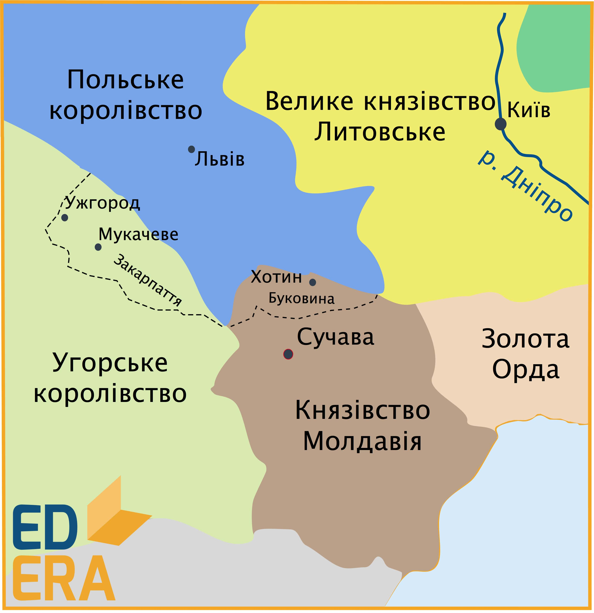
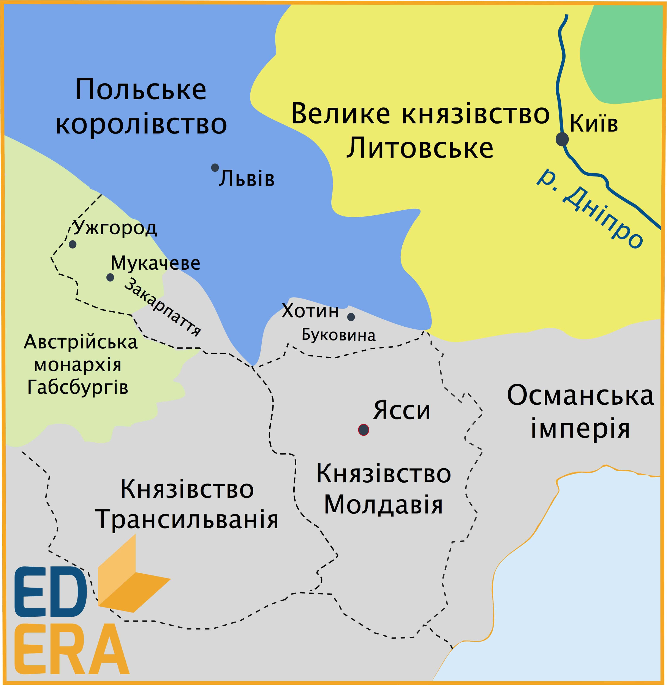

# Буковина у складі Молдавського князівства

<iframe align="center" width="560" height="315" src="https://www.youtube.com/embed/2Z8RpjyHPMg" frameborder="0" allowfullscreen></iframe>

У першій половині ХІІ ст. Буковина входила до складу Галицько-Волинської держави. У зв’язку із занепадом останньої після монголо-татарської навали, у першій половині XIV ст. північна частина Буковини перейшла під владу Золотої Орди. Внаслідок цьго, на територї Буковини відокремилася *Шипинська земля* (орієнтовано територія сучасної Чернівецької області), яка перебувала у залежності від золотоординців. Уже з середини XIV ст. Північна Буковина відійшла до Угорщини, де місцеве управління отримали у свої руки угорські намісники. На землях же південної частини Буковини активно розселилися волохи (румуни).

У **1359 році** внаслідок боротьби волоського та молдавського населення за створення власної держави утворилося самостійне *Молдавське князівство*, до складу якого на правах автономії потрапила й Північна Буковина (Шипинська земля). Щодо територіально-адміністративного устрою Буковини, то її територію було поділено на декілька волостей (повітів), що очолювалися старостами. Одним із найважливіших центрів волостей Молдавського князівства було *місто Хотин*, оскільки, будучи торгівельно-ремісничим пунктом на лінії кордону, там було розбудовано добре укріплений замок-фортецю. 

У середині XV ст. автономія Шипинської землі поступово ліквідовувалася в результаті розподілу її території на Чернівецьку та Хотинську волості. Із часом зникла й назва «Шипинська земля», на заміну їй прийшла географічно-історична назва «Буковина». 

Розглядаючи становище місцевого населення в складі Молдавського князівства, варто зауважити, що воно практично не зазнавало національно-релігійних утисків, а населення, хоч і було особисто вільним, підлягало виконанню різних повинностей та сплаті податків. Через це не обійшлося й без повстань, найвідомішими з яких є виступи під проводом *Мухи* (**1490 р.**) та *Андрія Борулі* (**1491 р.**): обидва були придушені місцевою владою. 

Із кінця XV ст. Молдавське князівство перебувало у воєнних діях з Османською імперією, внаслідок чого турецько-татарські війська вторглися в **1538 році** на територію князівства та захопили його разом із Буковиною.

<quiz>
<question>
	
В якому році утворюється самостійне Молдавське князівство?

        <answer>1357 р.</answer>
	<answer>1358 р.</answer>
        <answer correct>1359 р.</answer>
	<answer>1360 р.</answer>
</question>
</quiz>