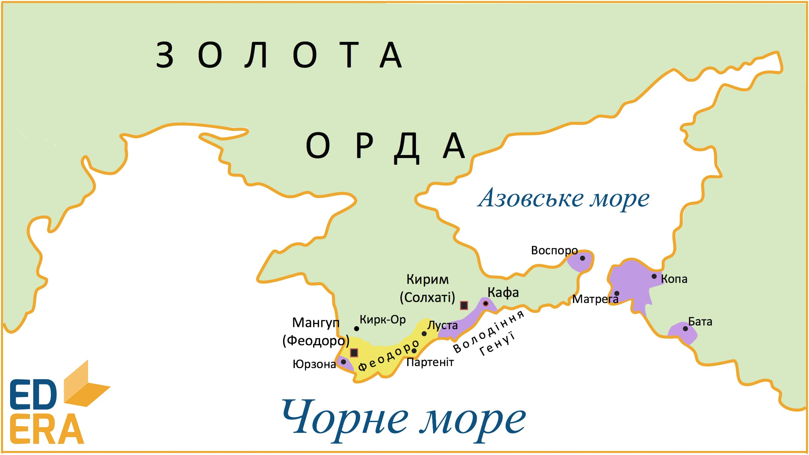

# Князівство Феодоро

<iframe align="center" width="560" height="315" src="https://www.youtube.com/embed/4PVglvIlVtE" frameborder="0" allowfullscreen></iframe>

На початку ХІІ ст. генуезькі купці закріплюються на південному узбережжі Криму внаслідок домовленостей із Золотою Ордою. Основними центрами їхніх володінь стають такі припортові міста як Кафа (сучасна Феодосія), Лупіко (Алупка), Джаліта (Ялта) та ін. 

У південно-західній частині Кримського півострову утворюється князівство Феодоро, столицею якого стало місто **Мангуп** *(Феодоро)*, та яке перебувало у залежності від Золотої Орди. Основна частина населення сповідувала православ’я, а саме місто Мангуп (Феодоро), стало центром православної митрополії, яка підпорядковувалася Константинопольському патріарху. Князівство перебувало у тісному союзі з Візантією, а також в дружніх відносинах із Кримським улусом, згодом Кримським ханством. Основним заняттям населення було землеробство, тваринництво, а також ремесло і торгівля. 

З падінням Константинополя у **1453 році** внаслідок його завоювання турками-османами, останні в **1475 році** захоплюють південне узбережжя Криму, включно з містом Мангуп (Феодоро). Князівство перетворилося в провінцію Османської імперії. 

<quiz>
<question>
	
Столицею Феодоро було місто

        <answer>Кафа</answer>
	<answer>Каламіта</answer>
        <answer>Солхат</answer>
	<answer correct>Мангуп</answer>
</question>
<question>
	
В якому році османськими військами було захоплено князівство Феодоро?

        <answer>1453 р.</answer>
	<answer>1470 р.</answer>
        <answer correct>1475 р.</answer>
	<answer>1480 р.</answer>
</question>
</quiz>