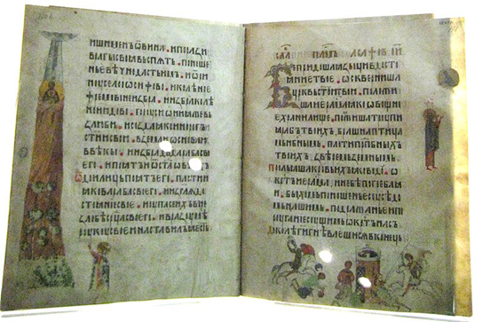
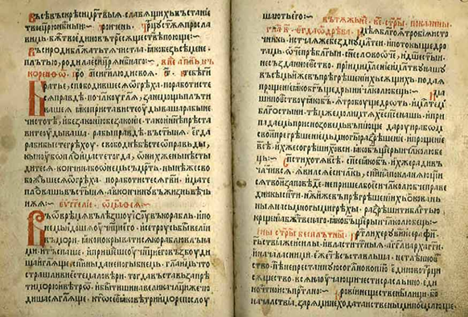

# Література та книгодрукування. Фольклор

<iframe align="center" width="560" height="315" src="https://www.youtube.com/embed/aKbQkg-HvHo" frameborder="0" allowfullscreen></iframe>

Стосовно світської та церковної літератури, то вона в XIV-XV ст. продовжує розвиватися, а Київ зберігає свій статус центру книгописання. Книги були рукописними й у зв’язку з цим дуже дорогі, що робило їх предметом розкоші та практично недоступними для пересічного населення. 

З творів світської літератури яскравим прикладом є збірник повчань **«Ізмарагд»**. Серед церковної літератури здійснювалося видання Євангелій, релігійних проповідей, житій святих. Так, однією з найвідоміших книг цього часу є **Київський Псалтир** із близько 300 мініатюрами на своїх сторінках, який був переписаний з константинопольського рукопису ХІ ст. протодияконом Спиридонієм у Києві в XIV ст. на замовлення смоленського єпископа Михаїла.

<i>Київський Псалтир Спиридонія</i>, 
автор фото: shakko

Своїми традиційними особливостями відзначалося літописання, центрами якого були такі міста як Київ, Львів, Острог, Луцьк та інші. Укладається **Короткий Київський літопис (Супрасльський літопис)** який висвітлює важливу інформацію про історичні події з *ІX ст. по 1515 р.*, та низка білорусько-литовських літописів відомих на сьогодні в багатьох редакціях. 

З винайденням **Йоганном Гутенбергом** у середині 1440-х років друкарського верстата поширюється книгодрукування. Основною мовою тогочасних книг була латина, однак наприкінці  XV ст. друкуються релігійні книги й на церковнослов’янській мові. Таким першодрукарем став **Швайпольт Фіоль** який у *1494 році* надрукував церковнослов’янською мовою (кирилицею) такі книги: *«Осьмогласник» («Октоїх»), «Часослов», «Тріодь пісна» і «Тріодь цвітна»*. 

<i>«Октоїх» Швайпольта Фіоля</i>

Поширеними на українських землях були і праці білоруського першодрукаря - **Франциска Скорини**, який у *1517 році* заснував у Празі друкарню, де видав кириличним шрифтом *«Псалтир»*, що був першою друкованою білоруською книгою. Окрім цього, ним було видано та перекладено близько 20-ти разів Біблію.

З усної народної творчості, яка розвивалася на традиціях Київської держави, найпоширенішою була обрядова поезія, з народним побутом і певним культовим магічним мотивом. Фольклор нерозривно пов’язувався із обрядовими святами літнього, осіннього, зимового та весняного циклів. Складалися веснянки, розповсюдженими були купальські (на свято Івана Купала) й жниварські пісні, ну і звісно колядки та щедрівки на Різдво.

Зароджується **епічна поезія**, яка являла собою *історичні пісні* та *балади, думи*, що прославляли народних героїв, як вигаданих і міфологізованих, так і реальних. Основним мотивом поставала боротьба супроти татарських і турецьких набігів, важке становище поневоленого населення тощо. Думи які виконувалися разом із грою на бандурі чи кобзі, оспівували любов до Батьківщини, потреби в її захисті, а також визначні події з історії. Яскравим прикладом цього жанру є *дума про «Марусю Богуславку»* з якою ви мали ознайомитися на уроках української літератури.  

<quiz>
<question>
  
У якому році вийшов друком «Осьмогласник» («Октоїх») Швайпольта Фіоля?

        <answer>1490 р.</answer>
  <answer>1517 р.</answer>
        <answer>1504 р.</answer>
  <answer correct>1494 р.</answer>
</question>
<question>
  
Хто винайшов друкарський верстат?

        <answer>Юрій Дрогобич</answer>
  <answer>Швайпольт Фіоль</answer>
        <answer correct>Йоганн Гутенберг</answer>
  <answer>Франциско Скорина</answer>
</question>
</quiz>