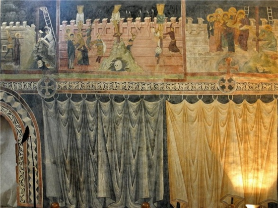

# Образотворче мистецтво

<iframe align="center" width="560" height="315" src="https://www.youtube.com/embed/XwR5itlgdOU" frameborder="0" allowfullscreen></iframe>

Розвивалося й образотворче мистецтво, провідним жанром якого залишалося малярство. Помітною рисою став відхід малярів від традиційних візантійських особливостей іконографії з метою передачі на своїх роботах душевного стану людини, її почуттів та емоцій. Людським позам та рисам обличчя надавалися виразність, відображувалася індивідуальність, опановувалася техніка світлотіньового моделювання. Це були типові особливості й риси західноєвропейського мистецтва того часу. 

Малярство представлялося здебільшого фресками та іконописом. Фресок до нашого часу дійшло небагато. Серед них відомими є виразні *фрескові розписи каплиці в Горянах під Ужгородом*, *Вірменської церкви у Львові*, та в інших храмах і палацах, зокрема Польщі (*розписи в каплиці Святої Трійці в Любліні 1418 р.* та *каплиці Святого Хреста Вавельського замку у Кракові 1470 р.*).

<i>Фрескові розписи в каплиці Святої Трійці в Любліні</i>
 

Техніка іконописання також удосконалювалася та набувала нових помітних рис під впливом європейських ідей гуманізму: використовували світлотінь і пряму перспективу. Із ХV ст. набували поширення ікони, які малювали на дошках, та ікони зі сценами Страшного Суду. Яскравим зразком іконописання цього періоду є <i>ікона Богородиці Одигітрії (Матері-Проповідниці)</i> з Волині, а також <i>ікона Богородиці з пророками з церкви в Підгородцях</i>. Остання виконана у візантійському стилі, її особливістю є те, що на іконі зображені як старозавітні, так і новозавітні персонажі, що символізує поєднання Старого та Нового Завітів. Ще одним видатним твором іконопису є <i>ікона Юрія Змієборця, с. Звиженя</i> Львівської області.

Внаслідок поширення католицизму помітно розвивалася скульптура, оскільки статуями прикрашали католицькі храми і костели. Продовжувало вдосконалюватися орнаментальне різьблення, в якому, окрім рослинних і тваринних орнаментів, поширювалися геометричні фігури.

Книжкова мініатюра, як і книгописання, також набували нових рис. Яскравою пам’яткою тогочасної мініатюри є <i>Київський Псалтир 1397 року</i>. У ньому вміщено близько 300 ілюстрацій, сюжети яких різноманітні (від біблійних до побутових мотивів), а самі зображення відзначаються індивідуальністю та виразністю, свіжістю кольорів.  Окрім нього, художньою виразністю відзначається <i>Галицьке Євангеліє XIV ст.</i> і <i>Радзивіллівський літопис XV ст.</i> зі значною кількістю мініатюр на історичну тематику.

<quiz>
<question>
  
Яка ікона виконана у візантійському стилі та особливістю якої є те, що на іконі зображені, як старозавітні, так і новозавітні персонажі?

        <answer>ікона Богородиці Одигітрії (Матері-Проповідниці)</answer>
  <answer correct>ікона Богородиці з пророками з церкви у Підгородцях</answer>
        <answer>ікона Юрія Змієборця із с. Звиженя</answer>
  <answer>Вишгородська ікона Божої Матері</answer>
</question>
</quiz>