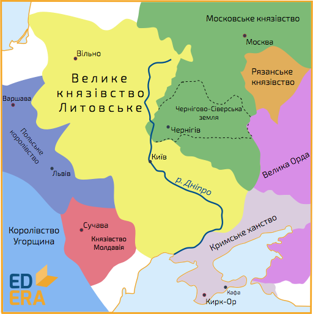

# Посилення Московської держави та входження Чернігово-Сіверщини до її складу

<iframe align="center" width="560" height="315" src="https://www.youtube.com/embed/pD3SKn4UpoU" frameborder="0" allowfullscreen></iframe>

З другої половині XV ст. Московське князівство посилює свої позиції на міжнародній арені, що призводить до боротьби із Великим князівством Литовським за «руську спадщину», тобто за україно-білоруські землі. Причиною цьому стало бажання московського князя Івана ІІІ об’єднати всі землі минувшої Київської Русі під зверхністю Москви, узявши собі титул «Государя всієї Русі» та активно просуваючи доктрину так званого «третього Риму».   

Внаслідок ліквідації литовцями на українських землях удільних князівств, посиленням впливу католицизму, окремі українські та білоруські князі переходять на бік Москви. Так, на початку XVІ ст., вчинили князі Чернігово-Сіверщини, через що, розпочинається військова боротьба між ВКЛ та Москвою, наслідком якої стало закріплення в **1503 році** за Московським князівством Чернігово-Стародубського та Новгород-Сіверського князівств. **1508 року** Литва підтверджує свою відмову щодо цих земель на користь Московської держави: приєднані території поділяють на повіти, з очільниками - воєводами, які були поставлені на заміну попереднім князям.

З 1512 року військові дії з боку Москви проти Литви поновлюються. В сферу інтересів Московії тепер потрапила територія західної частини Смоленщини. **1 серпня 1514 року** московським військом взято місто Смоленськ. Вирішальна ж битва відбулася **8 вересня 1514 року** *під Оршею*, де литовська армія на чолі з князем Костянтином Острозьким завдала поразки московському війську. На цьому боротьба за україно-білоруські землі між Литвою та Москвою не припинилася: війна тривала до 1522 р. та завершилася перемир’ям, за яким Литва визнала відхід Смоленська до Москви. Остання московсько-литовська війна тривала з 1534 по 1537 рр., в результаті якої під владу Московської держави остаточно відійшли Чернігово-Сіверщина та місто Смоленськ.

Основним результатом московсько-литовських війн стало посилення Московського князівства завдяки приєднанню до нього Чернігово-Сіверських земель та Смоленська, що у свою чергу значно підірвало позиції Великого князівства Литовського на міжнародній арені.

<quiz>
<question>
	
В якому році до Московського князівства відійшли Чернігово-Стародубське та Новгород-Сіверське князівства?

        <answer correct>1503 р.</answer>
	<answer>1505 р.</answer>
        <answer>1508 р.</answer>
	<answer>1510 р.</answer>
</question>
</quiz>