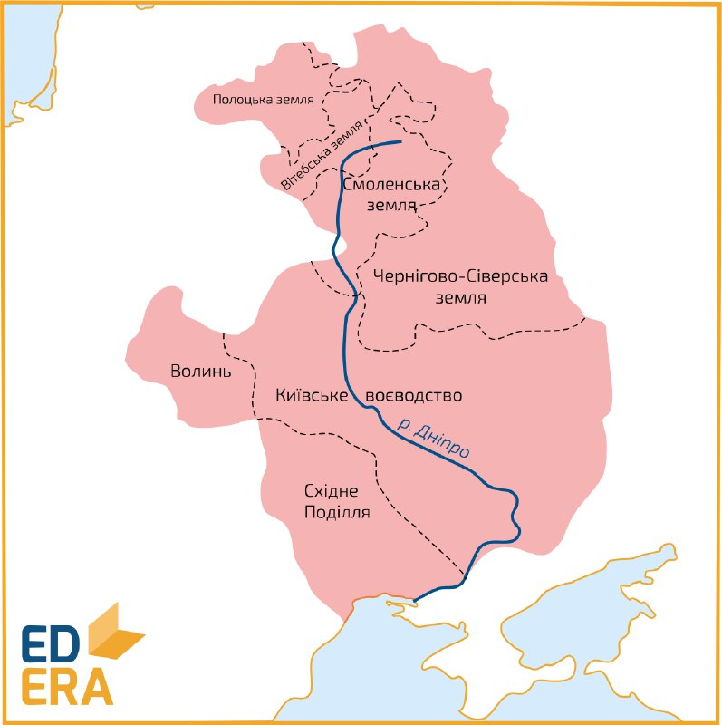
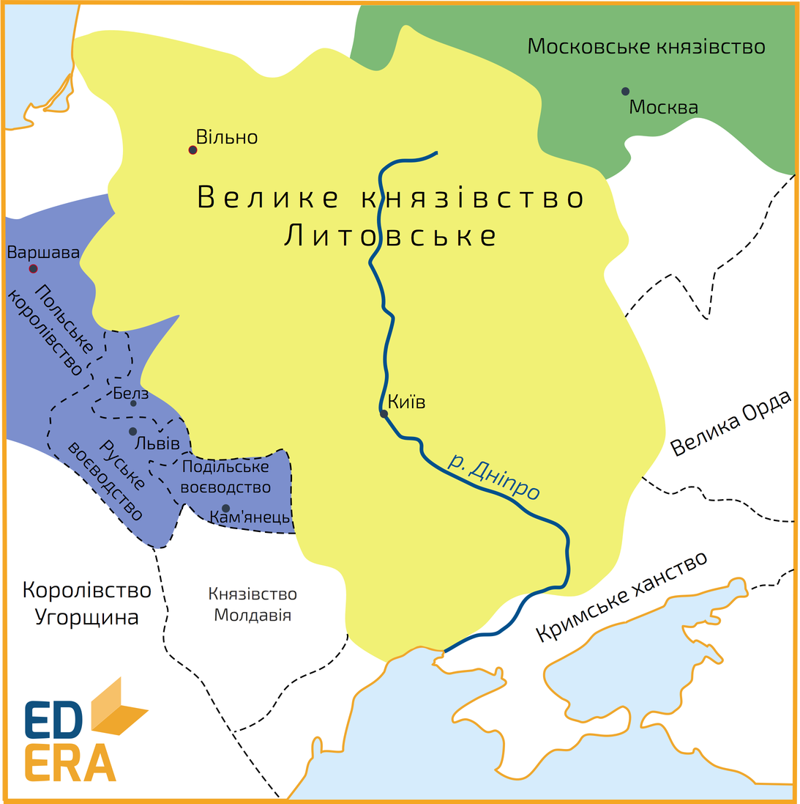

# Правління Свидригайла. «Велике князівство Руське»

<iframe align="center" width="560" height="315" src="https://www.youtube.com/embed/u8htho14FtE" frameborder="0" allowfullscreen></iframe>

По смерті Вітовта в <b>1430</b> році литовські, руські та білоруські феодали обрали на великокняжий литовський престол, без погодження із польським королем, сина Ольгерда – Свидригайла, діяльність якого була спрямована на розрив унії з Польським королівством, та здобуттям Литвою незалежності.  Польща не забарилася із відповіддю та розпочала військові дії проти Свидригайла, здійснивши окупацію Поділля та Волині через розрив литовським князем відносин із Польським королівством. Протягом 1430–1431 рр. поляками в ході воєнної кампанії було здобуто такі міста як, Володимир-Волинський, Кам’янець, здійснюється облога Луцька. Поразка литовського володаря <i>під Луцьком влітку</i> <b>1431 р.</b> значно послабила його позиції у внутрішньому політичному середовищі, чим скористалася невдоволена литовська знать, спільно з поляками вчинивши заколот та обравши на великокняжий стіл брата Вітовта – Сигізмунда Кейстутовича, який одразу відновив умови <i>Віленсько-радомської унії 1401 року</i>. 

Такий хід подій збурив прихильників Свидригайла з боку православної руської та білоруської знаті, оскільки за його патронатом вони обіймали провідні державні посади, відповідно отримали широкі права та привілеї. Вони відмовилися визнати владні повноваження Сигізмунда, підтримали в боротьбі Свидригайла та заявили про утворення <b>Великого князівства Руського</b>, до складу якого увійшли наступні руські землі: Київщина, частина земель Чернігівщини та Сіверщини, Волинь, Поділля, Вітебщина, Смоленщина й Полоцька земля.

Зміцнивши опорні сили, Свидригайло розпочав активні військові дії, внаслідок чого занепокоєні Сигізмунд і Ягайло видали в <b>1432 році</b> привілей, за умовами якого православні феодали зрівнювалися в правах із литовськими феодалами-католиками, але не мали можливості обіймати високі посади в державі. Це доволі зменшило кількість прихильників Свидригайла, до чого послугували й негативні риси його характеру. Історики зазначають, що князь литовський був доволі непослідовний, часом жорстокий та схильний до інтриг, що тільки збільшувало кількість його противників. Так у літописах зустрічається згадка про те, що за наказом Свидригайла було живцем спалено православного митрополита Герасима, якому було оголошено підозру в зв’язках із Московським царством.

Вирішальною подією, яка поклала край повстанню Свидригайла, стала битва <i>під Вількомиром</i>, що на річці Швянті (<b>1 вересня 1435 року</b>; сучасна Литва), внаслідок якої військові сили Свидригайла було вщент розбито Сигізмундом: боротьба за литовський великокняжий престол припинилася. Відновивши владу над усією територією ВКЛ, Сигізмунд розпочав здійснювати політику, що спрямовувалася на поступовий відхід з-під впливу Польщі та зміцненню незалежності Литви. Однак, опора на лицарів і дрібних землевласників, небажання рахуватися з удільними князями, обмежуючи їхню владу, призвело до його смерті: українсько-білоруські князі змовилися та вбили Сигізмунда.

З метою закріплення новоприєднаних територій (Галичини та Поділля) за Польщею, <b>1434 року</b> створюється <b>Руське воєводство</b> в Галичині з центром у місті Львів, та <b>Подільське</b> в Західному Поділлі з головним містом – Кам’янцем (Кам’янець-Подільський). Адміністрацію воєводств очолював воєвода, якого призначав король. Щодо адміністративно-територіального поділу, то територія воєводств поділялася на землі та повіти.

Польська система управління на руських землях відчутно відрізнялася від литовської. <b>Влітку 1434 року</b> було видано королівський привілей, який урівнював місцеву шляхту з польською та запроваджував польське право. Відповідно, вводилася польська система управління, ключові посади в якій діставалися полякам-католикам. Запроваджувалася польська система судочинства, для якої характерним був становий характер, великі польські землевласники отримували в свої володіння значні маєтності, в містах активно починали заселятися євреї та вірмени, яким надавалися вагомі поступки, пільги та привілеї, з метою заохочення їх переселення та ведення торгівлі.

<quiz>
<question>
	
Коли було обрано на великокняжий литовський престол Свидригайла

        <answer>1429 р.</answer>
	<answer correct>1430 р.</answer>
        <answer>1431 р.</answer>
	<answer>1435 р.</answer>
</question>

<question>
	
Центром утвореного Руського воєводства було місто

        <answer correct>Львів</answer>
	<answer>Луцьк</answer>
        <answer>Київ</answer>
	<answer>Кам’янець-Подільський</answer>
</question>

<question>
	
Влітку 1434 року видається королівський привілей який

        <answer>ліквідовує новоутворені воєводства</answer>
	<answer>уводить руську систему судочинства внаслідок її ефективності та широкої поширеності</answer>
        <answer>закріплює литовсько-руську систему управління, ключові посади в якій дістаються литовцям-католикам</answer>
	<answer correct>урівнює місцеву шляхту з польською, та запроваджує польське право</answer>
</question>
</quiz>