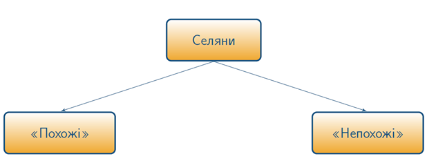

# Сільське господарство та становище селянства

Протягом ХІV—ХV ст. домінуючу роль у господарському житті населення відігравало сільське господарство, а саме рільництво, тваринництво та рибальство. Широкого поширення набуло бортництво, якому на зміну поступово приходить присадибне бджільництво, а також городництво і садівництво. Найпоширенішими сільськогосподарськими культурами які засівали були ячмінь, жито та пшениця. З худоби в основному тримали волів, корів та свиней. Щодо полювання, то ним займалися в основному заможні феодали, на території чиїх володінь знаходилися ліси, та які надавали місцевому населенню спеціальний дозвіл на полювання.

В цей період відбувається зростання великого приватного феодального землеволодіння на українських землях – *латифундій*, які характеризувалися натуральним характером господарювання із застосуванням праці залежних селян. Найбільшими магнатами в чиїх руках опинилися значні земельні наділи були Острозькі, Радзивіли, Немиричі, Замойські та інші.

В   ХІV—ХV ст. у Західній Європі значно зріс попит на такі сільськогосподарські товари, як зерно та м'ясо, що було обумовлено розвитком товарно-грошових відносин. Саме тому, на українських землях великі землевласники розпочинають організовувати фільварки. 

Визначення

<b>Фільварок</b> – велике багатогалузеве господарське виробництво, яке базувалося на постійній праці залежних селян та орієнтувалося на товарно-грошові відносини (ринок), зі збереженням окремих ознак натурального господарства.

Внаслідок цього, земельні феодали розпочинають активно відбирати землю в селян перетворюючи їх на кріпаків та змушуючи відбувати панщину. Кріпацтво стає дедалі поширенішою формою експлуатації селян, остаточне закріпачення яких (на законодавчому рівні) відбулося в результаті прийняття трьох Литовських статутів (1529 р., 1566 р., 1588 р.). 

Селяни складали домінуючу частину населення, серед яких були як особисто вільні селяни (<i>«похожі»</i>), які мали право відходити від феодала, так і ті, що були прикріплені до свого наділу (<i>«непохожі»</i>). Поділ селян на «похожих» і «непохожих» є доволі умовним. Так, «непохожий» селянин міг залишити свого господаря, але за умови, що знайде собі заміну, яка виконуватиме всі покладені на нього повинності та обов’язки. 

Розглядаючи становище селянства, то воно відрізнялося від того, до якої країни були приналежними українські землі. В основному селяни були вільними та сплачували різноманітні податки за користування землею, що розподілялася волоками між селянськими дворищами. Однак, феодальна залежність поступово перетворюється в кріпосну: селяни прикріплювалися до землі й запроваджувалася панщина, що призвело до обмеження їхніх прав та свобод.

За різновидом повинностей селян можна поділити на три групи:

<li><b>данники</b>, які сплачували данину за користування землею, а також мисливськими і бортними угіддями;</li>
<li><b>тяглі</b>, що виконували панщину, та працювали в господарстві свого господаря здійснюючи «тяглу» службу, тобто разом зі своєю худобою обробляли землю;</li>
<li><b>слуги</b>, - селяни, які відбували особисту службу при своєму господарі та в разі потреби виступали із ним у військовий похід та виконували різного роду доручення.</li>

Розмежування між вище наведеними групами селян теж доволі умовне, так як, зокрема, селяни з розряду слуг окрім виконання своїх зобов’язань  сплачували різні податки, відбували певні повинності тощо.

<quiz>
<question>
  
Велике приватне феодальне землеволодіння на українських землях, що характеризувалося натуральним характером господарювання із застосуванням праці залежних селян

        <answer>Фільварок</answer>
  <answer>Мануфактура</answer>
        <answer correct>Латифундія</answer>
  <answer>Дворище</answer>
</question>
</quiz>