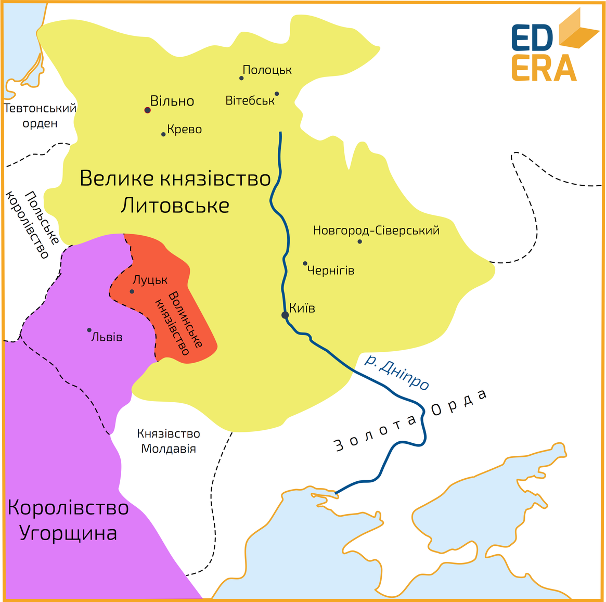
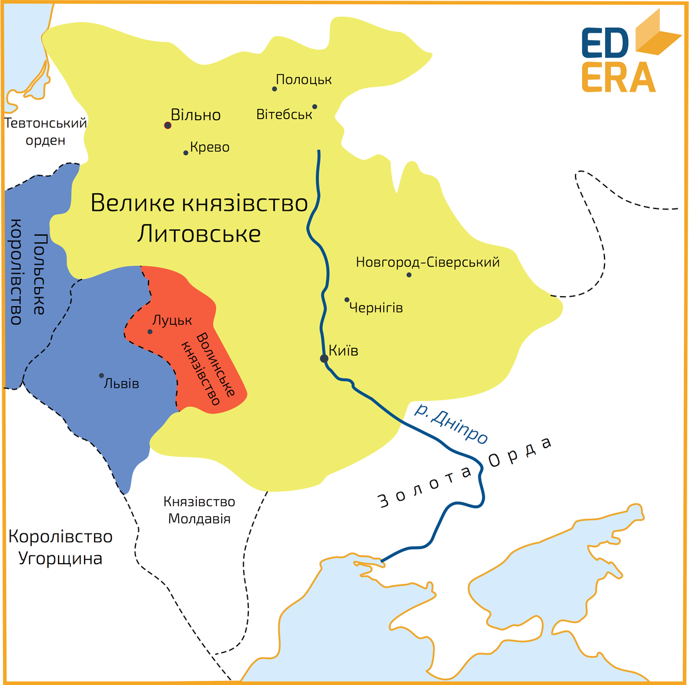

# Утвердження польської влади на Галичині

<iframe align="center" width="560" height="315" src="https://www.youtube.com/embed/KnvRn5n-jRA" frameborder="0" allowfullscreen></iframe>

По смерті Юрія ІІ Болеслава розпочалися активні військові дії з боку сусідніх держав щодо території Волині та Галичини. У 1340 році польський король Казимир ІІІ Великий вторгається на Галичину, захоплює, але не втримує Львів, у зв’язку з сильним опором місцевого населення. Все ж,  приєднати до Польщі Галицькі землі йому тоді не вдалося, так як бояри на чолі з Дмитром Дедьком заручилися татарською допомогою. Казимир ІІІ Великий відступив, після чого Дедько зосередив в своїх руках владу на Галичині. На Волині ж, розпочав правити литовський князь Любарт Гедимінович, якого було запрошено на престол місцевими боярами, однак влада якого, формально, поширювалася й на Галичину, оскільки тодішній її управитель Дмитро Дедько визнав себе васалом Любарта.

За Любарта Гедиміновича, Волинь перетворилася на доволі потужний соціально-економічний регіон. Він розбудовував міста (за його ініціативи було побудовано місто Любар), сприяв веденню торгівлі, релігійно-культурним процесам на території своїх володінь, адже опікувався освітою, підтримував руську мову, культуру, православну віру. За Любарта столицю князівства було перенесено до Луцька,  де було побудовано загальновідомий оборонний Луцький замок, а саме місто було розбудовано та добре укріплене за всіма військовими вимогами того часу.

У середині 40-х років Казимир знову вдається до військових дій, і доволі успішних. Йому вдалося захопити Сяноцьку землю. Восени 1349 року розпочався широкомасштабний похід, внаслідок якого до Польщі відійшла Галичина та Холмщина.
 

Любарт здійснив безуспішну спробу повернути втрачені землі, та врешті-решт <b>1352 року</b> Польща 	й Литва уклали домовленість, відповідно до умов якої Галичина відійшла до Польщі,  а Волинь закріпилася за Литвою. У 1382 році Любарту вдалося повернути відібрані Польщею землі, однак після його смерті, Галичину знову відвоювали поляки. 

Після смерті Казимира ІІІ, поляки передали (через династичну угоду) Галичину Угорщині, королем якої на той час був Людовік (Лайош) Угорський. Однак той своєю чергою передав її сілезькому князю Владиславу Опольському, який являвся йому племінником. Владислав на своїх землях проводив власну самостійницьку політику, яка передбачала опору на поляків, німців та угорців з активною підтримкою католицизму.

1387 року Польща захопила Галичину. Цьому посприяло обрання Ядвіги, дочки Владислава, королевою Польщі, чоловіком якої за умовами Кревської унії став литовський князь Ягайло. Галицько-Волинська держава остаточно припинила своє існування. 

З утвердженням польської влади на українських землях розпочалося поступове ополячення та окатоличення місцевого населення. Однак, разом із цим відбувалися позитивні процеси та зрушення у культурі, оскільки розпочинають поширюватися західноєвропейські принципи та тенденції в культурно-освітньому середовищі.

<quiz>
<question>
	
В 1340 році польський король Казимир ІІІ Великий вторгається на

        <answer>Волинь</answer>
	<answer>Поділля</answer>
        <answer>Київщину</answer>
	<answer correct>Галичину</answer>
</question>

<question>
	
За Любарта Гедиміновича столицю князівства перенесено до

        <answer correct>Луцька</answer>
	<answer>Любара</answer>
        <answer>Холму</answer>
	<answer>Володимира</answer>
</question>
</quiz>