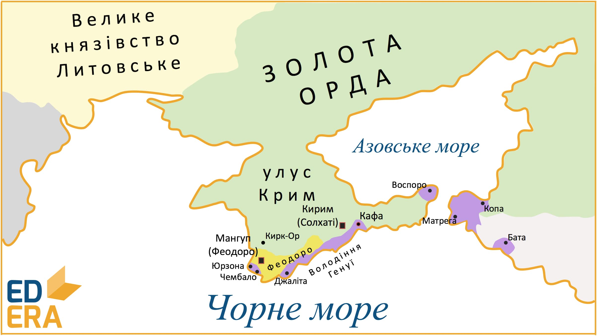
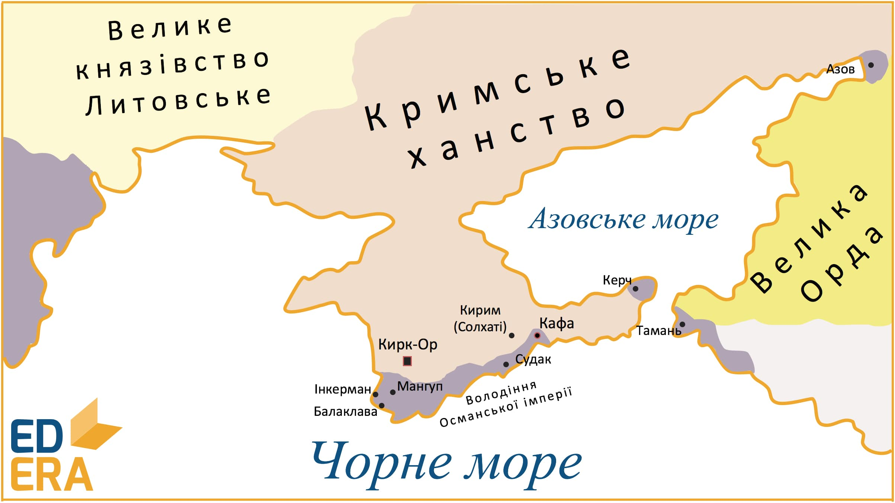
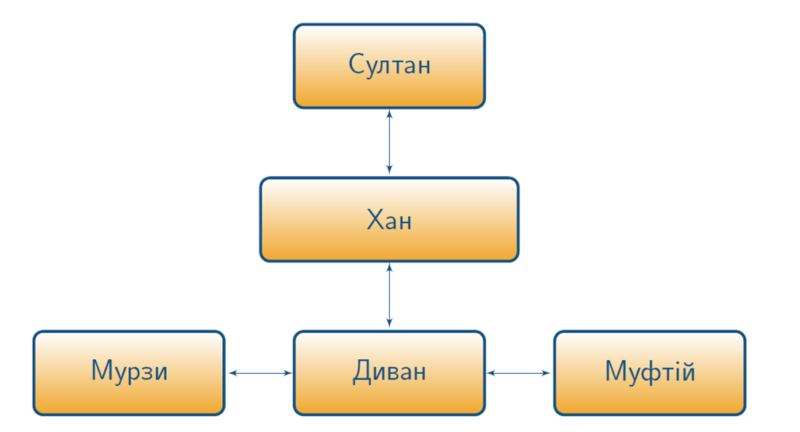

# Утворення Кримського ханства

<iframe align="center" width="560" height="315" src="https://www.youtube.com/embed/4PVglvIlVtE" frameborder="0" allowfullscreen></iframe>

В ході монголо-татарської навали Крим переходить до складу Золотої Орди на території якого створюється улус із центром у місті Солхаті (сучасний Старий Крим). З ХІІІ ст. на території Криму активно розселяються вірмени та італійці, а монголи та половці започатковують кримськотатарський етнос. З кінця ХІІІ ст. в Криму все більшого поширення набуває іслам. 

Після підпорядкування кримських земель Золотій Орді продовжується активний розвиток міст, ремісництва та торгівлі. Генуезькі купці, з дозволу золотоординської адміністрації, розпочинають засновувати власні факторії, які стали основними важливими осередками торгівлі. Так, найбільшою факторією на Кримському півострові стало *місто Кафа* (сучасна Феодосія), відомим своїм невільницьким ринком, де татарами продавалися в рабство військовополонені. 1318 року в Кафі утворюється католицьке єпископство.

Початок XV століття був важким часом міжусобних війн на території Золотої Орди. Місцева впливова татарська знать на чолі з *Хаджі Гіреєм* виступила за виокремлення Криму в незалежну державу, внаслідок чого, за його сприянням утворюється нова держава – Кримський улус у південно-східній частині Кримського півострова. А вже в **1449 році** Хаджі-Гірей проголошує себе повноправним володарем Криму й оголошує про незалежність ханства від Золотої Орди. Після смерті Хаджі-Гірея розпочинається боротьба за спадщину між його синами в результаті якої у Криму утверджується *Менглі-Гірей*. 

**1475 року** турецький султан Мегмед ІІ розпочинає захоплення Кримського півострову здобувши ключові торгові міста, включно з князівством Феодоро, тобто все південне узбережжя Криму. Менглі-Гірей визнає васальну залежність від Османів, будучи змушеним відтепер брати участь у військових походах турецького султана, який також самостійно призначав та усував підвладних йому ханів.

Територія Кримського ханату була доволі обширною: окрім Криму до його території входили землі від гирла Дніпра аж до гирла Дону, та від річки Кубані – до Грузії. Столицею ханату було спершу місто **Кирк-Ор**, а вже згодом – **Бахчисарай**.

Щодо політичного устрою, то він був сформований на зразок золотоординського: форма правління – монархія, на чолі якої стояв **хан**, який карбував власну монету. Основою знаті були князі (беї), які очолювали роди та темники (воєначальники), що керували військом. Влада хана обмежувалася діяльністю *курултая* – з’їзду найвпливовіших родів у державі, які також входили до державної ради, *дивану*, що вирішувала найважливіші справи у державі. Ще однією впливовою силою в суспільстві були мурзи – привілейовані члени інших родів. Панівною релігію було мусульманство, а очільником мусульманського духовенства був муфтій, який також був представником судової влади.

Стосовно господарської діяльності, то провідну роль відігравало скотарство. Землеробство доволі добре було розвинуте в гірській частині Криму, однак не стало провідною галуззю господарства. В основному вирощували злакові та городні культури, а також займалися садівництвом та виноградарством. Важливим промислом був видобуток солі. 

Розвивалася реміснича діяльність, серед якої найпоширенішим було ковальство, зброярство, ткацтво, гончарство, а також ювелірна справа. 

Цінним культурним надбанням стала кримськотатарська палацова архітектура, приклад чому, Ханський палац у Бахчисараї. 

Населення було особисто вільним, однак сплачувало податки мурзам. Найбільш поширеною була військова справа, у зв’язку з доволі частими військовими діями та промислами, що реалізовувалося, зазвичай, у здійсненні спустошуючих грабіжницьких нападів на сусідні землі, в першу чергу українських, забираючи населення та військовополонених у ясир – полон, з подальшим продажем на невільницьких ринках в якості рабів.

Основними напрямками татарських набігів стали землі Київщини, Поділля та Галичини. Так, у вересні 1482 року Менглі Гірей за підтримки московського князя Івана ІІІ здійснює похід на Київщину, в результаті чого ним пограбовано та спалено місто Київ, спустошено довколишні землі. 1487 року відбувається похід у Східне Поділля, який було зупинено руськими князями внаслідок битви біля Копистирина. 1498 року на Галичину вторгаються турки спустошуючи все навкруги, а в 1500 році татарські загони здійснюють рейд територією Волині, Брацлавщини, Галичини спалюючи та знищуючи міста і села, а також захоплюючи в ясир місцеве населення. 

Полонених, здебільшого, продавали у рабство на невільницьких ринках (найбільший знаходився в місті Кафа). Так, із хлопців виховували яничарів, які становили в подальшому піхоту в султанському війську; дівчата та жінка потрапляли в основному до гаремів, або ж працювали прислугою, а чоловіків відправляли на каторгу в якості гребців на турецьких кораблях – галерах. 

Військові набіги здійснювалися неодноразово на українські землі. Знищувалося та захоплювалося в полон населення, руйнувалися та спустошувалися міста і села, піддавалися грабунку культурні та релігійні пам’ятки. Все це призводило до важких соціально-економічних та культурних наслідків на території України.

<quiz>
<question>
	
В ході монголо-татарської навали Крим переходить до складу

        <answer>Литовсько-Руського князівства</answer>
	<answer>Польського королівства</answer>
        <answer>Османської імперії</answer>
	<answer correct>Золотої Орди</answer>
</question>
<question>
	
Столицею Кримського ханства було місто

        <answer>Мангуп</answer>
	<answer>Кирим</answer>
        <answer correct>Бахчисарай (Кирк-Ор)</answer>
	<answer>Кафа</answer>
</question>
</quiz>