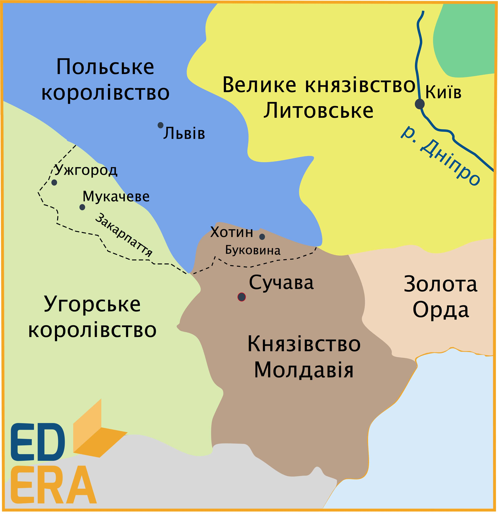
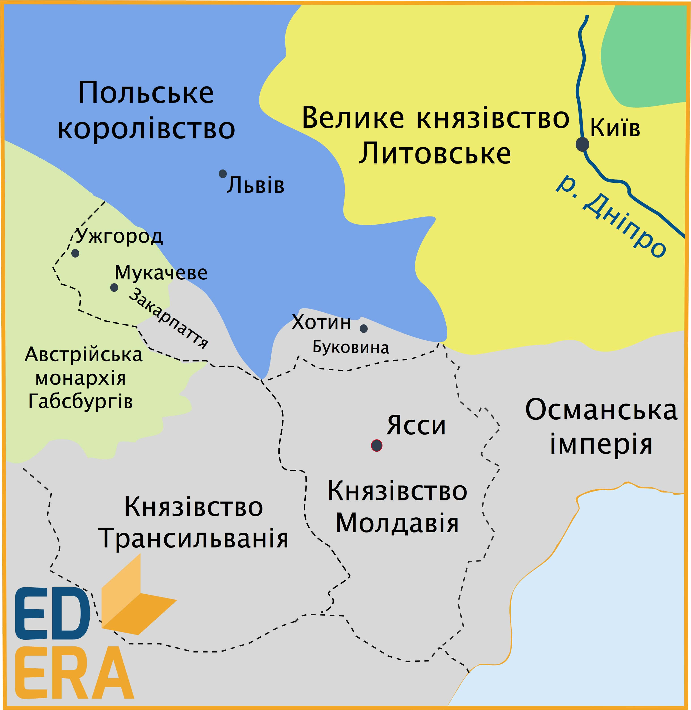

# Закарпаття під владою Угорщини

<iframe align="center" width="560" height="315" src="https://www.youtube.com/embed/EbCtmzZLSck" frameborder="0" allowfullscreen></iframe>

Протягом XI-XIII ст. Закарпаття відійшло до Угорського королівства, внаслідок його завоювання угорцями. Було здійснено поділ новоприєднаних земель на нові територіально-адміністративні одиниці – *комітати*, очільниками яких були королівські намісники, – **ішпани** *(жупани)*, що перебрали на себе функції адміністративної, військової та судової влади.  

Територією Закарпаття активно розселилися мадяри, волохи, словаки, німці; ряду міст було надане магдебурзьке право (Хуст, Берегово тощо). Однак угорські дворяни, включно з католицьким духовенством, сконцентрували у своїх руках основні земельні наділи. Розпочалися поступові процеси асиміляції та мадяризації населення, збільшилися побори з боку іноземних володарів, зросли податки та панщина, все більшого поширення набув католицизм, що призвело до соціального напруження в краї:  1315 року спалахнуло повстання Петра Петені (Петра Петровича) супроти угорської влади, яке зазнало поразки.

Внаслідок конфлікту з литовським князем Вітовтом, наприкінці XIV ст. подільський князь *Федір Коріятович* перебрався на Закарпаття, де отримав від угорського короля Сигізмунда землі в Мукачівському краї, включно з містом Мукачеве та його приміською округою. Розпочалася приналежна розбудова міста, було побудовано мурований замок з відповідним йому укріпленням, а на Чернечій горі розбудовувався православний монастир Святого Миколи. Через деякий час у Мукачеві постало православне єпископство.  

Діяльність Федора Коріятовича сприяла соціально-економічному та культурному розвитку на підвладних йому землях: князь підтримував торгівлю (важливого значення набув мукачівський ярмарок) та ремесло, активно боровся за національно-релігійні інтереси місцевого населення. Однак, після його смерті в 1414 році, Мукачівський край повернувся під владу угорців, які поновили політику феодального гніту. 

Знаковим виступом стало антифеодальне повстання **1514 року**, яке було очолене Дьєрдем Дожем проти свавілля угорських володарів. Військові сили повстанців були розгромлені, очільника взято в полон, опісля чого страчено (побутує легенда, що його було спалено на розпеченому залізному троні). Виступ не став переломним: розправившись із учасниками повстання, угорська влада обклала населення ще більшими поборами та податками. 

**1526 року**, внаслідок розгрому угорських військових сил турецькими військами під *м. Могачем*, Угорщина перейшла до складу Османської імперії. Західна частина Закарпаття (Пряшівщина та Ужгородщина) відійшли до складу Австрії, а територія східної частини — до Трансільванії. 

<quiz>
<question>
	
Протягом XI - XIII ст. Закарпаття відходить до

        <answer>Польського королівства</answer>
	<answer correct>Угорського королівства</answer>
        <answer>Молдавського князівства</answer>
	<answer>Литовсько-Руського князівства</answer>
</question>
<question>
	
Наприкінці XIV ст. на Закарпаття в Мукачівський край перебирається князь

        <answer>Володимир Ольгердович</answer>
	<answer>Любарт Гедимінович</answer>
        <answer correct>Федір Коріятович</answer>
	<answer>Любарт Гедимінович</answer>
</question>
</quiz>