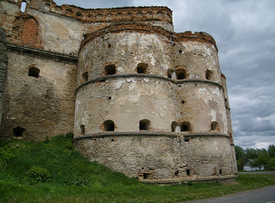

# Архітектура й містобудування в XVI столітті

Як і в XV ст., із поширенням магдебурзького права під час містобудування використовувалися принципи регулярної забудови, а центральною частиною міста була ринкова площа з ратушею. Саме така розбудова міст була поширена на західноукраїнських землях у таких містах, як Львів, Стрий, Івано-Франківськ тощо. Будинки будувалися як з каменю, так із дерева. Задля захисту та оборони навколо міст зводилися мури з брамами та вежами. 

Стосовно оборонних споруд, то з постійною загрозою з боку татар широкого поширення набула баштова система укріплень, тобто бастіонні укріплення, в основі яких були високі та товсті мури із оборонними вежами. Було відновлено Київський замок, вдосконалено Хотинську фортецю, перебудовується Острозький замок та Камянець-Подільська фортеця, а на мисі, утвореному річками Південний Буг та Бужок, – побудовано Меджибізький замок.

<i>Бастіон Меджибізького замку</i>, 
автор фото: Борис Мавлютов

У XVI ст. містобудування на західноукраїнських землях зазнало помітного впливу від європейського Відродження. Зводилися будівлі за планами європейських архітекторів, наприклад у **1591 році** італієць *Павло Римлянин* розбудував Успенську церкву в Львові, а *Октавіано Манчіні* відбудував у Києві Софійський собор. 

Вражаючими архітектурними шедеврами постали ансамблі львівських споруд – будинок Корнякта, Чорна кам’яниця, Успенська церква, каплиця Трьох Святителів, вежа Корнякта, а також каплиці Боїмів та Кампіанів.

Культові релігійні споруди були як мурованими, так і дерев’яними. Такими є, зокрема Богоявленська церква в Острозі, церква св. архангела Михаїла у Волі-Висоцькій поблизу Жовкви, Троїцька церква в Межиріччі, церква Зішестя Святого Духа в Потеличі.