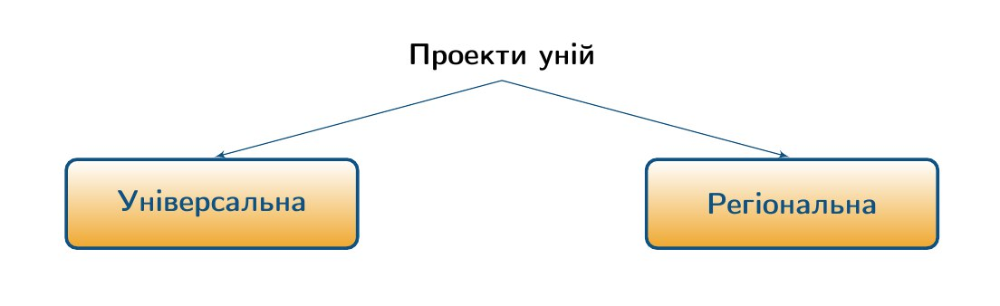
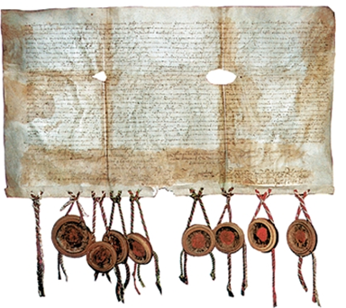

# Берестейська унія. Греко-католицька церква

<iframe align="center" width="560" height="315" src="https://www.youtube.com/embed/gEuB5ys0OjQ" frameborder="0" allowfullscreen></iframe>

Після укладення Люблінської унії міжрелігійна проблема все більше розпочинає перебувати  в центрі уваги, розпочавшись ще з ХІ ст., коли в **1054 р.**  відбувся розкол  Християнської церкви *(«Велика Схизма»)* на католицьку та православну. Відтоді неодноразово ставилося питання про об’єднання церков через  укладення спільної унії, задля досягнення взаємної згоди в спірних релігійних питаннях. Такою спробою, зокрема, був скликаний у **1439 році** *Флорентійський собор*, де було укладено унію між Константинопольським патріархом та Папою Римським. Однак унію не вдалося реалізувати як на українських, так і на російсько-білоруських землях.

Уже в ХVI ст. на **Тридентському соборі (1544-1563 рр.)**, що проводився з метою реформування Римо-Католицької церкви внаслідок активного поширення протестантизму в європейських країнах, однією з умов до зміцнення Церкви виступало зближення та зміцнення взаємовідносин із Московським царством, де була домінуючою православна Церква. Однак Москва не бажала поступатися власним впливом, тому спроби «порозумітися» виявилися невдалими. У зв’язку з цим акцент на об’єднання церков переміщується на українські землі. 

Значною мірою на перебіг укладення унії вплинула *календарна реформа* **Григорія ХІІІ у 1582 р.**, яка лише посприяла ще більшому розколу між католицьким і православним духовенством. До реформи всі послуговувалися «юліанським» календарем, який було уведено в 46 р. до н.е. за Юлія Цезаря. Цікаво, що календар був створений за єгипетським зразком на основі сонячного календаря із римськими назвами місяців. Головною проблемою календаря, що власне й зумовило до його реформування,  було те, що за 128 років у кінці виходила похибка  в одну зайву добу. Внаслідок цього, 21 березня поступово віддалялося від весняного рівнодення та зміщувалося до  літнього. Це впливало на проведення свята Пасхи, яке за традиціями приурочували до дня весняного рівнодення. Тому, за ініціативи папи Григорія ХІІІ, було внесено поправку до календаря щодо підрахунку днів, а саме було додано 10 додаткових днів при переході до нового календаря. Відповідно за буллою папи, після 4 жовтня наступало не 5 жовтня, а 15 жовтня. Із цього дня за універсалом **Стефана Баторія** на території всієї Речі Посполитої  вступав у дію новий *григоріанський календар*. Водночас Константинопольський патріарх **Єремія** закликав усі Церкви східного обряду та православних єпископів не переходити на нововведений календар, а слідувати юліанському. 

Не обійшлося без сутичок. Взимку 1583-1584 рр. у Львові під час Різдвяних свят за наказом католицького архієпископа було опечатано руські храми з метою запобігти різдвяному богослужінню  православним населенням через те, що ті слідували за старим календарем. Подібні сутички відбувалися і в інших містах, що змусило Стефана Баторія з метою запобігання релігійному напруженню в державі видати у **1584 році** універсал, за яким григоріанський календар виключно застосовувався до світських, а не релігійних справ, тому кожна Церква на власний розсуд мала право вирішити, якому календареві слідувати. Завдяки цьому та через передчасну смерть Григорія ХІІІ в 1585 році конфлікт на певний час було вичерпано. 

**1589 року** Константинопольський патріархат визнав автокефалію Московського патріархату, й відтоді його глава почав носити титул «патріарха Московського й Усієї Русі». Не помітити явно не прихований підтекст просто не можливо. Під словосполучення «Усієї Русі» підпадали як українські, так і білоруські землі, населення яких сповідувало православ’я. Ця подія не залишилася непоміченою в Речі Посполитій, внаслідок чого унія набула все більшої актуальності. 

Не можна оминути і такий важливий факт, який посприяв укладенню унії,  як кризові явища в житті православного духовенства. Багато православних священнослужителів були неосвіченими, перебували на нижчих щаблях православного кліру, все більше перебували в залежності від багатих землевласників, а вищі церковні священнослужителі дедалі більше зосереджувалися на примноженні багатства. Окрім цього, все більшого впливу набували православні братства, які послаблювали авторитет православних церковних ієрархів. Такі речі не були настільки притаманними католицькому духовенству, яке зазнало значних змін внаслідок реформування за нормами Тридентського собору. Тому укладення унії мало б розв’язати важливі проблеми в православній організації та посприяти відновленню спокою як у релігійному, так і в суспільному житті країни.

Доволі важливо усвідомити причини, що врешті змусили православних і католиків сісти за стіл переговорів, так як з обох боків були серйозні розбіжності щодо бачення умов унії. За Люблінською унією більшість українських земель опинилися в складі єдиної держави, тому в унії православне населення вбачало об’єднуючий фактор, який мав би ще більше згуртувати українське суспільство та посприяти примиренню й досягненню компромісу з польським католицьким населенням. Рівність православної і католицької церкви мала б припинити міжрелігійну ворожнечу та покласти край переслідуванню православного населення при збережені православної релігійної обрядовості, що висувалося першочерговою умовою в ході унійного обговорення. Окрім цього, підпорядкувавшись за унією Папі Римському, Українська православна церква дала б відсіч зазіханням Московської, тому православні церковні владики та навіть шляхтичі й князі, в тому числі Василь-Костянтин Острозький, спершу виступили за підтримку унії.

Щодо поляків, то можливість укладення унії сприймалася ними неоднозначно. Багато хто з представників католицького  духовенства вбачав загрозу в унії як такій, що підірве позиції католицької церкви в державі. Міцна українська православна церква не була потрібна польським владикам, тому, незважаючи на обіцянки рівноправності двох церков після укладення унії, поляки все більше розглядали унійний акт як можливість активного поширення католицизму на українських землях. Це добре простежується в полемічних творах польських церковників, зокрема **Петро Скарга** закликав православних відкинути помилкові ідеї та визнати істинну римо-католицьку віру. 

Серед передунійних проектів пропонувалися до укладення два види уній: універсальна та регіональна. 

Варіант *універсальної унії* прозвучав ще на Флорентійському соборі. Відповідно до нього пропонувалося об’єднати в одну єдину Церкву Східну та Західну. Прибічником цього варіанту був відомий  русинський (український) релігійний діяч, філософ, історик, письменник **Станіслав Оріховський**, який закликав обидві Церкви до об’єднання на рівноправних засадах. 

Щодо проекту *регіональної унії*, то через надання  Московській церкві автокефалії, вона передбачала об’єднання Київської митрополії з Римо-Католицькою церквою без решти православних митрополій (московської, грецької, антіохійської). Серед прибічників цього варіанту унії був князь Василь-Костянтин Острозький, який виступив за об’єднання католицької церкви з усіма Церквами Східного обряду (включно з московською) на засадах рівноправ’я та зі збереженням православних традицій богослужіння із подальшим докорінним реформуванням церковного життя через поширення освіти та книгодрукування. Поляки ж виступали за повне підпорядкування Східної церкви Папі Римському. Це, зокрема, польський кардинал Станіслав Гозій та польський єзуїт Петро Скарга. Останній взагалі наполягав на тому, аби  православні віряни визнали зверхність Папи прийнявши католицький Символ віри, однак із поступкою в дотриманні власної обрядовості та мови богослужіння.

Найреалістичнішим видався проект регіональної унії, підготовку до якої й було розпочато. **20 червня 1590 року** православні владики, а власне *Кирило Терлецький, Гедеон Балабан, Лев Пелчицький, Діонісій Збируйський* написали листа до Риму, де висловили про свою готовність перейти під зверхність Папи Римського, але за умови збереження східних православних традицій богослужіння та православного церковного устрою. 

У **1594 році** *Терлецький*, новопризначений володимиро-берестейський владика *Іпатій Потій* та *Бернард Мацейовський* уклали **«Торчинські артикули»**  зі своїми пропозиціями щодо укладення унії, які було передано до Риму. Проти цього кроку різко виступив Острозький, який закликав до обговорення статей артикулів на спільному соборі духовенства й представників шляхти, однак цього власне й не було зроблено. Острозький виступив проти укладення унії та закликав світських і духовних представників до антиунійної агітації, а полякам погрожував військовою силою.

Усе ж, **23 грудня 1595 р.** у Ватикані відбулася церемонія укладення союзу (унії) між Київською митрополією та Римо-Католицькою Церквою. Через значні антиунійні настрої на руських землях на **16 жовтня 1596 року** було призначено церковний собор в *м. Бересті*. Серед прибічників унії на соборі був присутній зокрема Петро Скарга  та луцький, львівський і холмський католицькі єпископи. Зі сторони православного духовенства були представники Константинопольського патріархату та різного кліру й чину духовенство. Окрім них, у соборі взяли участь як світські, так і шляхетські представники. Присутнім був і Василь-Костянтин Острозький зі своїм сином.

Берестейський собор розпочався без взаємного порозуміння між прибічниками і противниками унії, внаслідок чого, від **18 жовтня** собор розділився на дві частини, і кожна зі сторін засідала самостійно. Так, прихильники унії перебували в *соборній церкві св. Миколая*, а противники – у садибі, де зупинилися Острозькі.  Як результат, кожен із соборів ухвалив свої рішення, затвердив власну канонічність та засудив опонентів. 

Унійний собор у церкві св. Миколая підтримав рішення про об’єднання з Римо-Католицькою церквою та подальшим підпорядкуванням Папі Римському, внаслідок чого утворилася греко-католицька церква.

Об’єднання передбачало наступні умови:
1.	незмінність форм таїнств та обрядів православного духовенства, ведення церковної служби церковнослов’янською мовою;
2.	Папа Римський висвячує патріарха, а він у свою чергу – митрополитів;
3.	представники вищого православного духовенства зрівнюються в правах із католицьким та отримують обіцяні місця в польському сенаті, звільняються від сплати податків;
4.	світські особи не мають права втручатися в релігійне життя, а усі храми, монастирі та церковні владики підпорядковуються безпосередньо патріарху;
5.	заборона примусового окатоличення православного населення, дозвіл на укладення мішаних шлюбів (між католиками та православними).

Разом із цим, митрополит Михайло Рогоза прокляв і позбавив сану православних Львівського і Перемишльського єпископів. 

На православному ж соборі анафемі піддалися прибічники унії: константинопольський патріарх Никифор відлучив від Церкви та позбавив сану митрополита Рогозу й решту унійних владик. Учасники православного собору заявили про непідтримку прийнятої унії та висловили про своє рішення усіма силами їй протистояти, що засвідчив і князь Василь-Костянтин Острозький. 

<i>Акт Берестейської унії</i>

Однак, це не завадило подальшому прийняттю унійного акту. 6 єпархій Київської митрополії прийняли положення Берестейської унії одразу після її ухвали, а **15 грудня 1596 року** король Речі Посполитої **Сигізмунд ІІІ** видав універсал про введення в дію положень Берестейської унії на території усієї держави. Розпочалася багаторічна релігійна боротьба, одним із виявів якої стало видання полемічної літератури з приводу унії, як з боку її прихильників, так і противників.

Таким чином, Берестейський собор не тільки не розв’язав міжконфесійну проблему, а навпаки тільки поглибив: замість однієї церкви постали вже дві – православна і греко-католицька, що призвело до подальшої боротьби Русі з Руссю.

<quiz>
<question>
  
У якому році проведено календарну реформу Григорія ХІІІ?

        <answer>1580 р.</answer>
  <answer>1581 р.</answer>
        <answer correct>1582 р.</answer>
  <answer>1583 р.</answer>
</question>
<question>
  
Хто із наведених історичних діячів не був причетним до укладення Торчинських артикулів?

        <answer>Кирило Терлецький</answer>
  <answer>Іпатій Потій</answer>
        <answer>Бернард Мацейовський</answer>
  <answer correct>Гедеон Балабан</answer>
</question>
</quiz>