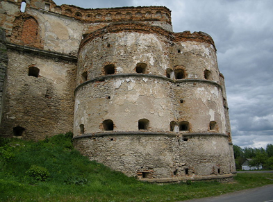

# Культура в XVI ст.

XVI ст. ознаменувалося новими тенденціями в розвитку та становленні культури. Активні суспільно-політичні події, пожвавлення торгово-економічних відносин, західноєвропейські процеси Відродження, Реформації та Контрреформації неабияк посприяли культурним процесам на території українських земель. Останні ж, перебуваючи під владою різних іноземних держав, зазнали значної взаємодії з культурами інших народів. А укладення Люблінської та Берестейської уній посприяло піднесенню національної самосвідомості українського народу: з одного боку, через об’єднання українських земель у межах однієї держави, з іншого – через суперечливі та складні політичні й соціально-економічні умови.

Умови розвитку української культури в XVI ст.:

<ul>
<li>об’єднання українських земель у межах однієї держави внаслідок укладення Люблінської унії;</li>
<li>втрата провідних позицій православної церкви через Берестейську унію й утворення греко-католицької церкви;</li>
<li>поступова полонізація та активне поширення католицизму завдяки діяльності єзуїтів;</li>
<li>вплив західноєвропейський процесів Відродження, Реформації та Контрреформації;</li>
<li>становлення і формування української мови.</li>	
</ul>

<iframe align="center" width="560" height="315" src="https://www.youtube.com/embed/N0mAEakweeU" frameborder="0" allowfullscreen></iframe>

<table class="centered-table">
<tr>
    <td width="40%" valign="top""><b>Українська мова, література та книгодрукування</b></td>
    <td width="60%" valign="top""><li>українська (руська) мова перебувала в статусі державної (за нормами Литовських статутів)</li><li>літературна староукраїнська мова («проста мова») використовувалася при написанні творів різних літературних жанрів та при укладенні нормативних документів (законів, указів тощо)</li><li>церковнослов’янська мова використовувалася під час релігійних служб та при написанні церковних книг</li><li>більшість населення спілкувалася у побуті народною мовою</li><li><b>Пересопницьке Євангеліє (1556-1561 рр.)</b> – написаний на староукраїнській мові; висока майстерність художнього оформлення; укладачі: Михайло Василевич із міста Сянок та архімандрит Пересопницького монастиря Григорій </li><li><b>Іван Федоров (Федорович)</b> – заснував у Львові друкарню; у <b>1574 р.</b> видав «Апостол» та «Буквар»; у <b> 1578 р.</b> надрукував церковнослов’янською мовою «Острозьку Біблію» у друкарні Острозької академії</li><li><b>1596 р.</b> – Лаврентій Зизаній видав у місті Вільно «Граматику словенську», а також словник «Лексика», який містив переклад церковнослов’янських слів на староукраїнську мову</li></td>
</tr>
<tr>
    <td width="40%" valign="top""><b>Освіта та шкільництво</b></td>
    <td width="60%" valign="top""><li>основні навчальні заклади – школи при церквах та монастирях</li><li>з’являються єзуїтські колегіуми та протестантські школи</li><li><b>1578 р.</b> – за ініціативи В.-К. Острозького та княжни Гальшки Острозької відкрито перший православний колегіум (згодом перший вищий навчальний заклад західноєвропейського типу – <b> Острозька академія</b>  (слов’яно-греко-латинська школа); перший ректор  –  Герасим Смотрицький; викладалися предмети «тривіуму» (граматика, діалектика, риторика) та «квадріуму» (арифметика, геометрія, музика, астрономія) + вивчали грецьку, латинську, старослов’янську мови, а також вищі науки: філософію, богослов'я, медицину</li><li>при православних братствах також відкривалися навчальні заклади, зокрема при Львівському Успенському братстві в 1585 році відкрилася школа слов’яно-греко-латинського типу</li></td>
</tr>
<tr>
    <td width="40%" valign="top""><b>Архітектура й містобудування</b></td>
    <td width="60%" valign="top""><li>під час містобудування використовувалися принципи регулярної забудови; центральною частиною міста була ринкова площа з ратушею (Львів, Стрий, Івано-Франківськ тощо); навколо міст задля захисту та оборони зводилися мури з брамами та вежами</li><li>на мисі, утвореному річками Південний Буг та Бужок, – побудовано Меджибізький замок</li>

бастіон Меджибізького замку 
автор фото: Борис Мавлютов
<li>у <b>1591 р.</b> італієць Павло Римлянин розбудував Успенську церкву в Львові, а Октавіано Манчіні відбудував у Києві Софійський собор</li><li>релігійні будівлі були як мурованими, так і дерев’яними; зокрема – Богоявленська церква в Острозі, церква св. архангела Михаїла у Волі-Висоцькій поблизу Жовкви, Троїцька церква в Межиріччі, церква Зішестя Святого Духа в Потеличі</li><li>яскравими прикладами архітектури є ансамблі львівських споруд – будинок Корнякта, Чорна кам’яниця, Успенська церква, каплиця Трьох Святителів, вежа Корнякта, а також каплиці Боїмів та Кампіанів</li></td>
</tr>
<tr>
    <td width="40%" valign="top""><b>Живопис та скульптура</b></td>
    <td width="60%" valign="top""><li>вдосконалюється скульптурний портрет, зокрема і на надгробних пам’ятниках; як приклад –  надгробний пам’ятник Костянтина Івановича Острозького в Успенській церкві Києво-Печерської лаври</li><li>з'являється декоративне різьблення по дереву, зокрема в іконостасах; як приклад – ансамбль іконостасу в церкві Успіння Богородиці<li>з'являється світський портретний живопис; як приклади – портрет Стефана Баторія (1576 р., автор Войцех Стефановський), портрет К.-В. Острозького тощо</li><li>книжкова мініатюра: невеликі кольорові зображення в рукописних книгах; завдяки книгодрукування набуває нових рис і форматів; як приклад – ілюстрації Пересопницького Євангеліє (1556–1561);</li><li>книжкова  гравюра: друк зображень на папері із відбитків  оброблених вручну металевих або дерев’яних пластин; яскравими прикладами є гравюри в «Апостолі» та «Букварі» І. Федорова</li> <li>живопис: вдосконалюється іконопис та виготовлення дерев’яних іконостасів; зображення на іконах набуває портретних ознак; як приклади – ікона Олексія Горошковича «Успіння» із церкви Собору архангела Михаїла у Смільнику (1547 р.),  храмова ікона «Різдво Христове» із села Трушевич біля Добромиля, ікона Федора «Богородиця Одигітрія з похвалою» (1599 р.) із церкви Покрови Богородиці в Рівному, ікона «Поклоніння волхвів» та ікона Благовіщення (1579 р.) Федуско; місто Перемишль – один із найпотужніших центрів релігійного малярства </li><li>декоративно-ужиткове мистецтво: відроджується скловаріння, вдосконалюється і розвивається килимарство, меблювання, вишивання, гаптування тощо</li></td>
</tr>
</table>

