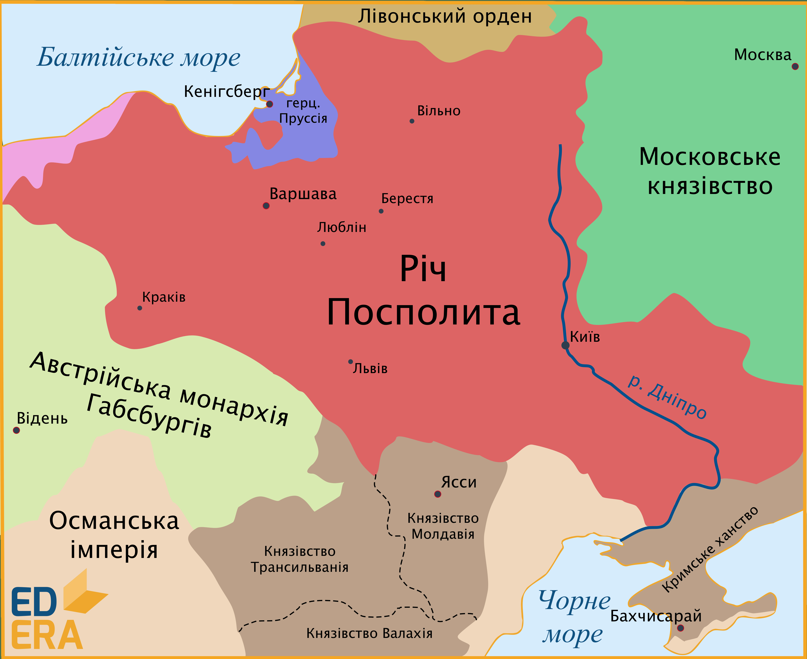
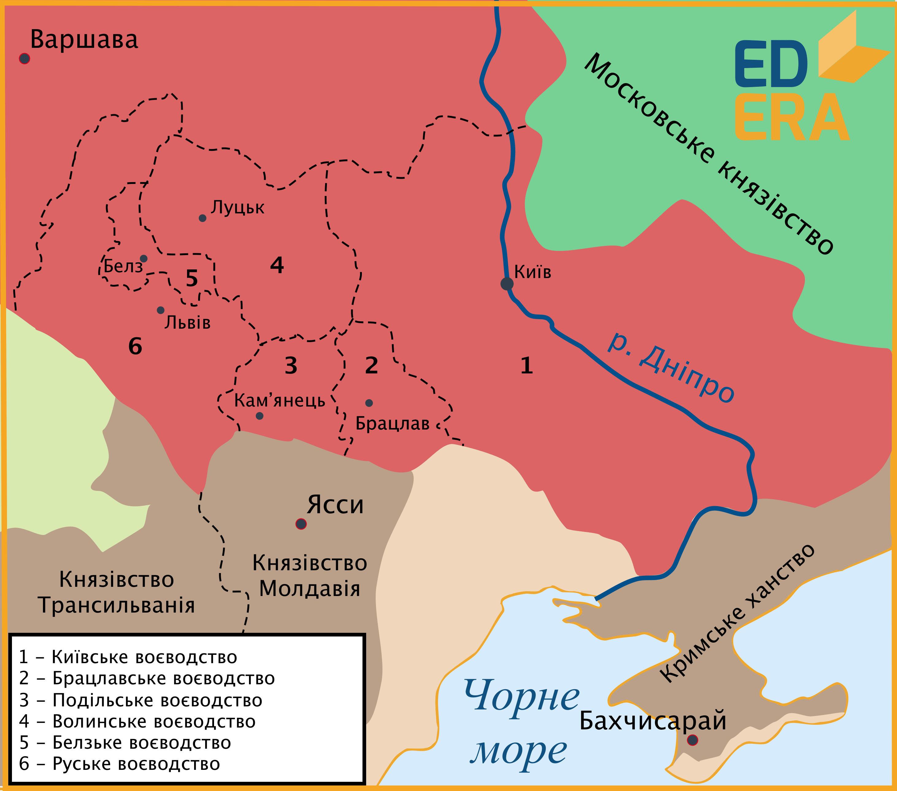

# Люблінська унія (1569 р.). Утворення Речі Посполитої

<iframe align="center" width="560" height="315" src="https://www.youtube.com/embed/JgIAx_apLRU" frameborder="0" allowfullscreen></iframe>

*Люблінський сейм* **1569 року** став важливою подією як в історії України, так і в історії загалом: на карті Європи Нового часу постала нова держава – **Річ Посполита**, в результаті об’єднання Польського королівства із Великим князівством Литовським.

У другій половині ХVІ ст. Московське князівство на чолі з російським царем Іваном ІV Грозним розпочало просування до Балтійського узбережжя, що безпосередньо зачіпало територіальні інтереси Великого князівства Литовського. Розпочалася затяжна **Лівонська війна (1558–1583)**, яка на перших порах значно послабила ВКЛ та об’єднані литовсько-руські війська. Агресія Московії загрожувала  не тільки Литовському князівству, а й Польському королівству. З утвердженням Московського князівства на Балтійському узбережжі й витісненням звідти Литовської держави Польща нажила б собі аж ніяк не дружелюбного сусіда та партнера.

Лівонська війна не обійшла стороною й українські (руські) землі. Окрім того, що у війні брали участь руські військові сили, війна призвела до умовного зміщення центру уваги на Північ, внаслідок чого частішими стали татарські набіги на південні території. Південна прикордонна смуга відзначалася слабкою системою оборони. Замки та фортеці потребували розбудови та реорганізації, укріплення та посилення військової присутності. Однак на це не було як людських ресурсів, так і матеріальних, у першу чергу – грошових.

Окрім проблем зовнішнього характеру, не менш важливими поставали на той час внутрішні проблеми. Соціальна еліта, зокрема шляхта литовських, українських (руських) і білоруських земель, що входили до складу Великого князівства Литовського, все більше прагнула до набуття тих прав і привілеїв, що були характерними для польського шляхетства. Зокрема недоторканність особи шляхтича, за якої без відповідного судового вироку не можна було відібрати в нього маєтності. Окрім цього, не абияк важило слово шляхтича, адже воно прирівнювалося до юридичного доказу в суді, а під час сейму при ухваленні законів одне слово *«вето»* з боку шляхтича забороняло прийняти той чи інший закон.

Польське королівство в середину ХVІ ст. характеризувалося економічним піднесенням та стабільністю, порівняно з іншими країнами Європи, в яких відбувалися війни, терори та перевороти. За рахунок торгівлі сільськогосподарськими продуктами, яких потребували все більш виснажені європейські країни, втягнуті у вир конфліктів, Польща збагачувалася й шукала нових можливостей та варіантів економічного зиску, що й побачила в недостатньо обжитих українських землях. Людські та територіальні ресурси вабили польських землевласників, які бажали розширення власних можливостей господарювання. 

Слід звернути увагу й на певні зрушення в релігійній ситуації. Ухвали польських сеймів **1555 р.** і **1570 р.** гарантували релігійну толерантність населенню та свободу віросповідання. Але в той же час, польський король був неодмінним прибічником католицизму, а православне духовенство не мало права засідати в польському сеймі.

Усі ці фактори, як зовнішні, так і внутрішні, сприяли новому зближенню Литви та Польщі, наслідком чого стало укладення **Люблінської унії**.

У **січні 1569 року** розпочав свою роботу сейм у Любліні за указом польського короля **Сигізмунда ІІ Августа**. Представники литовської знаті виступали за утворення федеративного об’єднання двох рівноправних держав – Польського королівства та ВКЛ. Польська ж сторона  наполягала на *інкорпорації (включенні)* ВКЛ до Польщі. На сеймі були присутні й руські князі (зокрема Василь-Костянтин Острозький), які представляли інтереси руських воєводств та висували вимогу зберегти свободи віросповідання й недоторканності місцевих звичаїв на руських землях у разі укладення унії. 

Після тривалих перемовин та дискусій посли на сеймі дійшли згоди. **1 липня 1569 року** на сеймі затвердили унійний акт, за положеннями якого утворилася нова федеративна держава – **Річ Посполита**. На чолі держави постав виборний король, який титулувався як *«Король польський і Великий князь Литовський»*. 

Щодо державного управління, то за унією такі законодавчі органи влади, як сейм і сенат, ставали спільними для обох держав, де засідали найвищі посадові особи Литви та Польщі. Спільною ставала й зовнішня політика. Виконавча ж влада, скарбниця та грошова система, судовий та правовий устрій, військо – були окремими та функціонували незалежно як у Польщі, так і в Литві. Окрім цього, литовсько-руська шляхта зрівнювалася в правах та привілеях з польською.

Українські землі за умовами унії перейшли під управління Польщі в складі Речі Посполитої. Як наслідок, переважна їх більшість об’єдналися в складі однієї держави. На інкорпорованих Польщею українських землях гарантувалися ті вимоги, що були висунуті українськими князями на сеймі в Любліні. *Литовські статути* залишалися основними законодавчими кодексами, руській (українській) мові надавався статус мови державного та публічного спілкування, а православне духовенство зрівнювалося в правах із католицьким.

  

Важливо!

Українські землі піддалися територіально-адміністративному реформуванню, внаслідок чого було створено <i>шість воєводств</i> за польським зразком: 
1. Руське (центр – Львів). 
2. Белзьке (центр – Белз). 
3. Подільське (центр – Кам’янець). 
4. Волинське (центр – Луцьк). 
5. Брацлавське (центр – Брацлав). 
6. Київське (центр – Київ). 

Об’єднання українських земель неабияк консолідувало українське населення, внаслідок чого розпочали формуватися спільні соціально-культурні та морально-етнічні цінності. Розпочалися активні міграційні процеси на українських землях. Населення з Галичини та Західного Поділля поступово освоїлося на Лівобережжі та заселило південні рубежі, налагоджувалася система оборони краю, що спонукало населення до ведення господарської колонізації й діяльності на Півдні та Сході.

Історичне значення Люблінської унії трактується вітчизняними істориками неоднозначно. Досі актуальними залишаються протиріччя щодо розгляду наслідків для українських земель від прийняття унії. З одного боку, більша частина українських земель після довготривалої паузи опинилися в складі єдиної новоутвореної держави – Речі Посполитої, що неабияк посприяло консолідації українського населення та подальшому розвитку соціально-культурного життя. Окрім цього, українським землям гарантувалася автономія в місцевому самоуправлінні та, зокрема, національно-релігійна толерантність. З іншого ж боку – ці гарантії почали поступово нівелюватися через діяльність польського уряду, внаслідок чого почала набирати обертів полонізація та окатоличення. Але ці два негативні процеси мали довготерміновий характер та проявилися не одразу, що власне слід зауважити і щодо соціально-релігійних конфліктів на українських землях, які були типовими для усіх країн Західної Європи.

<quiz>
<question>
  
Люблінську унію укладено

        <answer>1 червня 1569 р.</answer>
  <answer>1 липня 1596 р.</answer>
        <answer>1 серпня 1569 р.</answer>
  <answer correct>1 липня 1569 р.</answer>
</question>
<question>
  
Що стало спільним для Польщі та ВКЛ у новоутвореній Речі Посполитій?

        <answer>Судовий устрій</answer>
  <answer>Грошова система</answer>
        <answer correct>Зовнішня політика</answer>
  <answer>Казна</answer>
</question>
</quiz>