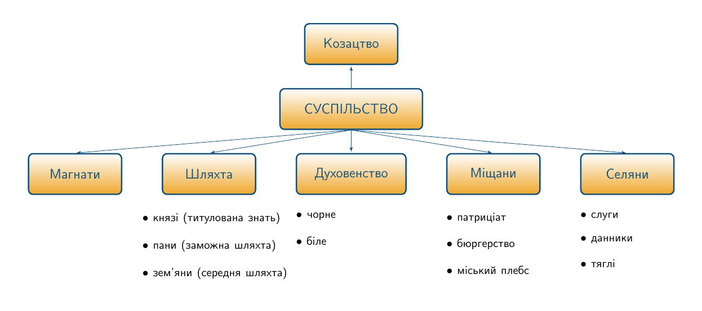

# Соцiальнi прошарки Речi Посполитої

<iframe align="center" width="560" height="315" src="https://www.youtube.com/embed/csOJFOb_Pas" frameborder="0" allowfullscreen></iframe>

Соціальна структура українського суспільства в ХVI ст. відзначається формуванням нового суспільного стану – **козацтва**, а також юридичним закріпленням прав і привілеїв шляхти, внаслідок прийняття **Литовських статутів**. 

Ще раніше, **1528 року** був проведений *перепис шляхти («попис земський»)*, у ході якого шляхтичам слід було підтвердити свої родові права на цей статус. Тих кому ці права не вдалося підтвердити, було позбавлено відповідних привілеїв та переведено у розряд селян. 

Через рік приймається **Перший Литовський статут**, за яким відбувся поділ всього шляхетства на шляхту та магнатів (князі і пани). У **1566 році**, напередодні Люблінської унії затверджується **Другий Литовський статут**, який зрівняв шляхту з магнатами, а також надав можливість шляхтичам брати участь в роботі повітових сеймиків та в загальнодержавному (вальному) сеймі. Відтепер за шляхтичами зберігалася пряма можливість брати участь в управлінні державою.

Окрім шляхти, відбулися зміни і в становищі селянства, що призвело до його остаточного закріпачення. 1505 року приймається постанова польським сеймом за якою селянам Галичини заборонялося змінювати своє місце проживання без відповідного дозволу господаря. 

**1557 року** із прийняттям **«Устава на волоки»** проводиться *волочна реформа*, що зруйнувала сільську громаду й громадську форму селянського землекористування, в результаті чого утвердилася подвірна система землеволодіння. Організовуються *волоки* – однакові ділянки землі, які були сформовані внаслідок переділу між населенням усіх земельних володінь литовського князя. За користування волокою селяни повинні були відбувати два дні панщини на тиждень, виконувати різноманітні повинності, або ж сплачувати грошовий чи натуральний податок. Як наслідок, збільшуються побори, селяни стають ще більш залежними від своїх господарів і втрачають свої права та свободи. 

За **Третім Литовським статутом** **1588 року** відбувається остаточне юридичне закріпачення селян: пани на своїх володіннях встановлюють довільну кількість днів панщини, селяни позбавляються права на розпорядження власним майном та на здійснення переходів від одного господаря до іншого. 

Решту суспільних станів детально розглянуто в розділі <a href="http://history.ed-era.com/8/socyalna_structura_suspylctva.html">«Соціальна структура суспільства в XV ст.»</a>, оскільки протягом наступного століття суттєвих змін у їхньому суспільно-політичному становищі не відбулося.

<quiz>
<question>
  
У якому році проведено волочну реформу?

        <answer>1529 р.</answer>
  <answer>1556 р.</answer>
        <answer correct>1557 р.</answer>
  <answer>1566 р.</answer>
</question>
</quiz>