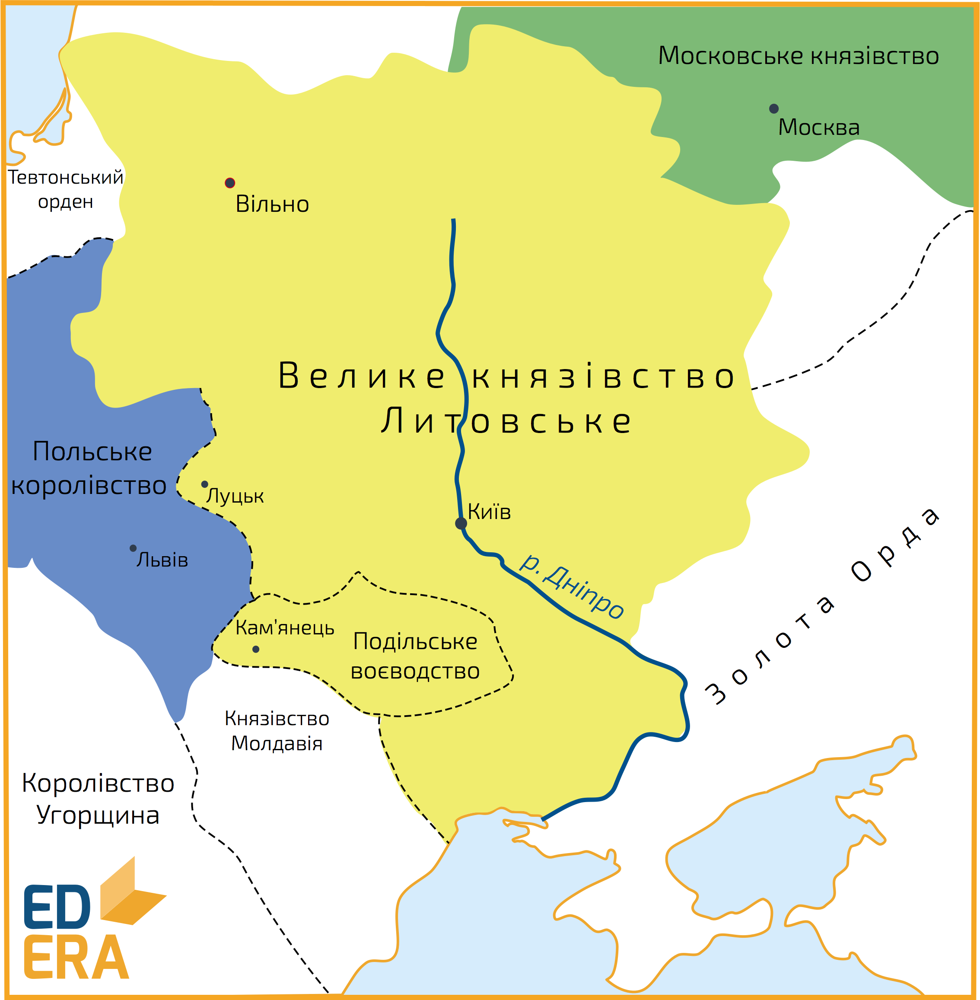
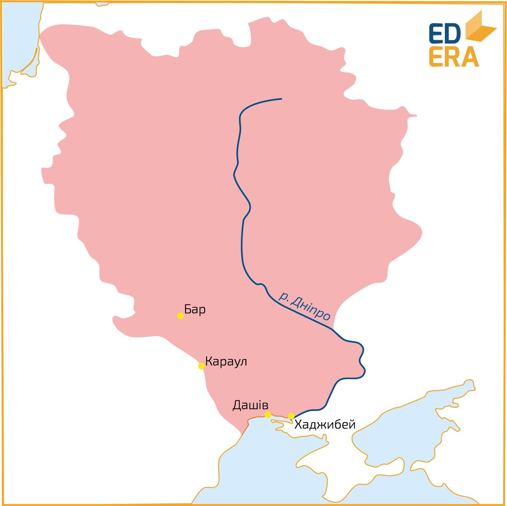

# Діяльність Вітовта на українських землях. Захоплення Польщею Західного Поділля

<iframe align="center" width="560" height="315" src="https://www.youtube.com/embed/8NIrTKdhKRU" frameborder="0" allowfullscreen></iframe>

Вітовт розпочинає своє правління з позбавлення влади литовських князів над руськими землями, таким чином здійснюючи <i>ліквідацію удільних князівств</i>, з метою посилити та централізувати владу у Литві. Історики вважають, що кроки які були здійснені Вітовтом у внутрішній політиці зумовлювалися непокорою удільних князів по-відношенню до нього, які бажали здійснювати більш самостійницьку та автономну політику. Ліквідація найбільших удільних князівств тривала до кінця 90-х рр. XIV ст. Так, Дмитро-Корибут втратив свої володіння у Новгороді-Сіверському, Федір Коріатович на Поділлі, Володимир Ольгердович у Києві, а їм на заміну прийшли намісники з оточення Вітовта, внаслідок чого українські землі втрачають автономію. Окрім цього, Вітовт доволі активно здійснює розбудову цілої системи опорних укріплень у таких містах, як Бар, Брацлав, Звенигородка, Черкаси тощо.

Внаслідок ліквідації у <b>1393 році</b> удільності <i>Подільського князівства</i>, поляки розпочинають військові дії бажаючи приєднати до Польщі ці землі, з метою послабити становище Вітовта. В результаті, західна частина Поділля з містами Кам’янець, Бокота, Смотрич, Червоноград та Скала відходить до Польського королівства. Вже у 1395 році Ягайло передає Західне Поділля Свидригайлу (мова про якого буде згодом), але в 1432 році воно знову відходить до польської корони.

<b>1398 року</b> Вітовта обирають своїм лідером литовсько-руські князі та бояри, але подальші події доволі сильно затьмарили його тріумф, у зв’язку з його невдалим втручанням в міжусобну боротьбу ханів Золотої Орди. 

В той час, у Золотій Орді відбувається міжусобна боротьба ханів за владу (хан Тохтамиш з одного боку, Тимур-кутлук, емір Єдигей під покровом еміра Тимура – з іншого) і Вітовт вирішує втрутитися, ставши на боці хана Тохтамиша, який 1398 року вручив Вітовту ярлик із правом власності на південноруські землі. За ним, Золота Орда формально зреклася від цих земель, передавши їх литовському володарю, а уклавши угоду з Тохтамишем, Вітовт тим самим зобов’язувався допомогти хану в боротьбі за владу в Орді. В разі успішної кампанії, хан повинен був підтримати Вітовта в наступі на князівство Московське, та з подальшим підкоренням всієї Русі. Окрім цього, Вітовту вдалося заручитися підтримкою з боку Польщі та Тевтонського ордену, а Папа Римський оголосив хрестовий похід проти золотоординців.

Фінальна битва відбулася <b>12 серпня 1399 року</b> <i>на річці Ворсклі</i>, в якій татари хитрістю вибороли перемогу розбивши вщерть об’єднане військо Вітовта та Тохтамиша, домінуючу роль в якому складали найкращі литовсько-польські та руські збройні сили, власне цвіт армії. Вітовт вдається до втечі, а татари рушили в напрямку Києва (населенню вдається втримати місто шляхом відкупу) спустошуючи все навкруги. Наслідки битви були катастрофічними для українських земель, у зв’язку з їхнім спустошенням та грабунком з боку татар. 

Плани Вітовта щодо самостійної Литовсько-Руської держави зазнали провалу, тому Вітовт наважується на зближення з Польщею, приєднавшись до Ягайла, та уклавши з ним  у <b>1401 році</b> <i>Віленсько-радомську унію</i>. За нею, Вітовт визнав над собою владу Ягайла, однак за Вітовтом було збережено пожиттєвий титул Великого князя литовського, але опісля його смерті всі підвладні йому територіальні надбання повинні були повернутися до складу Польської держави.

Доволі вагомо Вітовт відзначився у <i>Грюнвальдській битві</i>, яка відбулася <b>15 липня 1410 року</b>, між литовсько-русько-польським військом та німецькими рицарями Тевтонського ордену. Коаліції на чолі з польським королем Ягайлом та литовським князем Вітовтом вдалося розбити військо ордену, тим самим зупинивши німецький наступ на схід.

Після перемоги Вітовт продовжує розширювати та розбудовувати Литовську-Руську державу, зміцнює власні позиції на міжнародній арені. Так, ним було освоєно чорноморське узбережжя між Дніпром і Дністром, зводяться фортеці в таких містах як Каравул, Бар, Хаджибей (майбутня Одеса), Дашеві (майбутній Очаків) тощо.

Бажаючи втілити власні сподівання щодо незалежності Литви, за ініціативи Вітовта розпочинаються литовсько-польські перемовини, які завершуються в <b>1413 році</b> укладенням <i>Городельської унії</i>. За її умовами Велике князівство Литовське фактично ставало незалежним, але перебувало під зверхністю польського короля; литовці-католики зрівнювалися в правах із поляками, відповідно до чого, унією підтверджувалося привілейоване становище католиків, що дозволяло їм обіймати високі пости у державі. Умови унії тільки загострили внутрішньополітичні настрої в середині країни, так як литовська знать бажала повної самостійності Литви, а православна русько-білоруська знать була невдоволена широкими правами та привілеями, які були надані католикам. Все це вело до нового конфлікту, який власне вибухнув вже опісля смерті Вітовта.

Доволі активна розбудова Литовської держави, зміцнення позицій на зовнішній міжнародній арені не залишилися без уваги з боку впливових європейських правителів. <b>1429 року</b> розпочинається <i>Луцький з’їзд</i> в результаті якого мала відбутися коронація Вітовта, підтримку якому висловив як імператор Священної Римської імперії, так і Папа Римський включно з іншими західноєвропейськими володарями. Коронація була призначена <b>на вересень 1430 року</b>, але поляками була перехоплена та знищена корона, які були проти коронування Вітовта та розриву унії. Вітовту так і не вдалося втілити свої плани у реальність: після зриву коронації він помирає при загадкових обставинах.

<quiz>
<question>
	
Внаслідок битви на Ворсклі

        <answer>об’єднана армія на чолі з Вітовтом зазнає нищівної поразки, руські землі піддаються спустошенню</answer>
	<answer correct>литовсько-польські та руські збройні сили розбивають татарське військо</answer>
        <answer>руські землі остаточно закріплюються за Польським королівством</answer>
	<answer>Московське князівство розпочинає військовий наступ на територію Литви</answer>
</question>

<question>
	
Городельську унію укладено в

        <answer>1410 р.</answer>
	<answer correct>1413 р.</answer>
        <answer>1415 р.</answer>
	<answer>1420 р.</answer>
</question>
</quiz>